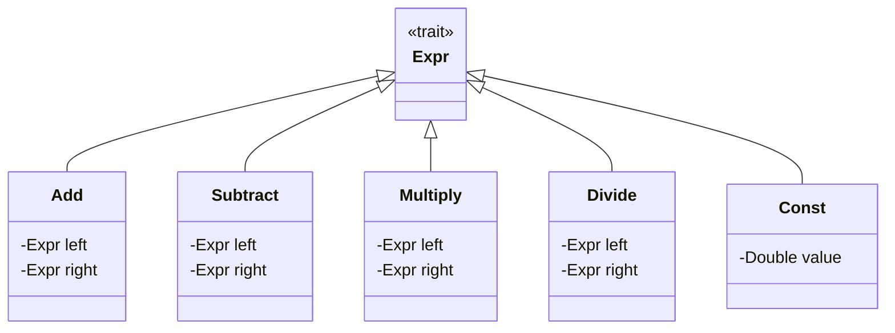

## Introduction

An Internal Domain-Specific Language (DSL) is a set of programming constructs designed to express solutions elegantly and concisely within a specific domain. Internal DSLs leverage the syntax and capabilities of a host general-purpose language, providing specialized constructs and abstractions tailored for their particular domain. This approach promotes code readability, maintainability, and allows developers to work at a higher level of abstraction, resulting in increased productivity.

## Characteristics of an Internal DSL

1. **Embedded in a Host Language:** An internal DSL operates within the syntax and constraints of a host language. This allows it to inherit the host language's infrastructure and tooling.
2. **Domain-Specific Abstractions:** It provides tailored constructs, idioms, and abstractions that align closely with the domain, making it easier to express domain-specific concepts.
3. **Ease of Use:** Designed to be easily understood and used by domain experts who may not necessarily be trained programmers.
4. **Interoperability:** Internal DSL benefits from the host language's features and can interoperate with general-purpose code seamlessly.

## Benefits of Internal DSLs

- **Enhanced Expressiveness:** Allows domain concepts to be captured more naturally and succinctly.
- **Improved Code Clarity:** Improves readability and maintainability by reducing boilerplate and making the code resemble natural language or domain jargon.
- **Increased Productivity:** Accelerates development by providing higher-level abstractions and eliminating low-level coding.
- **Reusability:** Constructs can often be reused across different parts of the application or different projects within the same domain.

## Example in Functional Programming

### Functional DSL for Mathematical Expressions

Consider creating a mathematical expression evaluator. The goal is to allow expressions to be written naturally and evaluated efficiently.

Here's an example using Scala:

```scala
sealed trait Expr
case class Add(left: Expr, right: Expr) extends Expr
case class Subtract(left: Expr, right: Expr) extends Expr
case class Multiply(left: Expr, right: Expr) extends Expr
case class Divide(left: Expr, right: Expr) extends Expr
case class Const(value: Double) extends Expr

object Expr {
  def eval(expr: Expr): Double = expr match {
    case Add(l, r) => eval(l) + eval(r)
    case Subtract(l, r) => eval(l) - eval(r)
    case Multiply(l, r) => eval(l) * eval(r)
    case Divide(l, r) => eval(l) / eval(r)
    case Const(v) => v
  }
}

object ExprSyntax {
  implicit def doubleToConst(value: Double): Const = Const(value)
  
  implicit class RichExpr(val left: Expr) extends AnyVal {
    def +(right: Expr) = Add(left, right)
    def -(right: Expr) = Subtract(left, right)
    def *(right: Expr) = Multiply(left, right)
    def /(right: Expr) = Divide(left, right)
  }
}

// Usage
import ExprSyntax._

val expr = (1 + 2) * (3 / 4) - 5
println(Expr.eval(expr)) // Output: -2.25
```

### Explanation

1. **Sealed Traits and Case Classes:** Define the core building blocks of expressions.
2. **Eval Function:** Contains the logic to evaluate an expression tree.
3. **Implicit Conversions and Classes:** Provide a more natural syntax for building expressions.

### UML Class Diagram


## Related Design Patterns

### External DSLs

Unlike internal DSLs, external DSLs have their own custom syntax and are independent of any host language. They often require specialized parsers and interpreters but provide maximum flexibility in design.

### Fluent Interfaces

Internal DSLs often use fluent interfaces, which rely on method chaining to create more readable and expressive code. They are commonly used in APIs where multiple methods can be called in a readable sequence.

### Interpreter Pattern

The Interpreter Pattern can be used in conjunction with internal DSLs to interpret the custom constructs defined within the DSL. This is particularly useful in domains requiring dynamic evaluation of expressions.

## Additional Resources

1. [Martin Fowler’s Domain-Specific Languages](https://martinfowler.com/books/dsl.html)
2. [Scala for the Impatient](https://www.amazon.com/Scala-Impatient-Cay-S-Horstmann/dp/0134540565)
3. [DSLs in Action](https://www.manning.com/books/dsls-in-action)
4. [Functional Programming in Scala](https://www.manning.com/books/functional-programming-in-scala)
5. [Kotlin DSL Example for Gradle](https://kotlinlang.org/docs/type-safe-builders.html)

## Summary

Internal DSLs harness the power of a host language to create expressive, domain-specific code constructs that streamline development. By embedding the DSL within the host language, developers can leverage existing infrastructure and focus on higher-level abstractions relevant to their domain. Proper use of implicit conversions and rich interfaces can transform regular code into highly readable and elegant solutions tailored to specific problems.

Internal DSLs present a powerful approach in the realm of functional programming, aligning well with principles like immutability and high-level abstractions. When designed well, they can significantly enhance the productivity and clarity of domain-specific tasks, making them a valuable tool in a programmer's toolkit.
