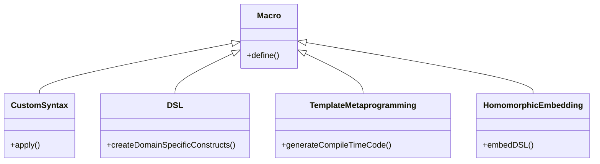

## Introduction

Macrology is a powerful design pattern in functional programming that involves using macros to define custom syntax for domain-specific constructs. This technique allows programmers to develop specialized languages within a host language, extending its syntax and semantics to better match the domain of the application.

## Understanding Macrology

In functional programming, macros provide a way to manipulate code as data, enabling the transformation of syntax trees before they are evaluated. This allows for custom behaviors and optimizations that are not possible with functions alone.

```scheme
;; Example in Scheme
(define-syntax increment
  (syntax-rules ()
    ((increment x)
     (+ x 1))))
     
(increment 5)
;; Evaluates to 6
```

In the example above, a macro `increment` is defined to increase the value of its argument by one. This macro generates code that adds one to the argument at compile time.

## Benefits of Macrology

1. **Reducing Boilerplate Code**: Macros can automate repetitive code patterns, reducing the effort required to write and maintain code.
2. **Enhanced Readability**: Custom syntactic constructs can make code more expressive and aligned with domain-specific terminology.
3. **Performance Optimizations**: Compile-time code generation can lead to performance improvements by eliminating runtime overhead.

## Related Design Patterns

### 1. **DSL (Domain-Specific Language)**

A domain-specific language (DSL) is a programming language specialized to a specific application domain. Macrology can be used to implement DSLs by defining macros that introduce new constructs fitting the problem domain.

### 2. **Template Metaprogramming**

Template metaprogramming is a technique used in languages like C++ where templates are used to generate code at compile time. While similar in spirit to macrology, it relies on the type system and template expansion mechanisms rather than syntactic transformation.

### 3. **Homomorphic Embedding**

Homomorphic embedding involves embedding a domain-specific language within a host language such that the syntax and semantics of the DSL map directly onto constructs in the host. Macros can aid in this embedding by allowing custom syntax within the host language.

## Additional Resources

- [Lisp In Small Pieces - Christian Queinnec](https://mitpress.mit.edu/9780262161283/lisp-in-small-pieces/)
- [Programming Macros in Scheme - MIT Scheme Manual](https://www.gnu.org/software/mit-scheme/documentation/stable/)
- [Clojure Macro Reference](https://clojure.org/reference/macros)
- [Understanding Metaprogramming and Macros in Julia](https://docs.julialang.org/en/v1/manual/metaprogramming/)

## Summary

Macrology, which involves using macros to define custom syntax for domain-specific constructs, is a powerful and flexible pattern in functional programming. It provides numerous benefits, including reduced boilerplate code, enhanced readability, and performance optimizations. Understanding macrology and its related patterns, such as DSLs and template metaprogramming, is essential for designing and implementing effective domain-specific languages within your applications.

By leveraging macrology, developers can create more expressive, efficient, and maintainable code tailored to their specific application domains. The additional resources provided can further guide you in mastering the art of macrology and its applications in functional programming.



By diving into the depths of macrology, you can harness the full power of functional programming to create powerful, domain-specific languages tailored to solve specific problems more effectively.


