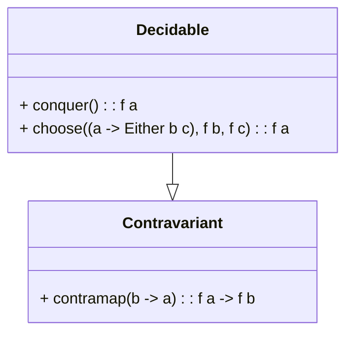

## Introduction
In functional programming, the Decidable design pattern is crucial for encapsulating and managing decision logic, especially in the context of validation. This pattern is an abstraction that allows the separation and reuse of conditional logic, providing a highly modular approach to validation routines.

## Understanding Decidable
The Decidable pattern extends the Contravariant Functor concept, providing additional combinators to handle decision-making processes. By using Decidable, you can encapsulate complex decision trees or validation logic into reusable components.

### Contravariant Functor
To grasp Decidable, it's important to first understand Contravariant Functors. A Contravariant Functor is a type of functor with a mapping function that acts in the reverse direction compared to traditional functors.

Here's a simple example in Haskell to illustrate a Contravariant Functor:

```haskell
class Contravariant f where
    contramap :: (b -> a) -> f a -> f b
```

### Decidable Definition
Decidable extends this concept by adding two main operations: `choose` and `conquer`.

- **conquer**: Provides a neutral element.
- **choose**: Combines multiple decision logics based on some criteria.

In Haskell, the Decidable type class can be defined as follows:

```haskell
class Contravariant f => Decidable f where
    conquer :: f a
    choose  :: (a -> Either b c) -> f b -> f c -> f a
```

### Visualization with Mermaid

Here’s a UML class diagram to visualize the relationship:



## Practical Example

Consider a scenario where we need to validate user input. We could use the Decidable pattern to create reusable validation logic:

```haskell
import Data.Functor.Contravariant.Divisible

data Validation a = Validation { runValidation :: a -> Bool }

instance Contravariant Validation where
    contramap f (Validation v) = Validation (v . f)

instance Decidable Validation where
    conquer = Validation (\_ -> True)
    choose f (Validation vTrue) (Validation vFalse) = Validation $ \a -> case f a of
        Left b  -> vTrue b
        Right c -> vFalse c

validateAge :: Validation Int
validateAge = Validation (> 18)

validateName :: Validation String
validateName = Validation (not . null)

validateUser :: Validation User
validateUser = choose userType (contramap age validateAge) (contramap name validateName)
    where userType (User age name) = if age > 0 then Left age else Right name

data User = User { age :: Int, name :: String }
```

## Related Design Patterns

### Validator
The Validator pattern is closely related and often implemented using Decidable. While Validator focuses on encapsulating validation logic, Decidable provides the structure for creating robust Validator implementations.

### Monad
Monads are often used alongside Decidables to handle chaining and sequencing of operations. While Decidables encapsulate decision logic, Monads manage side effects and computation flow.

### Functor and Applicative
Understanding Functor and Applicative patterns helps in grasping the full potential of Decidable. Functors provide basic mapping capabilities, and Applicatives extend this to handle computations with multiple inputs.

## Additional Resources
1. **Books**:
    - *"Functional Programming in Scala"* by Paul Chiusano and Runar Bjarnason: Covers core functional programming principles and includes detailed explanations of various patterns.
    - *"Category Theory for Programmers"* by Bartosz Milewski: Offers a deep dive into category theory, which is foundational for understanding patterns like Decidable.

2. **Online Articles and Tutorials**:
    - [Haskell Functors, Applicatives, and Monads](https://wiki.haskell.org/Typeclassopedia)
    - [Decidable Type Class in Haskell](https://hackage.haskell.org/package/contravariant-1.5/docs/Data-Functor-Contravariant-Divisible.html)

3. **Academic Papers**:
    - *"Type Classes: This Time It's Principled"* by Simon Marlow et al.: Explores the theoretical underpinnings of Haskell's type class system.
    
## Summary
The Decidable design pattern is an essential tool in functional programming for encapsulating and managing decision logic, particularly in validation contexts. By leveraging Contravariant Functors and extending them with `conquer` and `choose`, Decidable provides a robust framework for creating modular and reusable decision logic. Understanding related patterns such as Validator, Monad, and Functor can enhance your ability to implement effective solutions with Decidable.

Mastering Decidable can significantly improve the modularity, reusability, and maintainability of your validation logic, making it a valuable pattern in the functional programming toolkit.
