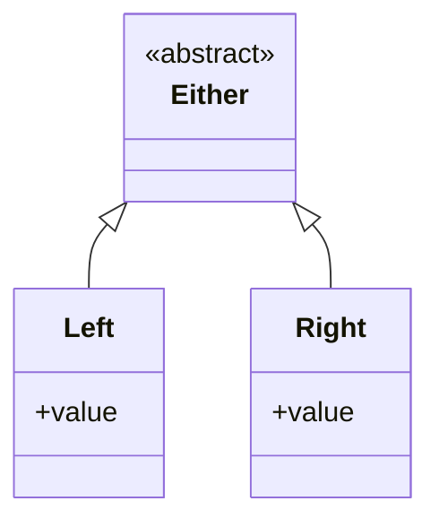

## Either Type: Encapsulating a Value for Success or Error

In functional programming, the *Either* type is a powerful construct used to represent a value that can be one of two possible types. This pattern is often employed to handle computations that may fail, offering a type-safe way of encapsulating a result or an error, thus eliminating many common sources of bugs associated with error handling.

### Definition

The *Either* type is defined with two type parameters: one for the "left" value and one for the "right" value. By convention, the left value is often used to represent an error, and the right value is used to represent a success.

#### Example in Haskell
```haskell
data Either a b = Left a | Right b
```

#### Example in Scala
```scala
sealed trait Either[+A, +B]
case class Left[+A](value: A) extends Either[A, Nothing]
case class Right[+B](value: B) extends Either[Nothing, B]
```

### Usage

The *Either* type enables defining functions that return a value which can either be a success or an error. This structure ensures that the caller must handle both possibilities, promoting robust and error-free code.

#### Example: Division Operation in Haskell
```haskell
safeDiv :: Int -> Int -> Either String Int
safeDiv _ 0 = Left "Division by zero error"
safeDiv x y = Right (x `div` y)
```

#### Example: Division Operation in Scala
```scala
def safeDiv(x: Int, y: Int): Either[String, Int] = {
  if (y == 0) 
    Left("Division by zero error")
  else 
    Right(x / y)
}
```

### Handling Either Values

Pattern matching is commonly used to handle the *Either* values in both Haskell and Scala.

#### Example in Haskell
```haskell
case safeDiv 10 2 of
  Left err -> putStrLn err
  Right result -> print result
```

#### Example in Scala
```scala
safeDiv(10, 2) match {
  case Left(err) => println(err)
  case Right(result) => println(result)
}
```

### Related Design Patterns

- **Option/Maybe Type**: Like the *Either* type, the *Option* or *Maybe* type is used to encapsulate optional values that might be present (some) or absent (none). It has a single type parameter and is typically used for operations that can fail but don’t need to indicate a specific type of failure.
- **Try Type**: Especially in Scala, the *Try* type encapsulates computations that may result in *Success* or *Failure*, analogous to the *Either* type but often used in contexts dealing with exceptions.

### Additional Resources

- "Functional Programming in Scala" by Paul Chiusano and Rúnar Bjarnason - This book provides an in-depth look at functional programming principles in Scala, including the use of the *Either* type.
- "Learn You a Haskell for Great Good!" by Miran Lipovača - This guide offers an accessible introduction to Haskell and covers fundamental types including *Either*.

### Summary

The *Either* type is a versatile and powerful pattern in functional programming for handling computations that can succeed or fail. With clear separation of success and error types, it enhances type safety and encourages explicit handling of error cases. By promoting robust code and reducing runtime errors, the *Either* type is a fundamental tool for effective functional programming.



Whether you're working in Haskell, Scala, or another functional programming language, understanding and using the *Either* type can significantly improve the robustness and clarity of your code.
