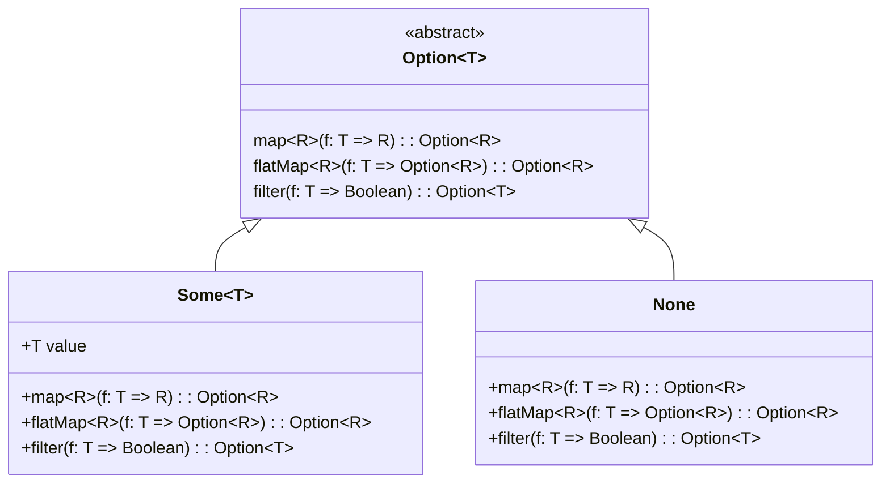
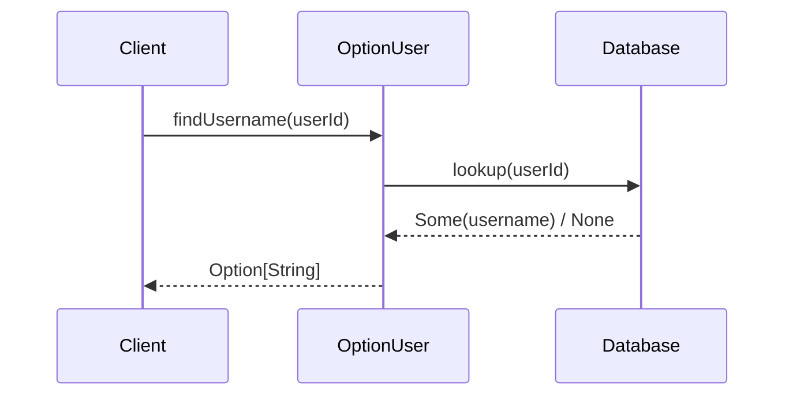

## Introduction to Option Type

In functional programming, handling the absence of values safely and predictably is crucial. The **Option Type** design pattern offers an elegant and robust solution for scenarios where a value might not exist. Rather than using null values, which can lead to null reference errors, the Option Type encapsulates the presence of a value or the absence of a value.

## What is Option Type?

The Option Type, also known as Maybe Type in some languages, is an algebraic data type that represents the presence or absence of a value. It consists of two cases:
- **Some(value)**: Indicates that a value is present.
- **None**: Indicates that there is no value.

### Type Definition
Here's how an Option Type can be defined in various functional programming languages:

#### Haskell
```haskell
data Maybe a = Just a | Nothing
```

#### Scala
```scala
sealed trait Option[+A]
case class Some[+A](value: A) extends Option[A]
case object None extends Option[Nothing]
```

#### Elm
```elm
type Maybe a = Just a | Nothing
```

### Basic Usage
To exemplify the Option Type in action, consider the following Scala example:

```scala
def findUsername(userId: Int): Option[String] = {
  val userMap = Map(1 -> "Alice", 2 -> "Bob")
  userMap.get(userId)
}

// Usage
val username = findUsername(1) match {
  case Some(name) => s"Username is $name"
  case None => "User not found"
}
```

## Benefits of Option Type

1. **Safety**: Using Option Type avoids null reference errors, making the code executable safer.
2. **Pattern Matching**: Functional languages provide powerful pattern matching features to efficiently handle Option Types.
3. **Chainable Operations**: Many functional operations like `map`, `flatMap`, and `filter` can be seamlessly chained on Option Types.

## Related Design Patterns

- **Monad Pattern**: The Option Type is a specific instance of a monad. Monads allow chaining operations while encapsulating context (such as presence or absence of a value) in a functional way.
  
- **Either Type**: While Option Type handles the presence and absence of a value, **Either Type** represents values that can be one of two types, often used for error handling.

### Example of Monad Pattern in relation to Option Type

```scala
def divide(a: Int, b: Int): Option[Int] = {
  if (b == 0) None else Some(a / b)
}

val result = for {
  x <- Some(10)
  y <- Some(2)
  res <- divide(x, y)
} yield res // Some(5)
```

## UML Diagrams

### Class Diagram



### Sequence Diagram



## Additional Resources

1. [Learn You a Haskell for Great Good!](http://learnyouahaskell.com/)
2. [Function Programming in Scala](https://www.manning.com/books/functional-programming-in-scala)
3. [Elm Guide on Maybe](https://guide.elm-lang.org/)

## Summary

The Option Type pattern is a fundamental design pattern in functional programming that provides a safe and expressive way to handle the presence and absence of values. By using the Option Type, developers can avoid common pitfalls like null reference errors and leverage functional features like pattern matching and monads for more reliable and maintainable code.

This design pattern not only boosts code safety but also integrates seamlessly with other functional programming paradigms and patterns, making it an essential tool in the functional programmer's repertoire.
