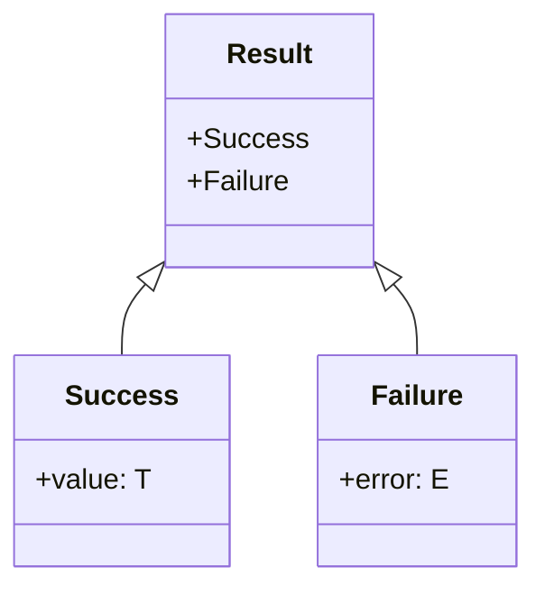
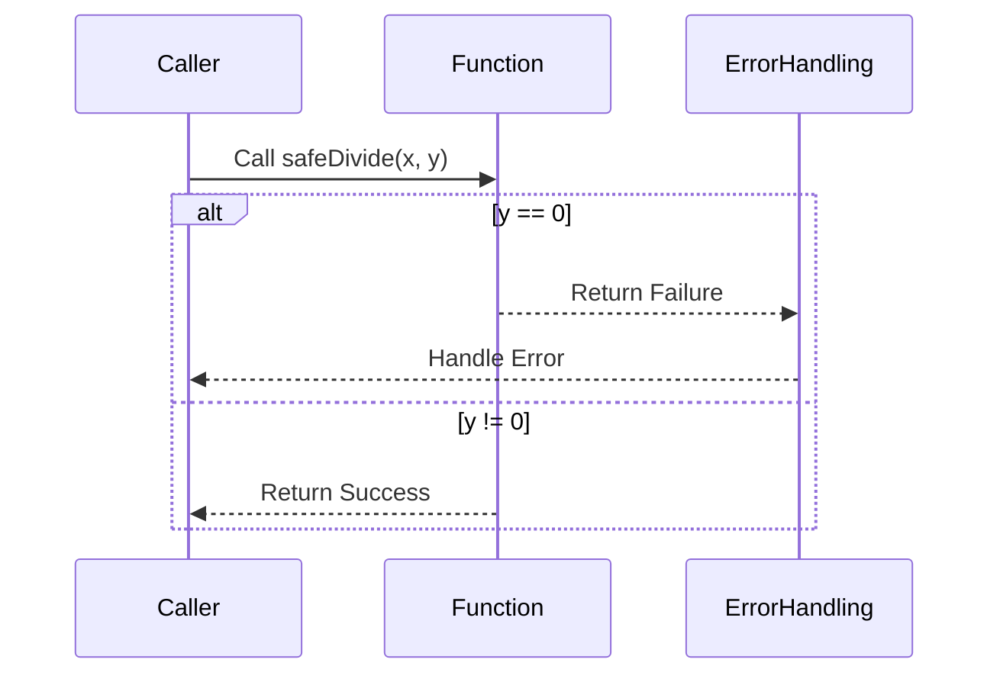

## Introduction

The **Result** pattern is a common and powerful design pattern in functional programming that encapsulates the concept of computations that might fail. It represents either a successful outcome or a collection of errors, providing a structured way to handle potential faults in programs. This pattern aids in creating robust and error-resilient applications by making error handling an explicit part of the function's type signature.

## Basic Concept

In essence, a `Result` type is a wrapper that holds either:
- A value signifying a successful computation (`Success`).
- An error signifying a failed computation (`Failure`).

By using the `Result` type, functions explicitly state that they may return an error, compelling the caller to handle the error-case logic.

## Type Definition

In functional programming languages like Haskell, Scala, or Rust, the `Result` type can be defined as follows:

### Haskell
```haskell
data Result e a = Success a | Failure e
```

### Scala
```scala
sealed trait Result[+E, +A]
case class Success[A](value: A) extends Result[Nothing, A]
case class Failure[E](error: E) extends Result[E, Nothing]
```

### Rust
```rust
enum Result<T, E> {
    Ok(T),
    Err(E),
}
```

### Examples

#### Haskell Example
```haskell
safeDivide :: Double -> Double -> Result String Double
safeDivide _ 0 = Failure "Division by zero error"
safeDivide x y = Success (x / y)
```

#### Scala Example
```scala
def safeDivide(x: Double, y: Double): Result[String, Double] = {
  if (y == 0) Failure("Division by zero error")
  else Success(x / y)
}
```

#### Rust Example
```rust
fn safe_divide(x: f64, y: f64) -> Result<f64, String> {
    if y == 0.0 {
        Err(String::from("Division by zero error"))
    } else {
        Ok(x / y)
    }
}
```

## Benefits

1. **Type Safety**: Provides compile-time assurances about error handling.
2. **Explicit Error Handling**: Makes error handling an essential part of the function signature, ensuring that errors are not overlooked.
3. **Composability**: Eases the composition of multiple operations that may fail, as `Result` types can be chained together.
4. **Readability**: Adds clarity to the function's contract, improving the readability of the code.

## Related Design Patterns

### Either
The **Either** type is similar to the `Result` type but more general. It typically encapsulates a value of one of two possible types (a disjoint union). While `Result` is used specifically for error handling, `Either` can be used for any computation that could have two possible outcomes.

### Option/Maybe
The **Option** type (known as `Maybe` in Haskell) represents a value that can either be present (some value) or absent (none). This is often used to represent optional values that are not necessarily associated with errors.

## UML Class Diagram



## UML Sequence Diagram



## Additional Resources

1. [Haskell Wiki - Error Handling](https://wiki.haskell.org/Error_handling)
2. [Rust Documentation - Result](https://doc.rust-lang.org/std/result/)
3. [Scala Documentation - Using Either for Error Handling](https://docs.scala-lang.org/overviews/scala-book/either.html)

## Summary

The `Result` type is an essential functional programming design pattern for safe and explicit error handling. By representing the success or failure of computations, it establishes clear contracts and ensures that potential errors are managed gracefully. Its benefits in terms of type safety, composability, and readability make it an indispensable tool in a functional programmer's toolkit.
