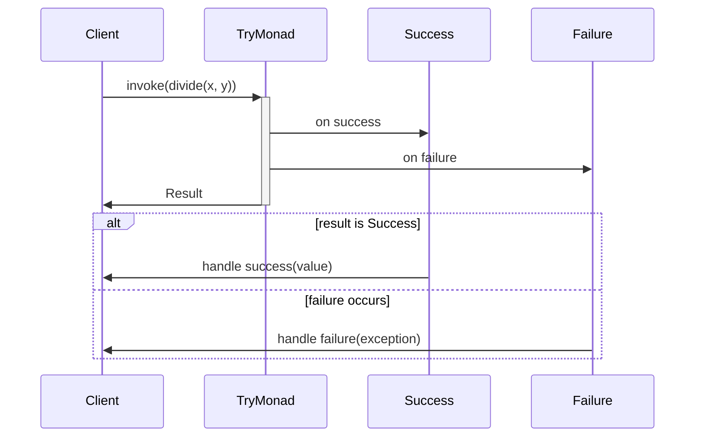

## Introduction to the Try Monad

In functional programming, the **Try Monad** serves as a powerful design pattern to manage exceptions and encapsulate success and failure cases. This ensures more predictable and maintainable code by fostering safe handling of operations that may fail.

The essence of the Try Monad resembles encapsulating an operation's result, differentiating between successful computation and failure without throwing exceptions directly. This pattern is vital for streamlining error handling, especially in languages promoting immutability and pure functions.

## Components of the Try Monad

There are two primary components:

1. **Success** - Represents a successful computation, holding the resultant value.
2. **Failure** - Represents a failed computation, encapsulating an exception.

These are commonly formalized as two subclasses deriving from a common trait, making use of case classes in Scala or similar constructs in other languages.

## Scala Example

```scala
import scala.util.{Try, Success, Failure}

def divide(x: Int, y: Int): Try[Int] = Try(x / y)

val result: Try[Int] = divide(4, 2)

result match {
  case Success(value) => println(s"Result: $value")
  case Failure(exception) => println(s"Failed with exception: ${exception.getMessage}")
}
```

### KaTeX Representation

We can represent the concept of the Try Monad using simple mathematical notation.


\text{TryMonad} = 
\begin{cases}
\text{Success}(x) & : x \in \text{Result} \\
\text{Failure}(e) & : e \in \text{Exception}
\end{cases}


## Using the Try Monad

### Creating a Try Monad

Creating a Try Monad is straightforward using Scala’s `Try`:

```scala
val success = Try(42)
val failure = Try(throw new RuntimeException("Oops!"))
```

### Mapping and FlatMapping

Like other Monads, `Try` supports `map` and `flatMap` operations, enabling chaining computations.

```scala
val computation = Try(10).map(_ * 2).flatMap(x => Try(x / 0))
```

### Recovering from Failures

Scala’s `Try` also allows you to recover from failures using `recover` and `recoverWith`.

```scala
val safeComputation = computation.recover {
  case e: ArithmeticException => 0
}
```

## UML Sequence Diagram

Illustrating the interaction with Try Monad using UML sequence diagram for better clarity:



## Related Design Patterns

### Option Monad

Similar in spirit, the **Option Monad** encapsulates computations that might not yield a value (i.e., presence or absence), widely represented by `Some` and `None`.

### Either Monad

Extending the idea further, **Either Monad** differentiates between two mutually exclusive possibilities: `Left` for failure, often holding an error, and `Right` for success.

### Future Monad

The **Future Monad** handles asynchronous computations, encapsulating future success or failure, commonly used in concurrent programming scenarios.

## Additional Resources

- [Scala Standard Library Documentation on Try](https://www.scala-lang.org/api/current/scala/util/Try.html)
- [Functional Programming in Scala — Chapter on Error Handling](https://books.underscore.io/essential-scala/)
- [Haskell Try Monad Implementation](https://wiki.haskell.org/Try_monad)

## Summary

The Try Monad is a cornerstone in functional programming for robust and efficient exception handling. It offers an elegant way to deal with success and failure without resorting to traditional exception mechanisms. Understanding and utilizing the Try Monad can lead to more reliable and maintainable codebases, especially in environments that emphasize immutability and pure functions. Exploring related patterns like Option, Either, and Future Monads can further enrich your toolkit for handling complex functional requirements.

By incorporating these patterns, developers can write code that is not just safer but also easier to reason about, ultimately enhancing code quality and developer productivity.
