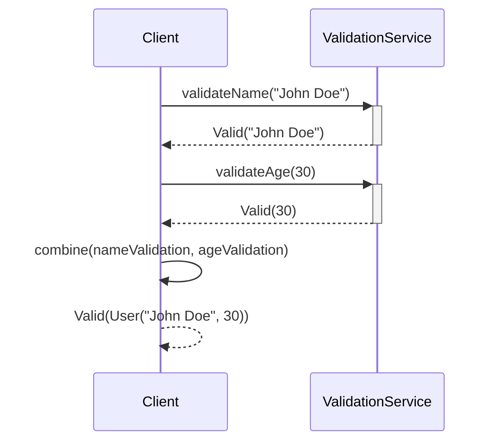

## Introduction

In functional programming, it is often necessary to validate data while accumulating multiple validation errors. The `Validated` design pattern achieves this by providing a way to collect and handle multiple errors instead of stopping at the first occurrence of an error. This minimizes code complexity, improves readability, and makes the error information more useful.

## Definitions

In essence, the `Validated` pattern encapsulates the concept of validation in a functional way, using either a `Valid` or `Invalid` type to represent successful or failed validations respectively:

- `Valid<A>`: Encapsulation of a valid result of type `A`.
- `Invalid<E>`: Encapsulation of an invalid result with errors of type `E`.

## Implementation

### Scala

Scala's Cats library provides a `Validated` type, making it simple to use this pattern.

```scala
import cats.data.Validated
import cats.data.Validated.{Valid, Invalid}
import cats.syntax.apply._ // for tupled

type ValidationResult[A] = Validated[List[String], A]

def validateName(name: String): ValidationResult[String] = {
  if (name.nonEmpty) Valid(name) else Invalid(List("Name cannot be empty"))
}

def validateAge(age: Int): ValidationResult[Int] = {
  if (age > 0) Valid(age) else Invalid(List("Age must be greater than zero"))
}

case class User(name: String, age: Int)

val userValidation = (validateName("John Doe"), validateAge(30)).mapN(User)
// Result: Valid(User("John Doe", 30))
```

### Haskell

In Haskell, you can use the `Validation` type from the `validation` package to achieve similar functionality.

```haskell
import Data.Validation
import Data.Semigroup (Semigroup, (<>) )

data User = User {
  name :: String,
  age :: Int
} deriving (Show)

validateName :: String -> AccValidation [String] String
validateName name =
  if not (null name)
    then _Success name
    else _Failure ["Name cannot be empty"]

validateAge :: Int -> AccValidation [String] Int
validateAge age =
  if age > 0
    then _Success age
    else _Failure ["Age must be greater than zero"]

validateUser :: String -> Int -> AccValidation [String] User
validateUser name age = User <$> validateName name <*> validateAge age

main :: IO ()
main = print $ validateUser "Alice" 25
-- Result: _Success (User {name = "Alice", age = 25})
```

## Combining Errors

One of the strengths of the `Validated` pattern is how it accumulates errors. Depending on the implementation, errors can be combined using standard functional approaches like `map`, `flatMap`, or combinator operators like `|@|` in some libraries.

### Example in Scala

```scala
val nameValidation = validateName("John Doe")
val ageValidation = validateAge(30)
val combined = (nameValidation, ageValidation).mapN((name, age) => User(name, age))

combined match {
  case Valid(user)           => println(s"User: $user")
  case Invalid(errorList) => println(s"Errors: ${errorList.mkString(", ")}")
}
```

### Sequence Diagram for Validation Process



## Related Design Patterns

- **Either**: Represents a value of one of two possible types (a disjoint union). Typically, `Either` is used for computations that might fail, where failure is captured as an `Either.Left`.
- **Option/Maybe**: Provides a container that either holds a value (`Some`/`Just`) or is empty (`None`/`Nothing`), useful for optional values without validation errors accumulation.
- **Try**: Used for computation that might throw an exception, where `Try` can be `Success` or `Failure`.

## Additional Resources

1. [Scala Cats Documentation on Validated](https://typelevel.org/cats/datatypes/validated.html)
2. [Haskell Validation Library](https://hackage.haskell.org/package/validation)
3. [Functor, Applicative, and Monad in Functional Programming](https://wiki.haskell.org/Typeclassopedia)

## Summary

The `Validated` design pattern is a powerful functional programming tool for error handling and validation. It allows for the accumulation of multiple errors in a concise, readable way, improving overall code robustness. Understanding `Validated` enhances the ability to handle complex validations in a clear, functional manner.
