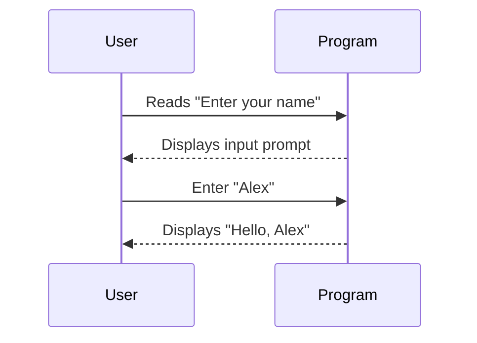

## Introduction

In functional programming, maintaining purity and avoiding side effects is essential. However, real-world applications often involve side effects such as reading user inputs, writing to files, or interacting with databases. **The IO Monad** is a design pattern that allows us to handle input and output (I/O) operations while still adhering to functional programming principles.

## What is an IO Monad?

An **IO Monad** captures I/O operations in a functional manner, allowing these operations to be composed and executed sequentially without violating the core principle of immutability and side-effect-free functions.

In languages like Haskell, the IO Monad plays a crucial role in ensuring that I/O operations remain well-behaved and predictable, encapsulating side effects and providing a consistent interface for functional programmers.

## Theoretical Foundation

The concept of monads comes from category theory, which provides a framework for handling a variety of computational contexts. A Monad in functional programming is a type class with three primary operations:
- `unit` (or `return`): wraps a value into a monad.
- `flatMap` (or `bind`): chains operations that return monadic values.
- `map`: applies a function to the wrapped value without unwrapping it.

Formally, a Monad must satisfy three laws:
1. **Left Identity**: `return a >>= f` is equivalent to `f a`
2. **Right Identity**: `m >>= return` is equivalent to `m`
3. **Associativity**: `(m >>= g) >>= h` is equivalent to `m >>= (\x -> g x >>= h)`

## Specifics to IO Monad

The IO Monad provides a way to sequence operations. Below is an illustration in Haskell using the IO Monad:

```haskell
main :: IO ()
main = do
    putStrLn "Enter your name:"
    name <- getLine
    putStrLn ("Hello, " ++ name ++ "!")
```

In this example, `putStrLn` and `getLine` are both operations that return `IO` Monads, which we can chain together using the `do` notation.

## Sequences in Mermaids UML

Here's a conceptual representation of IO operations sequencing using UML diagrams:



## Benefits of Using IO Monads

1. **Encapsulation of Side Effects**: Encapsulates side effects, ensuring the rest of the code remains pure.
2. **Explicit Sequencing**: Specifies the exact sequence of operations.
3. **Improved Testability**: Isolates impurity, making testing of pure logic simpler and more deterministic.

## Relation to Other Design Patterns

### Maybe Monad

Just as the IO Monad encapsulates I/O operations, the **Maybe Monad** encapsulates values that might fail. The idea is to handle potential absence of values gracefully without having to deal with null references.

### State Monad

The **State Monad** deals with computations that carry some state along. While the IO Monad manages I/O actions, the State Monad handles stateful computations in a sequential manner.

## Additional Resources

For a deeper understanding of IO Monads and their practical application in functional programming, the following resources are invaluable:

1. [Haskell Wikibook on I/O](https://en.wikibooks.org/wiki/Haskell/Monad_transformers)
2. [Real World Haskell - Chapter 7](http://book.realworldhaskell.org/read/input-and-output.html)
3. [Learn You a Haskell for Great Good!](http://learnyouahaskell.com/input-and-output)

## Summary

The IO Monad is a sophisticated and essential design pattern in functional programming. It enables developers to handle I/O operations in a pure, functional manner without losing the benefits of immutability and purity. By encapsulating side effects, providing explicit sequencing, and improving testability, the IO Monad ensures that I/O operations are both manageable and consistent with functional programming principles. For a functional programmer, mastering the IO Monad is part of leveraging the full power and elegance of functional paradigms.


