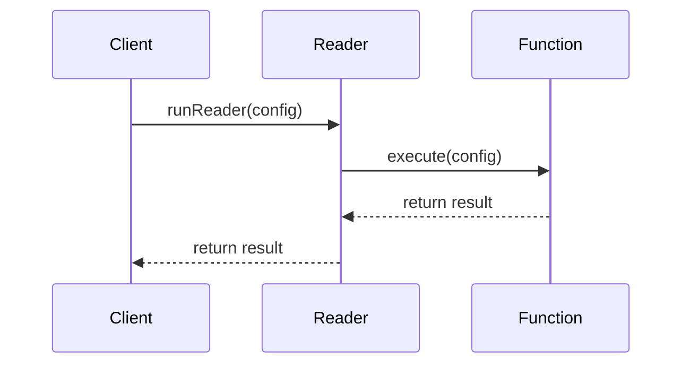

## Reader Monad: Passing Contextual Read-Only Information Through a Computation

### Introduction

The Reader Monad is a functional programming construct that allows you to pass read-only contextual information through a computation. It is particularly useful when functions need access to shared read-only data without explicitly passing the data through multiple function calls.

### Definition and Usage

In simpler terms, a Reader Monad encapsulates a computation that depends on an external environment. It provides a way to "read" from this environment without directly modifying it. This pattern is often used to manage global configurations, dependency injection, or logging contexts.

#### Haskell Example

In Haskell, the Reader Monad is found in the `Control.Monad.Reader` module.

```haskell
import Control.Monad.Reader

type Config = String

-- A function that requires some configuration data
configDependentFunction :: Reader Config String
configDependentFunction = do
    config <- ask
    return ("The configuration is: " ++ config)

-- Running the Reader
main :: IO ()
main = do
    let config = "Read-only Config"
    putStrLn $ runReader configDependentFunction config
```

In this case, the `Reader` Monad allows us to access `Config` within `configDependentFunction` without threading it through every function manually.

### Components of the Reader Monad

1. **The Environment**: The read-only context that needs to be passed.
2. **Reader Type Constructor**: Typically defined as `Reader e a`, where `e` is the type of the environment and `a` is the return type.
3. **runReader**: A function to execute a computation with the given environment.
4. **ask**: A function that retrieves the environment.
5. **local**: A function that temporarily modifies the environment for a given computation.

### Related Concepts and Design Patterns

#### Dependency Injection (DI)

The Reader Monad aligns well with the Dependency Injection pattern commonly found in Object-Oriented Programming. In both, the goal is to supply necessary dependencies to components without them creating or knowing about the dependencies themselves.

#### Configuration Management

Managing configurations, especially in larger applications, often motivates using the Reader Monad. Functions that depend on system-wide configurations, such as database settings or API endpoints, naturally benefit from being wrapped in a Reader.

#### Functional Approach to Dependency Management

While OO approaches might use dependency injection frameworks, the Reader Monad achieves similar results in a purely functional way without compromising immutability.

### Advanced Usage

There are certain advanced scenarios where the Reader Monad proves beneficial:

- **Combining with Other Monads**: When combined with other monads using monad transformers, the Reader Monad can enhance the functionality of computations.
  
  ```haskell
  import Control.Monad.Reader
  import Control.Monad.State

  type Config = String
  type AppState = Int

  -- A combined Reader and State monad
  type App = ReaderT Config (State AppState)

  combinedFunction :: App String
  combinedFunction = do
      config <- ask
      state <- get
      return ("Config: " ++ config ++ ", State: " ++ show state)

  -- Running the combined monad
  main :: IO ()
  main = do
      let config = "App Config"
          initialState = 42
          result = runState (runReaderT combinedFunction config) initialState
      print result
  ```

### UML Example

Here’s a sequence diagram explaining the flow of context in a Reader Monad:



### Additional Resources

- **Books**:
  - "Learn You a Haskell for Great Good!" by Miran Lipovača
  - "Haskell Programming from First Principles" by Christopher Allen and Julie Moronuki

- **Research Papers and Articles**:
  - [Haskell Wikibook on Reader Monad](https://en.wikibooks.org/wiki/Haskell/Monad_transformers/ReaderT)
  - "Functional Programming with Haskell" by Graham Hutton

- **Online Tutorials**:
  - [Reactive Clojure Reader Monad](https://cljdoc.org/d/com.rpl/rx-cljs/0.1.0/doc/readermonad)
  - [Scala Recipe: Using the Reader Monad](http://blog.higher-order.com/blog/2015/06/23/reader-monad/)

### Summary

The Reader Monad is a powerful tool in the functional programming paradigm, designed to handle read-only shared data efficiently. It simplifies the passing of constant information through a series of computations and aligns with widely-known architectural patterns like Dependency Injection. Understanding and utilizing the Reader Monad can significantly enhance code maintainability and clarity, especially in complex functional applications.
