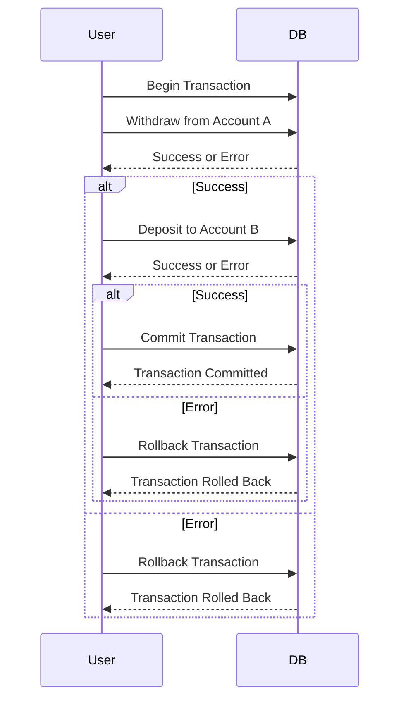

Database operations often involve multiple steps that must be executed within a transaction to ensure data consistency and integrity. In the realm of functional programming (FP), ensuring that these operations adhere to immutability and side-effect management principles presents a unique challenge. The Transaction Monad is a design pattern that addresses these concerns by encapsulating database transactions in a functional way.

## Understanding Monads

Before delving into the Transaction Monad, it's vital to grasp the basic concept of Monads in functional programming. A Monad is a design pattern used to represent computations as a series of steps. It's a type class with three essential properties:

1. **Unit (or Return)**:
   ```haskell
   return :: a -> m a
   ```
   Wraps a value in a default context within the Monad.

2. **Bind**:
   ```haskell
   (>>=) :: m a -> (a -> m b) -> m b
   ```
   Chains operations together, ensuring that each step executes sequentially.

3. **Associativity**:
   The order of applying operations does not change the result:
   ```haskell
   (m >>= f) >>= g == m >>= (\x -> f x >>= g)
   ```

## Introduction to the Transaction Monad

The Transaction Monad encapsulates the concept of database transactions within the Monad paradigm. It manages the initiation, completion, and rollback of transactions seamlessly, providing a high level of abstraction over the underlying database operations.

### Basic Structure

The basic structure of a Transaction Monad might look like this:

```haskell
data Transaction a = Transaction { runTransaction :: Connection -> IO (Either Error a) }
```

Here, `Transaction a` is a Monad representing a computation that is run with a database `Connection` and results in an `IO` action yielding either an error or a value of type `a`.

### Monad Instance

To use `Transaction` as a Monad, we need to define instances for `return` and `>>=`:

```haskell
instance Functor Transaction where
  fmap f tx = Transaction $ \conn -> do
    result <- runTransaction tx conn
    return (fmap f result)

instance Applicative Transaction where
  pure = return
  (<*>) = ap

instance Monad Transaction where
  return x = Transaction $ \_ -> return (Right x)
  tx >>= f = Transaction $ \conn -> do
    result <- runTransaction tx conn
    case result of
      Left err -> return (Left err)
      Right value -> runTransaction (f value) conn
```

### Error Handling

Handling errors within the Monad is crucial. Here’s how it can be incorporated:

```haskell
instance MonadError Error Transaction where
  throwError err = Transaction $ \_ -> return (Left err)
  catchError tx handler = Transaction $ \conn -> do
    result <- runTransaction tx conn
    case result of
      Left err -> runTransaction (handler err) conn
      Right value -> return (Right value)
```

### Starting and Committing a Transaction

Managing transaction control is essential. We can define functions to start, commit, and rollback transactions:

```haskell
beginTransaction :: Transaction ()
beginTransaction = Transaction $ \conn -> do
  execute_ conn "BEGIN"
  return (Right ())

commitTransaction :: Transaction ()
commitTransaction = Transaction $ \conn -> do
  execute_ conn "COMMIT"
  return (Right ())

rollbackTransaction :: Transaction ()
rollbackTransaction = Transaction $ \conn -> do
  execute_ conn "ROLLBACK"
  return (Right ())
```

## Using the Transaction Monad

Here’s an example of using the `Transaction` Monad for database operations:

```haskell
transferFunds :: Int -> Int -> Double -> Transaction ()
transferFunds fromAccount toAccount amount = do
  beginTransaction
  withdraw fromAccount amount
  deposit toAccount amount
  commitTransaction

withdraw :: Int -> Double -> Transaction ()
withdraw account amount = Transaction $ \conn -> do
  balance <- query conn "SELECT balance FROM account WHERE id = ?" (Only account)
  if balance >= amount
    then do
      execute conn "UPDATE account SET balance = balance - ? WHERE id = ?" (amount, account)
      return (Right ())
    else return (Left InsufficientFunds)

deposit :: Int -> Double -> Transaction ()
deposit account amount = Transaction $ \conn -> do
  execute conn "UPDATE account SET balance = balance + ? WHERE id = ?" (amount, account)
  return (Right ())
```

### Sequence Diagram for Transfer Funds



## Related Design Patterns

1. **Reader Monad**: Often used together with the Transaction Monad to pass configuration or database connections through the application without explicit parameter passing.
2. **State Monad**: Can be used to encapsulate state changes within transactions.
3. **Error Monad (Either)**: Facilitates error handling by chaining operations and processing potential failures.

## Additional Resources

- *"Learn You a Haskell for Great Good!"* by Miran Lipovača - Provides a solid introduction to Monads in Haskell.
- *"Real World Haskell"* by Bryan O'Sullivan, John Goerzen, and Don Stewart - Offers practical insights into using Haskell for real-world applications, including database interaction.
- *Functional Programming in Scala* by Paul Chiusano and Rúnar Bjarnason - Though focused on Scala, the principles and patterns are applicable to other functional languages as well.
- [Haskell.org](https://www.haskell.org) - Official Haskell documentation and resources.

## Summary

The Transaction Monad is a powerful design pattern for managing database transactions in a functional programming context. By leveraging Monads' capabilities, it ensures that transactions are executed in a predictable, sequential manner while managing errors and ensuring data consistency. This pattern offers a blend of readability, maintainability, and correctness, essential for robust software design.

Understanding and implementing the Transaction Monad aids in grasping the broader concepts of functional programming and coping effectively with side effects, especially those emanating from I/O operations such as database transactions.
