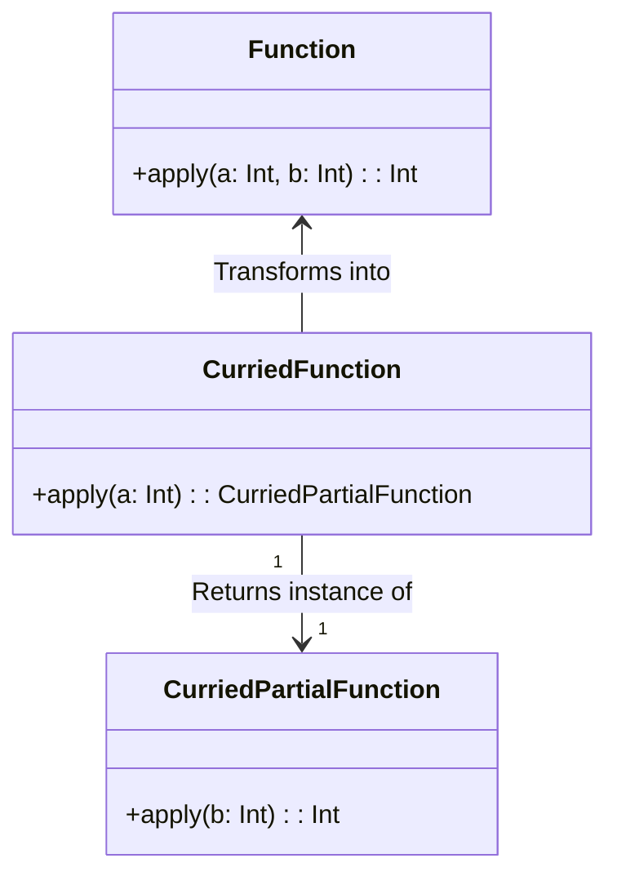
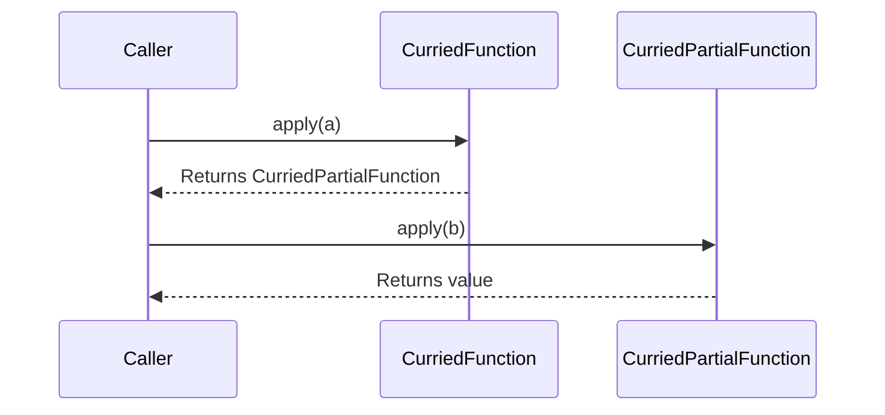

## Introduction to Currying

Currying is a fundamental concept in functional programming. Named after the mathematician Haskell Curry, currying transforms a function that takes multiple arguments into a sequence of functions, each taking a single argument. This concept is crucial in functional programming paradigms like Haskell, ML, and even JavaScript functional programming techniques.

### What is Currying?

In simple terms, currying is a process of decomposing a function that takes multiple parameters into nested functions that each take a single parameter. Consider a function `f(x, y, z)` which takes three arguments. In curried form, this function becomes `f(x)(y)(z)`.

### Why Currying?

Currying allows for greater modularity and flexibility in function management. By transforming functions in this way, it becomes easier to reuse and compose them, leading to more readable and maintainable code.

## Example: Currying in JavaScript

A straightforward example in JavaScript can help to clarify the mechanics of currying:

```javascript
function add(a, b) {
  return a + b;
}

// Curried version
function curriedAdd(a) {
  return function(b) {
    return a + b;
  };
}

console.log(add(2, 3)); // Output: 5
console.log(curriedAdd(2)(3)); // Output: 5
```

In this example, `curriedAdd` transforms the basic two-argument `add` function into a sequence of nested functions that take one argument each.

## Implementation of Currying

### Currying in Haskell

Haskell functions are automatically curried. That is, every function in Haskell takes exactly one argument. Here's an example in Haskell:

```haskell
add :: Int -> Int -> Int
add x y = x + y

-- Using the curried function
let addFive = add 5
addFive 3 -- Output: 8
```

### Currying in Python

Python requires some extra work to achieve currying, but it can be done using closures or functools.partial.

```python
from functools import partial

def add(a, b):
    return a + b

def curried_add(a):
    def inner_curried_add(b):
        return a + b
    return inner_curried_add

curried_add = partial(add)
partially_applied_add = curried_add(2)

print(partially_applied_add(3))  # Output: 5
```

## Related Design Patterns

### Partial Application

Partial application is a technique where some of the function's arguments are fixed (or partially applied), returning another function for the remaining arguments. Unlike currying, which transforms a function into nested functions, partial application maintains the original function structure but fixes some arguments. 

Example in JavaScript:

```javascript
function multiply(a, b) {
  return a * b;
}

const double = multiply.bind(null, 2);  // Partially applying "2"
console.log(double(5));  // Output: 10
```

### Higher-Order Functions

Higher-order functions are functions that take other functions as arguments or return them as results. Currying is often used in the composition of higher-order functions to create more abstract and reusable software components.

Example in JavaScript:

```javascript
function higherOrder(fn) {
  return function(x) {
    return fn(x);
  };
}

const increment = x => x + 1;
const incrementedValue = higherOrder(increment)(5); // Output: 6
```

## Diagrams

### UML Class Diagram

Here is a simple UML Class Diagram illustrating the concept of a curried function:



### Sequence Diagram

A sequence diagram shows how a curried function is invoked and returns nested functions:



## Additional Resources

- [Haskell Language Documentation on Currying](https://www.haskell.org/definition/)
- [MDN Web Docs on JavaScript Function Currying](https://developer.mozilla.org/en-US/docs/Web/JavaScript/Guide/Functions#currying)
- [Python's functools.partial](https://docs.python.org/3/library/functools.html#functools.partial)

## Summary

Currying is a powerful functional programming technique that transforms a function with multiple arguments into a series of nested functions, each accepting a single argument. This concept is essential for writing modular, reusable, and maintainable code. Currying is tightly associated with related design patterns like partial application and higher-order functions, making it a staple in the functional programmer's toolkit.
