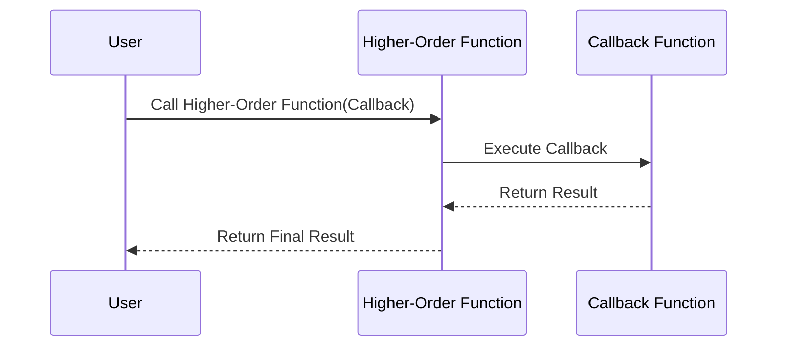

## Introduction to Higher-Order Functions

Higher-Order Functions (HOFs) are a fundamental concept in functional programming that significantly increase the expressiveness and reusiveness of code. A higher-order function is one that either takes functions as arguments, returns a function, or both.

## Definition and Characteristics

Higher-Order Functions have two primary characteristics:
1. **Taking Functions as Arguments:** A HOF can accept one or more functions as parameters.
2. **Returning Functions:** A HOF can produce a new function as its output.

### Example: Higher-Order Functions in JavaScript

Here's an example of a higher-order function in JavaScript:

```javascript
// A function that takes another function as an argument
function higherOrderFunction(callback) {
    console.log("Executing higher-order function.");
    callback(); // Calling the function passed as an argument
}

// A simple function to be used as a callback
function simpleFunction() {
    console.log("Executing callback function.");
}

// Passing 'simpleFunction' to 'higherOrderFunction'
higherOrderFunction(simpleFunction);

// A function that returns another function
function createGreeter(greeting) {
    return function(name) {
        console.log(greeting + ", " + name);
    };
}

const greetHello = createGreeter("Hello");
greetHello("Alice");
greetHello("Bob");
```

In the above code:

1. `higherOrderFunction` takes `callback` which itself is a function.
2. `createGreeter` returns a new function based on the `greeting` parameter.

## How Higher-Order Functions Empower Functional Programming

### 1. **Function Composition**
Higher-Order Functions enable function composition, which is the process of combining simple functions to build complex ones. 

```javascript
const add = (x) => (y) => x + y;
const multiply = (x) => (y) => x * y;
const addThenMultiply = (x, y, z) => multiply(z)(add(x)(y));

console.log(addThenMultiply(2, 3, 4)); // (2 + 3) * 4 = 20
```

### 2. **Currying**
Currying is the technique of translating a function that takes multiple arguments into a sequence of functions that take a single argument.

```javascript
const curry = (f) => (a) => (b) => f(a, b);

const sum = (a, b) => a + b;
const curriedSum = curry(sum);

console.log(curriedSum(1)(2)); // 3
```

### 3. **Lazy Evaluation**
Higher-Order Functions can enable lazy evaluation, optimizing performance by deferring computations until their results are needed.

### 4. **Code Reusability**
HOFs help encapsulate common patterns and make them reusable. 

## Related Design Patterns

Higher-Order Functions tie into several other important design patterns and concepts in functional programming:

### **Function Composition**
Function composition involves creating a single function that's the result of applying multiple functions in sequence.

### **Currying**
Currying breaks down the process of taking several parameters into the nested form of functions where each function takes exactly one argument.

### **Partial Application**
Partial application fixes a number of arguments to a function, producing another function of smaller arity.

### **Functor and Monad**
These are abstractions that allow applying functions to wrapped values in a context like an array or a promise.

## Diagrammatic Representation

### Using Mermaid for Function Execution Sequence



## Additional Resources

1. [Functional Programming in JavaScript: Classic Functional Techniques for Modern JavaScript](https://www.oreilly.com/library/view/functional-programming-in/9781491956355/)
2. [Learn You a Haskell for Great Good!](http://learnyouahaskell.com/)
3. [The Road to Learn React](https://www.roadtoreact.com/)

## Summary

Higher-Order Functions are indispensable in functional programming for their ability to manipulate and return functions, promoting modular, reusable, and often more concise code. They play a key role in enabling concepts like function composition, currying, and lazy evaluation. Understanding and effectively utilizing HOFs can significantly enhance one's ability to write robust functional code.

---
By mastering Higher-Order Functions, you can unlock deeper insights and capabilities in the domain of functional programming, leading to clearer, more efficient, and more maintainable code.
