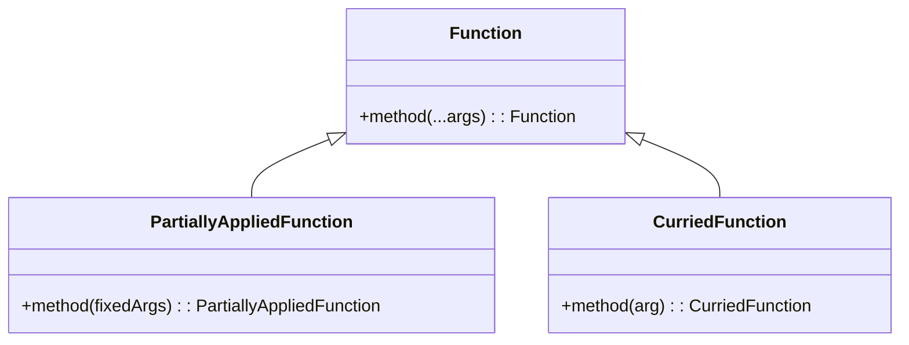

Partial Application is a powerful design pattern in functional programming. This pattern involves taking a function with multiple parameters and fixing a number of arguments to produce another function with a smaller arity (i.e., fewer arguments). This technique facilitates function composition, code reuse, and enhances code readability.

## Overview

### Definition

In functional programming, **Partial Application** is the process of fixing a set of arguments to a function. This generates another function that takes the remaining parameters. Partial Application does not evaluate the function immediately; instead, it returns a new function that waits for the remaining arguments.

### Terminology

- **Arity**: The number of arguments a function takes.
- **Currying**: A related concept where a function with multiple arguments is transformed into a sequence of functions, each with a single argument.
- **Higher-order Functions**: Functions that can take other functions as arguments or return them as results.

## Programming Example

### JavaScript Example

```javascript
function add(a, b, c) {
    return a + b + c;
}

// Partial Application fixing `a = 1`
function partialAdd(b, c) {
    return add(1, b, c);
}

// Using the partially applied function
const result = partialAdd(2, 3); // => 6
```

By fixing the first argument to `1`, the `partialAdd` function becomes simpler and only requires two parameters.

### Haskell Example

```haskell
add :: Int -> Int -> Int -> Int
add a b c = a + b + c

-- Partial application fixing `a = 1`
partialAdd :: Int -> Int -> Int
partialAdd = add 1

-- Using the partially applied function
result = partialAdd 2 3 -- => 6
```

Haskell inherently supports Partial Application due to its currying nature.

## Advantages

- **Improved readability**: By fixing certain arguments, the resulting functions are contextually more meaningful.
- **Code reusability**: Smaller and more specific functions can be composed and reused throughout different parts of the codebase.
- **Functional Composition**: Enhances the ability to compose functions in a pipeline pattern.

## Related Design Patterns

### Currying

Currying is closely related to Partial Application. It transforms a function that takes multiple arguments into a series of functions that each take a single argument.

#### JavaScript Currying Example

```javascript
function curryAdd(a) {
    return function(b) {
        return function(c) {
            return a + b + c;
        };
    };
}

const curriedAdd = curryAdd(1)(2)(3); // => 6
```

Currying and Partial Application both allow deferred execution of a function, but Currying systematically breaks down a multi-parameter function into nested single-parameter functions.

### Higher-Order Functions

Higher-order functions either take other functions as arguments or return them as results. Both Partial Application and Currying rely on this concept.

#### Example in JavaScript

```javascript
function createMultiplier(multiplier) {
    return function(value) {
        return value * multiplier;
    };
}

const double = createMultiplier(2);

const outcome = double(5); // => 10
```

This higher-order function creates a new function with a specific multiplier, exemplifying Partial Application.

## UML Class Diagram



## Additional Resources

- [Learn You a Haskell for Great Good!](http://learnyouahaskell.com/)
- [JavaScript Allongé, the Six Edition: PβU](https://leanpub.com/javascriptallongesix)
- [Functional Programming in JavaScript](https://www.oreilly.com/library/view/functional-programming-in/9781492041232/)

## Summary

Partial Application is a fundamental design pattern in functional programming that enhances modularity and readability by fixing some arguments of a function, producing a new function with smaller arity. It is closely related to currying and higher-order functions, making them more practical and easier to utilize in various programming languages. Through this pattern, developers can write more maintainable and reusable code, leveraging the full power of functional programming paradigms.
