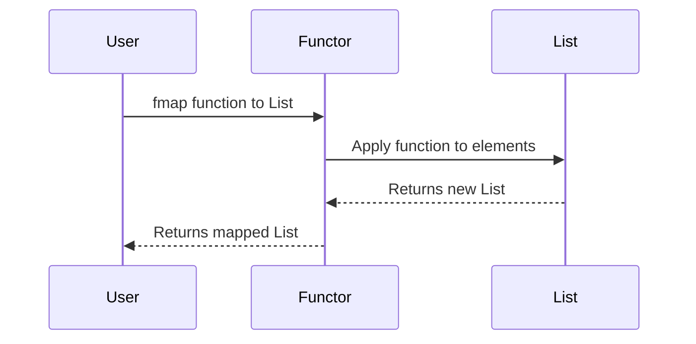

## Introduction

In functional programming, a **Functor** is an abstraction that allows functions to be applied to values within a context. This context can be anything from lists, and trees, to options (like `Maybe`), and more. The core idea of a Functor is to provide a way to apply a function to values inside a context while preserving that context.

## The Functor Category: Theory and Laws

Functors are deeply rooted in category theory. In this framework, a functor is a type of mapping between categories. Concretely, in functional programming:

### Functor Laws

To be a valid functor, a data type must satisfy two laws:

1. **Identity Law**: `F.map(id) == id`
2. **Composition Law**: `F.map(f.compose(g)) == F.map(g).map(f)`

Here, `F` represents a functor, `id` is the identity function, and `compose` represents function composition.

## Definition and Implementation

### Definition in Haskell

Here is a standard definition of the Functor type class in Haskell:

```haskell
class Functor f where
    fmap :: (a -> b) -> f a -> f b
```

In this definition:

- `f` represents a Functor.
- `fmap` is a function that takes a function `(a -> b)` and a functor `f a`, applying the function to the value(s) inside the `f` context and returning a new functor `f b`.

### Example with Lists

Lists in Haskell are functors. The `fmap` function applies a function to each element in the list.

```haskell
instance Functor [] where
    fmap = map
```

#### Haskell Code Example

```haskell
doubleList :: [Int] -> [Int]
doubleList = fmap (*2)

-- Example Usage
main :: IO ()
main = print (doubleList [1, 2, 3, 4])
-- Output: [2, 4, 6, 8]
```

## Related Concepts and Design Patterns

### Applicative Functors

While a Functor allows applying a single-argument function to values within a context, an **Applicative Functor** extends this idea to multi-argument functions. Applicative Functors provide the method `ap` which allows applying a functor that contains a function to another functor that contains a value.

### Monads

Monads build on the concept of Functors and Applicative Functors. They not only allow function mapping but also chaining operations that return wrapped values via the `bind` (or `>>=`) operation.

### Traversable

The Traversable pattern extends Functors by allowing not only mapping of functions but also traversal of structures, collecting results in an arbitrary applicative functor. This adds more power to data structure manipulation.

## Advanced Examples and Use Cases

### Mapping over `Maybe`

Using `Maybe` as a functor allows safe manipulation of optional values.

```haskell
instance Functor Maybe where
    fmap _ Nothing  = Nothing
    fmap f (Just x) = Just (f x)
```

#### Haskell Code Example

```haskell
safeDouble :: Maybe Int -> Maybe Int
safeDouble = fmap (*2)

main :: IO ()
main = do
    print (safeDouble (Just 3))  -- Output: Just 6
    print (safeDouble Nothing)   -- Output: Nothing
```

## UML Sequence Diagram



## Additional Resources

1. **Haskell Documentation on Functor**: [Haskell Functors](https://haskell-lang.org/documentation/functor)
2. **"Learn You a Haskell for Great Good!"**: Comprehensive book on Haskell basics and Functors.
3. **"Category Theory for Programmers" by Bartosz Milewski**: Deep dive into category theory principles useful for understanding functional programming structures like Functors.

## Summary

The Functor design pattern is a cornerstone of functional programming, providing a mechanism to apply functions within a context, ensuring that context (such as lists, options, etc.) is maintained. This abstraction leads the way to other complex structures like Applicative Functors, Monads, and Traversables, making it an essential concept for any functional programmer.

The laws and properties of functors play a critical role in ensuring predictable behavior, making them reliable and powerful tools in the functional programming toolkit.

