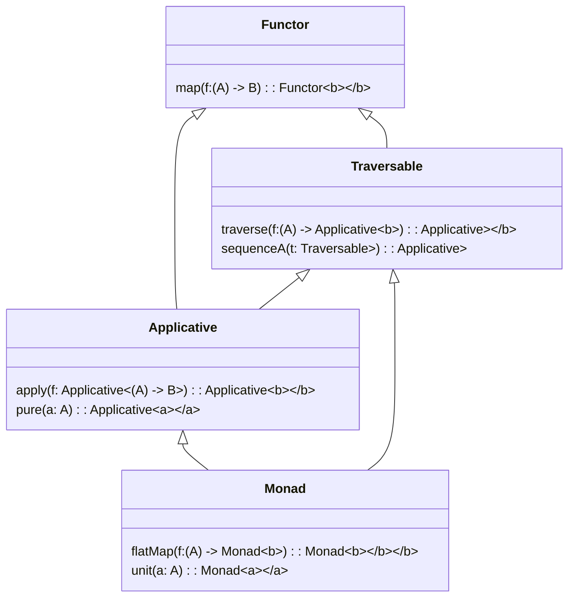

## Introduction

In functional programming, a **Traversable** is an abstraction that provides a way to traverse a data structure and transform it into a list or another structure. This pattern is extended from both the **Functor** and **Foldable** type classes, offering powerful means to apply functions across elements systematically.

## Theoretical Background

Traversable extends both Functor and Foldable type classes and is tightly integrated with concepts from Category Theory. By fulfilling specific laws and adhering to a few required functions, Traversable ensures consistency and predictability in traversal operations.

### Core Concepts

1. **Functor**: A type class that offers a `map` function to apply a function to every element in a structure.

2. **Foldable**: A type class that enables folding (or reduction) of a data structure into a single aggregate value.

### Traversable Type Class

In Haskell-like pseudocode, the Traversable type class might be defined as follows:

```haskell
class (Functor t, Foldable t) => Traversable t where
    traverse :: Applicative f => (a -> f b) -> t a -> f (t b)
    sequenceA :: Applicative f => t (f a) -> f (t a)
```

Where:
- `traverse` applies a function that returns an applicative context across the structure, collecting the results.
- `sequenceA` takes a structure with applicative contexts and flips it to an applicative containing the structure.

## Traversable Laws

To be a valid instance of Traversable, a type must obey the following laws:

1. **Naturality**:
   ```haskell
   t . traverse f = traverse (t . f)
   ```

2. **Identity**:
   ```haskell
   traverse Identity = Identity
   ```

3. **Composition**:
   ```haskell
   traverse (Compose . fmap g . f) = Compose . fmap (traverse g) . traverse f
   ```

## Use Case Scenarios

1. **Data transformation**: Applying a function to each element in a data structure while maintaining the original structure.
2. **Validation**: Aggregating validations over a collection of items, such as form fields.
3. **State Propagation**: Managing state transformations over collections.

### Example Implementation

Here is a simple example in Haskell using a list:

```haskell
instance Traversable [] where
    traverse _ []     = pure []
    traverse f (x:xs) = (:) <$> f x <*> traverse f xs
```

## Related Design Patterns

### Functor
A pattern that allows functor to be mapped over, supporting operations to apply functions to every element.

### Applicative
An extension of Functor that allows for functions that apply operations wrapped in a context.

### Monad
Extends Applicative by also supporting chaining operations and handling context transformations, ensuring cleaner and more expressive code.



## Additional Resources

1. "Learn You a Haskell for Great Good!" by Miran Lipovača
2. "Haskell Programming from First Principles" by Christopher Allen and Julie Moronuki
3. [Haskell: Typeclassopedia](https://wiki.haskell.org/Typeclassopedia)

## Summary

The **Traversable** design pattern in functional programming defines an elegant system for traversing data structures, transforming them, and aggregating results within a consistent framework. Extending concepts from Functor and Foldable, it plays a crucial role in functional thinking, aiding developers to write concise, expressive, and maintainable code.

By adhering to the core laws and leveraging related patterns like Functor, Applicative, and Monad, Traversables form a cornerstone of functional patterns, enabling robust and predictable data manipulation across various domains.
