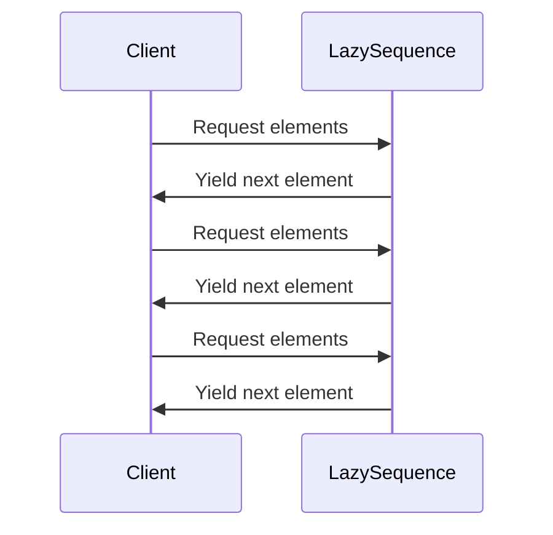

## Introduction to Lazy Sequences

Lazy Sequences, often referred to as lazy lists, are data structures where elements are generated incrementally and only as needed. Unlike eager evaluation, where elements are computed and stored upfront, lazy evaluation defers computation until the elements are accessed. This approach can significantly improve performance, especially for collections that may not be fully traversed or for infinite data structures.

## Core Concept of Lazy Sequences

Lazy Sequences take advantage of lazy evaluation to defer operations on sequence elements until they are explicitly required. This can drastically reduce memory usage and computational overhead.

### Example in Haskell

Haskell, known for its lazy evaluation by default, offers an intuitive way to define lazy sequences:

```haskell
naturals :: [Integer]
naturals = [0..]
```

In this example, `naturals` is an infinite sequence of natural numbers generated lazily. Computation only occurs when elements of `naturals` are accessed.

## Benefits of Lazy Sequences

1. **Efficiency**: Lazy sequences save computational resources by generating only the needed elements.
2. **Memory Consumption**: They help in reducing memory usage by not storing the entire sequence upfront.
3. **Infinite Data Structures**: Convenient for working with infinite lists, streams, and data structures.
4. **Enhanced Modularity**: They safely compose operations like mapping, filtering, and folding over sequences.

## Related Design Patterns

### 1. **Lazy Evaluation**

Lazy Sequences leverage the broader concept of lazy evaluation, a cornerstone of functional programming where expressions are not evaluated until their values are required.

### 2. **Iterators**

While iterators in imperative programming languages provide a means of traversing collections one element at a time, lazy sequences extend this idea by inherently incorporating the deferred computation.

## Use Cases and Examples

### Summing a Finite Lazy Sequence in Scala

Scala offers a mix of eager and lazy constructs, with the `Stream` class (deprecated in Scala 2.13 and replaced by `LazyList`) being a notable example:

```scala
val naturals: LazyList[Int] = LazyList.from(0)

val firstTenNaturals = naturals.take(10).sum  // Sums first 10 natural numbers

println(firstTenNaturals)  // Output: 45
```

### Generating a Lazy Sequence in Clojure

Clojure uses lazy sequences as a fundamental part of its immutable data structures:

```clojure
(def naturals (iterate inc 0))

(take 10 naturals)
```

### Implementing Infinite Streams in JavaScript

JavaScript ES6 introduced generators providing a way to implement lazy sequences using the `yield` keyword:

```javascript
function* naturals() {
  let n = 0;
  while (true) {
    yield n++;
  }
}

const it = naturals();
console.log([...Array(10).keys()].map(() => it.next().value));  // Output: [0,1,2,3,4,5,6,7,8,9]
```

## Diagram: Lazy Sequences in Use

Below is a sequence diagram illustrating the incremental computation of a lazy sequence in action:



## Additional Resources

- **Books**:
  - "Purely Functional Data Structures" by Chris Okasaki
  - "Programming in Haskell" by Graham Hutton
  
- **Online Articles**:
  - "The Power of Laziness in JavaScript" by Alex MacCaw
  - "An Introduction to Functional Programming with Haskell" by Bryan O'Sullivan
   
- **Libraries & Frameworks**:
  - Haskell's `Data.List` module
  - Scala's `LazyList`
  - Clojure's `clojure.core/lazy-seq`

## Summary

Lazy Sequences present a powerful mechanism for dealing with potentially large or infinite collections of data in a memory-efficient way. By deferring the computation of elements until they are explicitly requested, programs can optimize resource usage and improve overall performance. Understanding and harnessing lazy sequences, alongside related patterns like lazy evaluation and iterators, allows developers to write more efficient and expressive code in functional programming paradigms.

Exploring the various implementations across different languages reveals the versatility and robustness of lazy sequences, demonstrating their fundamental role in modern software development.
