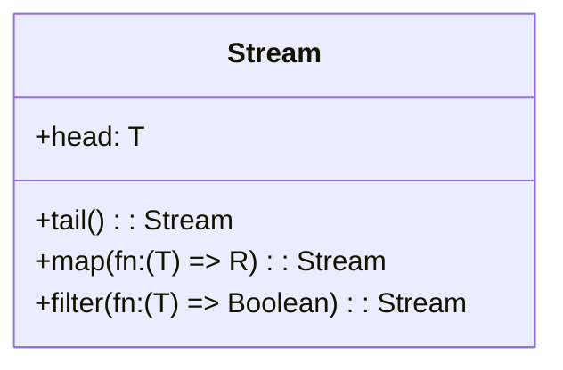
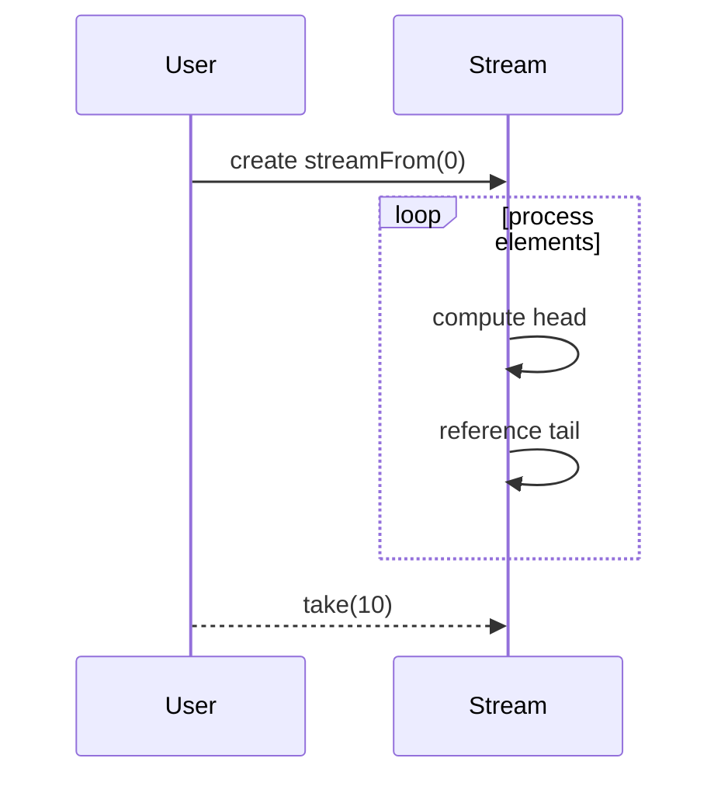

## Overview

Streams are a powerful and flexible pattern in functional programming that represent a lazy and potentially infinite sequence of data elements. Unlike traditional data structures, elements of a Stream are computed on demand, allowing for efficient memory usage and the capacity to represent infinite data sequences without computation overhead.

## Principles

### Lazy Evaluation

Lazy evaluation is a technique where expressions are not evaluated until their values are actually needed. This allows Streams to defer computation, which can lead to performance improvements, particularly when handling potentially large or infinite data sequences.

### Immutability

In functional programming, Streams are immutable. Once a Stream is created, it cannot be altered. Any operations on a Stream, such as mapping or filtering, produce a new Stream rather than modifying the original.

### Composability

Streams support a range of higher-order functions that allow for composing operations, such as `map`, `filter`, and `reduce`. This composability is one of the key benefits of using Streams, facilitating clear and concise declarative code.

## Implementation

### Basic Stream Example

Here's a simple example of creating and using Streams in a functional programming language such as Haskell:

```haskell
-- Define a simple Stream
streamFrom :: Int -> [Int]
streamFrom n = n : streamFrom (n + 1)

-- Take the first 10 elements from the Stream
take 10 (streamFrom 0)
-- Output: [0, 1, 2, 3, 4, 5, 6, 7, 8, 9]
```

### Lazy Fibonacci Sequence

A classic example of Streams' laziness is generating Fibonacci numbers:

```haskell
fibonacci :: [Int]
fibonacci = 0 : 1 : zipWith (+) fibonacci (tail fibonacci)

-- Take the first 10 Fibonacci numbers
take 10 fibonacci
-- Output: [0, 1, 1, 2, 3, 5, 8, 13, 21, 34]
```

## Applications

### Data Processing Pipelines

Streams are extensively used in data processing, enabling the construction of pipelines for transforming and processing large datasets. Lazy evaluation ensures that only necessary computations are performed, improving efficiency.

### Infinite Sequences

Streams can represent infinite sequences like the sequence of all natural numbers or the Fibonacci sequence. This allows for elegant and concise definitions without special handling for sequence termination.

## Related Design Patterns

### Monads

Monads, another fundamental concept in functional programming, can be used in combination with Streams to handle effects like I/O, exceptions, and stateful computations in a controlled way.

### Functors and Applicatives

Streams often interact with Functors and Applicative Functors, which allow for generic programming over different data structures, facilitating higher-level abstractions in functional programs.

### Reactive Programming

Streams have strong affinities with Reactive Programming frameworks, which are designed around streaming data and asynchronous event handling, blurring the lines between push-based and pull-based data flows.

## UML Diagrams

### Class Diagram



### Sequence Diagram



## Additional Resources

1. **Books**:
   - "Functional Programming in Scala" by Paul Chiusano and Runar Bjarnason
   - "Haskell Programming from First Principles" by Christopher Allen and Julie Moronuki

2. **Online Resources**:
   - [Haskell Wiki on Lazy Evaluation](https://wiki.haskell.org/Lazy_evaluation)
   - [Scala's Streams Documentation](https://www.scala-lang.org/api/current/scala/collection/immutable/Stream.html)

3. **Courses**:
   - Coursera: Functional Programming Principles in Scala by Martin Odersky
   - edX: Introduction to Functional Programming by Erik Meijer

## Summary

Streams are a cornerstone of functional programming, enabling the representation of lazy, potentially infinite data sequences. Their lazy nature and composability make them ideal for declarative data transformation and efficient memory usage. Understanding Streams, alongside related patterns like Monads and Reactive Programming, equips programmers with powerful tools for writing clear and efficient functional code.

Streams exemplify the elegance of functional programming, allowing for clear, concise, and strongly-typed data manipulation. By mastering Streams, developers can better leverage the inherent power of functional programming paradigms.
