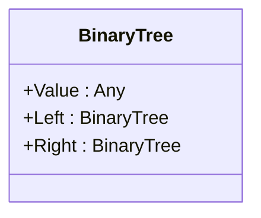

## Introduction to Binary Tree

In functional programming, a **Binary Tree** is an essential immutable data structure that serves to organize hierarchical data efficiently. By leveraging the benefits of immutability, binary trees ensure that data integrity is maintained throughout manipulations without unexpected side-effects.

## Key Characteristics

### Immutable Structure
An immutable binary tree ensures that any operation performed does not alter the existing tree but rather produces a new tree structure. This immutability helps to maintain referential transparency and other functional programming paradigms.

### Hierarchical Data Organization
Binary trees are highly effective in organizing hierarchical data due to their branching nature. Each node in a binary tree has at most two children, commonly referred to as _left_ and _right_ child nodes.

## Binary Tree Construction

A binary tree is typically constructed using a recursive definition in functional programming, reflecting its inherent hierarchical nature.

### Algebraic Data Type Example

In Haskell, a binary tree can be defined using algebraic data types:

```haskell
data BinaryTree a = Empty
                  | Node a (BinaryTree a) (BinaryTree a)
```

In this definition:
- `Empty` represents an empty tree.
- `Node` contains a value of type `a` and two subtrees.

## Tree Traversal Methods

To utilize the data within a binary tree, you may need to traverse it using various tree traversal techniques:

### 1. In-order Traversal

```haskell
inOrder :: BinaryTree a -> [a]
inOrder Empty = []
inOrder (Node value left right) = inOrder left ++ [value] ++ inOrder right
```

### 2. Pre-order Traversal

```haskell
preOrder :: BinaryTree a -> [a]
preOrder Empty = []
preOrder (Node value left right) = [value] ++ preOrder left ++ preOrder right
```

### 3. Post-order Traversal

```haskell
postOrder :: BinaryTree a -> [a]
postOrder Empty = []
postOrder (Node value left right) = postOrder left ++ postOrder right ++ [value]
```

## Visual Representation

To illustrate the structure of a binary tree, we can use diagram.

### Binary Tree Diagram



Here, the `BinaryTree` class has three members: `Value`, `Left`, and `Right`, encapsulating the tree’s hierarchical data.

## Related Design Patterns

### 1. **Composite Pattern**
The Composite pattern allows individual objects to be represented uniformly across client code. In the context of trees, it treats both individual nodes and whole subtrees as instances of the tree.

### 2. **Visitor Pattern**
The Visitor pattern separates algorithms from the object structures they operate on, supporting operations such as tree traversal.

### 3. **Flyweight Pattern**
The Flyweight pattern aims to minimize memory usage by sharing as much data as possible through fine-grained objects, beneficial in handling numerous small BinaryTree nodes.

## Additional Resources

- [Functional Programming in Haskell by Graham Hutton](https://www.amazon.com/Programming-Haskell-Graham-Hutton/dp/0521877682)
- [Why Functional Programming Matters by John Hughes](https://haskell.epfl.ch/resources/fun.pdf)
- [Learn You a Haskell for Great Good!](http://learnyouahaskell.com/chapters)

## Implementation Example in Scala

More complex implementations can take place in Scala:

```scala
sealed trait BinaryTree[+A]
case object Empty extends BinaryTree[Nothing]
case class Node[A](value: A, left: BinaryTree[A] = Empty, right: BinaryTree[A] = Empty) extends BinaryTree[A]

object BinaryTree {
  def inOrder[A](tree: BinaryTree[A]): List[A] = tree match {
    case Empty => List()
    case Node(value, left, right) => inOrder(left) ++ List(value) ++ inOrder(right)
  }
}
```

## Summary

The Binary Tree in functional programming serves as a powerful data structure to represent hierarchical data in an immutable and efficient manner. Its various traversal methods (in-order, pre-order, post-order) provide tooling for diverse data manipulations while adhering to pure functional programming principles. Understanding and implementing binary trees form a foundational skill in the functional programming paradigm, propelled further by related patterns like the Composite and Visitor patterns.

By exploring this indispensable structure, programmers gain insights into immutable data structures, promoting better design principles and cleaner, more maintainable code.
