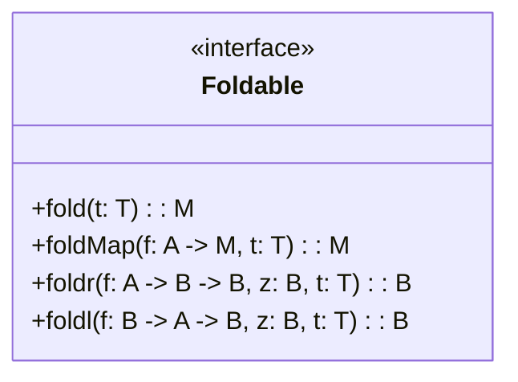

## Overview of the Foldable Design Pattern

In functional programming, the **Foldable** design pattern describes data structures that can be reduced (or folded) to a single summary value. This is achieved by recursively processing elements of the structure using a binary operator and a starting (or accumulator) value. 

Common operations associated with foldable structures include sums, products, logical conjunctions, disjunctions, and more. Foldable makes it possible to implement these operations generically over any data structure that supports the Foldable interface.

### Definition

In Haskell, the Foldable pattern can be abstractly represented using the `Foldable` type class:

```haskell
class Foldable t where
    fold :: Monoid m => t m -> m
    foldMap :: Monoid m => (a -> m) -> t a -> m
    foldr :: (a -> b -> b) -> b -> t a -> b
    foldl :: (b -> a -> b) -> b -> t a -> b
```

Similarly, in Scala, the `Foldable` trait may look like this:

```scala
trait Foldable[F[_]] {
  def fold[A](fa: F[A])(implicit M: Monoid[A]): A
  def foldMap[A, B](fa: F[A])(f: A => B)(implicit M: Monoid[B]): B
  def foldRight[A, B](fa: F[A], z: B)(f: (A, B) => B): B
  def foldLeft[A, B](fa: F[A], z: B)(f: (B, A) => B): B
}
```

## Key Functions

### Fold

This function collapses a data structure using the Monoid's binary operation and zero value.

```haskell
fold :: (Foldable t, Monoid m) => t m -> m
fold = foldMap id
```

### FoldMap

This function maps each element of the structure to a Monoid, and then folds the structure using the monoid operation.

```haskell
foldMap :: (Foldable t, Monoid m) => (a -> m) -> t a -> m
```

### Foldr

The right fold function (foldr) processes elements from right to left.

```haskell
foldr :: Foldable t => (a -> b -> b) -> b -> t a -> b
foldr f z t = foldMap (Endo . f) t `appEndo` z
```

### Foldl

The left fold function (foldl) processes elements from left to right.

```haskell
foldl :: Foldable t => (b -> a -> b) -> b -> t a -> b
foldl = foldl'
```

## Visual Representation in Mermaid

Here is a simplified UML representation of the `Foldable` pattern:



## Related Design Patterns

### Functor

**Functor** allows for mapping a function over a wrapped value. This pattern is often a precursor to more complex patterns like Foldable.

### Applicative

**Applicative** extends Functor with the ability to apply functions that are also wrapped in a context.

### Monad

**Monad** builds upon Functor and Applicative by introducing a mechanism for chaining operations on wrapped values.

## Additional Resources

1. [Learn You a Haskell for Great Good!] provides a beginner-friendly explanation of Foldables.
2. [Functional Programming in Scala] by Paul Chiusano and Rúnar Bjarnason covers a broader set of related patterns and principles.
3. [Haskell's Foldable Documentation] provides in-depth technical details and examples.

## Summary

The **Foldable** design pattern is crucial for functional programming. It simplifies the process of reducing complex data structures to a single summary value. Implemented across various languages like Haskell and Scala, Foldables ensure code can be more generic and reusable, adhering to the principle of immutability intrinsic to functional programming.

By understanding and leveraging the power of Foldable, developers can write more expressive and concise code that is inherently correct and easier to reason about.
