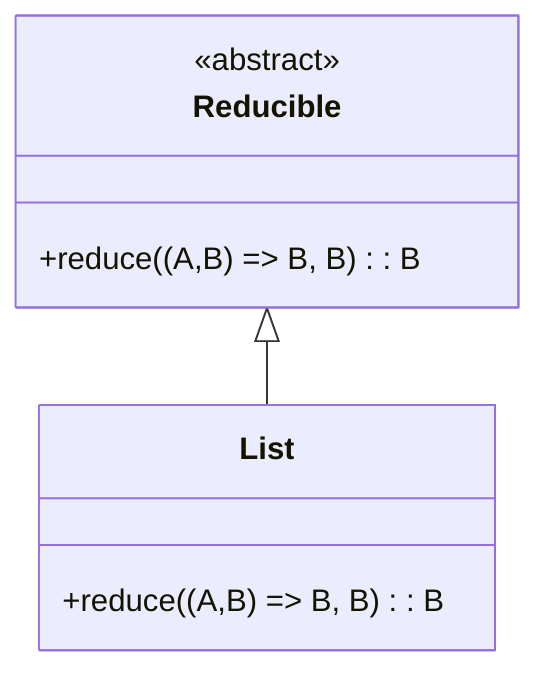

## Introduction

In functional programming, the `Reducible` design pattern refers to data structures that support *reduction operations*. A reduction operation, also known as a fold, is a method of processing elements of a data structure to produce a single cumulative result. This pattern plays a pivotal role in enabling concise, readable, and efficient transformations and aggregations of data.

Reducible data structures encapsulate their iteration mechanisms, allowing for cleaner and more generalized code. This article delves into the conceptual framework, implementation, and practical applications of the Reducible design pattern.

## Functional Programming and Reduction Operations

Reduction is a higher-order function that takes a combining function, an initial accumulator value, and a structure to reduce. The combining function iteratively integrates each element of the structure into the accumulator to produce a final result.

### Basic Example of Reduction

The classic example of a reduction operation is summing a list of numbers. 

```haskell
sum :: (Num a) => [a] -> a
sum = foldl (+) 0
```

In this Haskell example, `foldl` is a left-fold combinator that recursively processes the list, starting from the initial value `0`.

## The Reducible Pattern: Definition and Principle

The `Reducible` pattern can be abstracted into a set of core principles:

1. **Combine Function:** A binary function that specifies how two elements are to be combined.
2. **Identity Element:** An initial value that represents the base of the reduction.
3. **Traversal Mechanism:** A way to systematically traverse the data structure.

### Type Class Representation in Haskell 

A `Reducible` type class can be defined as follows:

```haskell
class Reducible r where
    reduce :: (a -> b -> b) -> b -> r a -> b
```

Here:

- `reduce` is the method that encapsulates the reduction logic.
- `a` represents the type of elements in the structure.
- `b` is the type of the accumulator.

### Data Structures Implementing Reducible

Different data structures can implement the `Reducible` interface. Here are a couple of examples:

#### Lists

A list is a classic example that supports reduction.

```haskell
instance Reducible [] where
    reduce = foldl
```

#### Trees

A binary tree can also be a candidate for reduction.

```haskell
data Tree a = Empty | Node a (Tree a) (Tree a)

instance Reducible Tree where
    reduce f b Empty = b
    reduce f b (Node x left right) = f x (reduce f (reduce f b right) left)
```

## Related Design Patterns

Several design patterns are closely related to `Reducible`:

### 1. **Functor**
The `Functor` pattern is about mapping functions over data structures, whereas `Reducible` is about folding data structures into single values.

### 2. **Monoid**
The `Monoid` pattern defines binary operations and an identity element which can be highly useful when defining reduction functionalities.

### 3. **Traversable**
This pattern defines a way to traverse a structure, applying a function and collecting results, and can be seen as a structure that facilitates reductions.

## Implementation Example in Scala

Here's an example of implementing `Reducible` in Scala:

```scala
trait Reducible[F[_]] {
  def reduce[A, B](fa: F[A])(f: (A, B) => B, b: B): B
}

object ListReducible extends Reducible[List] {
  def reduce[A, B](fa: List[A])(f: (A, B) => B, b: B): B =
    fa.foldLeft(b)(f)
}

val numbers = List(1, 2, 3, 4, 5)
val sum = ListReducible.reduce(numbers)((a, b) => a + b, 0)
```

## Visual Representation Using Mermaid

Below is diagram representing the Reducible pattern for a List.



## Additional Resources

- [Haskell Documentation on Folds](https://wiki.haskell.org/Foldr_Foldl_Foldl')
- [Functional Programming Patterns](http://www.functionalpatterns.com)
- [Scala Collections Library](https://docs.scala-lang.org/overviews/collections-2.13/overview.html)

## Summary

The `Reducible` design pattern is foundational in functional programming, enabling diverse data structures to support reduction operations. By abstracting the combining function, initial value, and traversal mechanism, `Reducible` facilitates elegant and efficient aggregations. Understanding and utilizing this pattern empowers developers to write more expressive and maintainable functional code.
