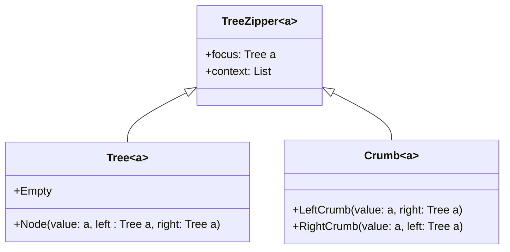

## Introduction

The **Zipper** is a powerful data structure used to traverse and perform localized updates on data structures, such as lists and trees, effectively. The name "Zipper" comes from the idea of "unzipping" a structure into a focused part and a context (which can be thought of as the rest of the structure). This enables efficient and straightforward manipulation, especially when combined with the functional programming paradigm. 

### Conceptual Overview

At its core, the Zipper consists of two primary components:
- **Focus**: The current element or node being examined or modified.
- **Context**: All other parts of the data structure, allowing you to reconstruct the whole structure if needed.

A typical usage scenario for the Zipper involves various tree manipulation tasks, where traversing up, down, left, and right nodes frequently is required.

## Zipper Data Structure

### Implementation Example
Here is a basic implementation of a Zipper for a binary tree in Haskell:

```haskell
data Tree a = Empty | Node a (Tree a) (Tree a) deriving (Show, Eq)

data TreeZipper a = TreeZipper {
    focus :: Tree a,
    context :: Breadcrumbs a
} deriving (Show, Eq)

type Breadcrumbs a = [Crumb a]

data Crumb a = LeftCrumb a (Tree a)
             | RightCrumb a (Tree a)
             deriving (Show, Eq)

goLeft :: TreeZipper a -> TreeZipper a
goLeft (TreeZipper (Node x l r) bs) = TreeZipper l (LeftCrumb x r : bs)

goRight :: TreeZipper a -> TreeZipper a
goRight (TreeZipper (Node x l r) bs) = TreeZipper r (RightCrumb x l : bs)

goUp :: TreeZipper a -> TreeZipper a
goUp (TreeZipper t (LeftCrumb x r : bs))  = TreeZipper (Node x t r) bs
goUp (TreeZipper t (RightCrumb x l : bs)) = TreeZipper (Node x l t) bs

-- Example of creating a simple tree and navigating with a zipper
let tree = Node 1 (Node 2 Empty Empty) (Node 3 Empty Empty)
let zipper = TreeZipper tree []
let newZipper = goLeft zipper
```

### Diagrams

#### Class Diagram
Here is class diagram to visually explain the Zipper data structure:



This diagram illustrates the relationships between the `Tree`, `Crumb`, and `TreeZipper` classes.

## Applying Zipper in Functional Programming

### Usage in Localized Updates

Zippers excel in scenarios requiring localized updates without re-transforming the entire data structure. Here’s how you might use a Zipper to update a node in a tree:

```haskell
updateFocus :: (a -> a) -> TreeZipper a -> TreeZipper a
updateFocus f tz@(TreeZipper (Node x l r) bs) = TreeZipper (Node (f x) l r) bs
updateFocus _ tz@(TreeZipper Empty _) = tz

let updatedZipper = updateFocus (+1) newZipper
```

### Traversal Capabilities

Given its structure, a Zipper supports efficient traversal in both directions. It can efficiently move up and down tree structures, with `goLeft`, `goRight`, and `goUp` operations as outlined in the earlier Haskell example.

## Related Design Patterns

Zipper is related to several other functional and data structure design patterns:
- **Iterator Pattern**: While Iterator typically supports sequential, possibly unidirectional traversal, Zipper focuses on bidirectional and hierarchical data traversal with localized updates.
- **State Monad**: The State Monad can be used in functional programming to manage state updates in a pure functional way, similar to how Zipper manages the context.
- **Lens**: Lens, a functional programming concept, also focuses on localized updates and access to data structures, often leveraging Zipper-like navigation for its operations.

## Additional Resources

### Books
- "Purely Functional Data Structures" by Chris Okasaki: A comprehensive book on data structures in functional programming.
- "Functional Programming in Scala" by Paul Chiusano and Runar Bjarnason: Contains practical insights and examples on Zippers and other functional structures.

### Articles and Tutorials
- "Zippers: Functional Pearl" by Gérard Huet: An influential paper that provides foundational understanding and examples.
- Online tutorials on Zipper implementations in various functional languages like Haskell and Scala.

## Summary
The Zipper data structure is a versatile tool in the functional programming toolkit. By enabling efficient bidirectional traversal and localized updates, it caters to complex tree structures and scenarios requiring fine-grained modifications. Its relationship with other design patterns like iterators and lenses further enhances its utility in crafting robust, maintainable, and efficient functional programs.

By mastering Zipper, functional programmers can manipulate data structures with increased flexibility and precision, integrating seamlessly within the broader ecosystem of functional data structures and monads. This makes Zipper not only a theoretical concept but a practical tool for real-world applications.
