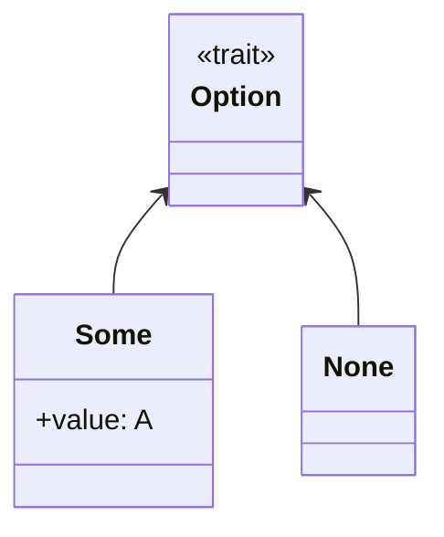

## Introduction

In functional programming, safely handling values that may or may not be present is a common concern. The **Option** design pattern provides a type-safe way to encapsulate optional values, eliminating the need for null references, which are a common source of runtime errors. This design pattern ensures that functions and methods operate robustly in the presence of absent values.

## What is Option?

The Option design pattern is essentially a container type that represents the presence or absence of a value. It is analogous to the `Maybe` type used in other functional programming languages.

### Variants of Option

- **Some**: Represents the presence of a value.
- **None**: Represents the absence of a value.

The `Option` type is an algebraic data type that can be either `Some(value)` or `None`.

In Scala, the `Option` type can be implemented as follows:

```scala
sealed trait Option[+A]

case class Some[+A](value: A) extends Option[A]
case object None extends Option[Nothing]
```

## Basic Usage

The Option pattern can be used effectively to prevent null pointer exceptions by forcing explicit handling of the presence or absence of values.

### Creating an Option

To create an option in Scala:

```scala
val someValue: Option[Int] = Some(42)
val noneValue: Option[Int] = None
```

### Pattern Matching

Pattern matching is a common technique for handling `Option` values:

```scala
def printOption(option: Option[Int]): Unit = option match {
  case Some(value) => println(s"Value: $value")
  case None        => println("No value")
}
```

### Default Values

Using `getOrElse` to provide a default value in case of `None`:

```scala
val value: Option[Int] = None
val result: Int = value.getOrElse(0) // result will be 0
```

## Related Design Patterns

### Either

The `Either` type is another commonly used functional pattern, representing a value that can be one of two types, usually `Left` (error) or `Right` (success). It is often used for error handling in functional languages.

### Monad

Both `Option` and `Either` are Monad instances, which means they follow the Monad laws (identity, associativity) and provide methods like `map`, `flatMap`, and `filter` to facilitate function composition.

### Try

`Try` is used to handle exceptions in a more functional way. It can be `Success(value)` or `Failure(exception)`. It helps in writing concise and clean code for operations that might throw exceptions.

```scala
import scala.util.{Try, Success, Failure}

def parseInt(s: String): Try[Int] = Try(s.toInt)

parseInt("123") match {
  case Success(value) => println(s"Parsed value: $value")
  case Failure(ex)    => println(s"Failed to parse value: ${ex.getMessage}")
}
```

## UML Representation

Below is a UML class diagram rendered using Mermaid to visualize the `Option` type.



## Additional Resources

- [Scala Standard Library: Option](https://www.scala-lang.org/api/2.13.7/scala/Option.html)
- [Functional Programming in Scala](https://www.manning.com/books/functional-programming-in-scala)
- [Haskell: Maybe Type](https://hackage.haskell.org/package/base/docs/Data-Maybe.html)
- [Category Theory for Programmers](https://github.com/hmemcpy/milewski-ctfp-pdfs)

## Summary

The `Option` design pattern is a powerful tool in functional programming for handling values that may or may not be present. By using `Option`, code becomes more robust and avoid potential runtime errors associated with null references. The pattern integrates well with other functional programming concepts and design patterns, such as `Either`, `Monad`, and `Try`, ensuring more expressive and safer codebases.

By leveraging the `Option` type, developers can write more predictable, cleaner, and maintainable code while adhering to the functional programming paradigm's principles.
