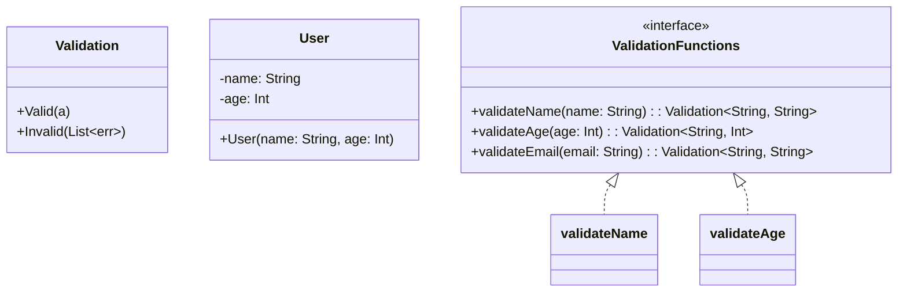
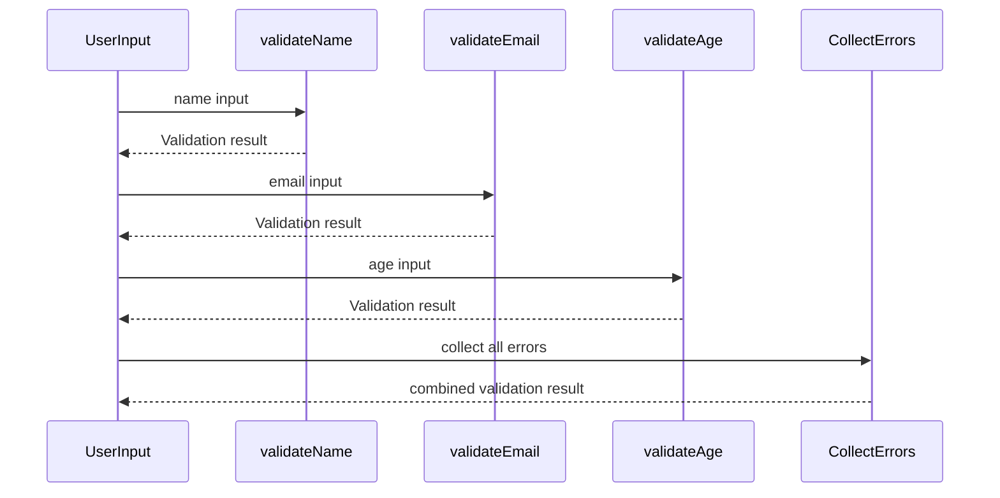

Validation is a crucial aspect of software development, ensuring data correctness and providing meaningful feedback to users. In many programming paradigms, when validations fail, the process stops at the first encountered error, a behavior known as short-circuiting. However, in functional programming, it is often more useful to collect all validation errors simultaneously and return them collectively. This approach provides a holistic view of data correctness, facilitating comprehensive error reporting and more effective debugging.

## Understanding the Validation Pattern

The Validation design pattern focuses on accumulating multiple validation results into a single coherent output. Instead of terminating validation upon encountering the first error, each possible error is collected and reported back to the caller. This pattern ensures that all potential issues are identified upfront, resulting in more informative feedback and robust error handling.

## Core Concepts

### Functor and Applicative Functor

The Validation pattern relies heavily on key functional programming concepts:

- **Functor**: An abstraction that allows applying a function to values wrapped in a context (e.g., `Validated` type).
- **Applicative Functor**: Extends functors by enabling the application of a function that is itself wrapped in a context to values wrapped in a context.

These concepts form the backbone of the pattern, allowing multiple validations to be combined in a seamless and expressive manner.

### Validated Type

A specialized data type is commonly used to model the validation results. The `Validated` type can have two states:
- `Valid`: Represents a successful validation with a valid value.
- `Invalid`: Represents a failed validation with a collection of error messages.

Here's a simple implementation in Haskell:

```haskell
data Validation err a = Valid a | Invalid [err]
```

This type facilitates the accumulation of multiple errors while maintaining the validity of successful operations.

### Combining Validations

To combine validations, we utilize the properties of Applicative Functors. Consider two validation functions:

```haskell
validateName :: String -> Validation String String
validateName name
  | null name = Invalid ["Name cannot be empty"]
  | otherwise = Valid name

validateAge :: Int -> Validation String Int
validateAge age
  | age < 0 = Invalid ["Age cannot be negative"]
  | otherwise = Valid age
```

We can combine these validations as follows:

```haskell
data User = User { name :: String, age :: Int }

validateUser :: String -> Int -> Validation String User
validateUser name age = User <$> validateName name <*> validateAge age
```

### Example Using Applicative Functors

Let's see a concrete example of combining validations. Suppose we want to validate user input for creating a new account:

```haskell
validateEmail :: String -> Validation String String
validateEmail email
  | not (isValidEmail email) = Invalid ["Invalid email format"]
  | otherwise = Valid email

-- Combines validations using Applicative Functors
validateAccount :: String -> String -> Int -> Validation String (String, String, Int)
validateAccount name email age = (,,) <$> validateName name <*> validateEmail email <*> validateAge age
```

In this example, any invalid states from the `validateName`, `validateEmail`, and `validateAge` functions are accumulated and reported back together.

## UML Class and Sequence Diagrams

### Class Diagram

Below is a UML class diagram representing the `Validation` pattern:



### Sequence Diagram

Here is sequence diagram detailing the validation process:



## Related Design Patterns

- **Maybe/Option Type**: Deals with the possibility of absence of a value.
- **Either Type**: Represents a value of one of two possible types (a disjoint union).
- **Monad**: Provides a way to chain operations together, common in managing side effects and computations.
- **Error Accumulation Monoid**: Aggregates multiple error messages into a single, comprehensive report.

## Additional Resources

For further reading, consider exploring:

- [Functors, Applicative Functors, and Monads in Functional Programming](https://wiki.haskell.org/Functor)
- [Handling Errors in Functional Languages](https://functionalprogramming.com)
- [Monad Transformers Step by Step](http://book.realworldhaskell.org/read/monad-transformers.html)
- [Applicative Do Notation](https://downloads.haskell.org/~ghc/latest/docs/html/users_guide/glasgow_exts.html#applicative-do)

## Summary

The Validation design pattern in functional programming offers an elegant way to collect all validation errors without short-circuiting. By leveraging functors and applicative functors, it enables combining multiple validation functions efficiently. The result is a comprehensive error report that is invaluable for debugging and better user feedback. The underlying concepts also connect with other functional patterns like `Maybe`, `Either`, and monads, making it a versatile tool in the functional programmer's toolkit.

Understanding and applying this pattern can significantly enhance the robustness of error handling in functional applications, ensuring fewer bugs and better development experience.
