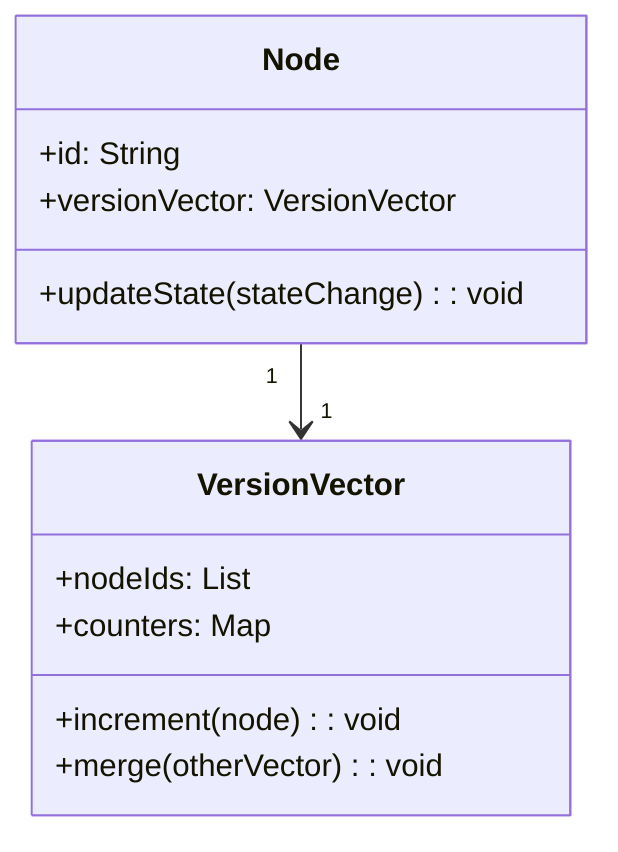
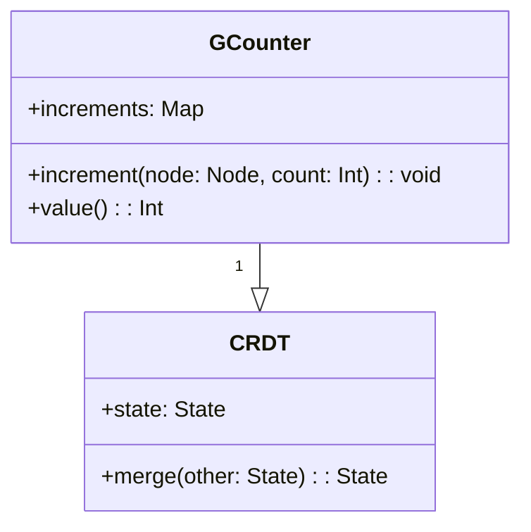
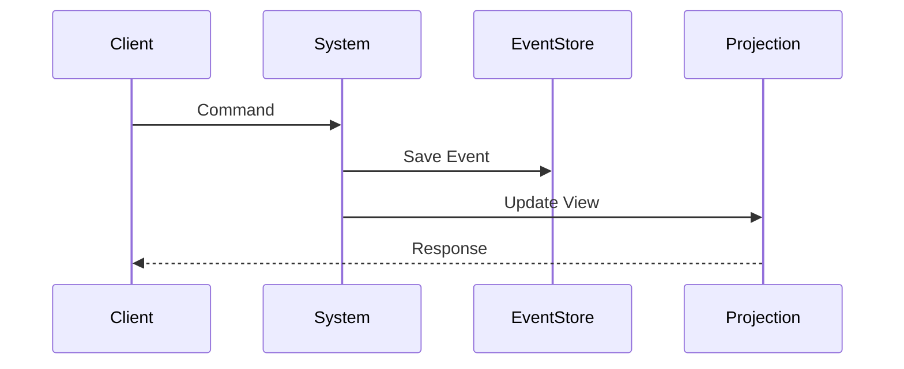

Eventual consistency is a consistency model used in distributed computing to achieve high availability. In this article, we will explore the concept of eventual consistency, its importance, and how it can be effectively implemented using functional programming principles and design patterns. We will also delve into related design patterns and provide additional resources for further reading.

## Understanding Eventual Consistency

Eventual consistency is a consistency model that ensures that, given enough time, all replicas of a distributed system will converge to the same state. Unlike strong consistency models that require immediate consistency across all nodes, eventual consistency allows for temporary discrepancies between replicas, aiming for consistency in the long run. This trade-off is often necessary to achieve high availability and resilience in distributed systems.

### Key Concepts

1. **Replication**: The process of storing copies of data objects across multiple nodes.
2. **Convergence**: The process by which all replicas eventually reach a consistent state.
3. **Latency**: The time delay between a write operation and the convergence of replicas.
  
## Functional Programming and Eventual Consistency

Functional programming principles, such as immutability and side-effect-free functions, provide a strong foundation for implementing eventual consistency. Pure functions can be composed to form predictable systems, enabling the creation of robust and reliable distributed systems.

### Core Principles

1. **Idempotence**: Ensures that multiple identical operations have the same effect as a single operation.
2. **Immutability**: Data is never modified after creation, which simplifies reasoning about state changes.
3. **Referential Transparency**: Functions produce the same output given the same input, and have no side effects, facilitating easier state management.

## Design Patterns for Eventual Consistency

### Version Vectors

A version vector is a method for tracking causality between different versions of an object in a distributed system. Each node maintains a vector of counters, representing the version of the object as seen by the node.

#### Example

Let's consider a simple example with three nodes:

- Node A updates the state and increments its counter.
- Node B does the same independently.
- When the nodes share their state, they merge the version vectors to determine the latest state.

### Conflict-free Replicated Data Types (CRDTs)

CRDTs are data structures designed to ensure eventual consistency and resolve conflicts automatically. They leverage mathematical properties to allow concurrent modifications and eventual reconciliation without communication.

#### Example

Consider a G-Counter CRDT, which supports only increments:

1. Each node locally increments its counter.
2. When they communicate, the counters are merged by taking the maximum value for each node.

### Event Sourcing

Event sourcing captures all changes to the state as a sequence of events. Each event is immutable, and the current state is derived from replaying these events.

#### Example

In an event-sourced system, the state evolution is determined by:

1. Events being stored immutably.
2. New state being derived by applying events to the initial state.

## Related Design Patterns

1. **Saga Pattern**: Manages distributed transactions by breaking them into a series of steps, each with a compensating action.
2. **Circuit Breaker Pattern**: Prevents repeated attempts to execute failing operations in a system.
3. **Outbox Pattern**: Ensures message delivery in the presence of eventual consistency by storing messages in a separate "outbox" table.

## Additional Resources

1. [Designing Data-Intensive Applications by Martin Kleppmann](https://www.oreilly.com/library/view/designing-data-intensive-applications/9781491903063/)
2. [Event Sourcing: The Good, the Bad, and the Meh](https://martinfowler.com/articles/201701-event-sourcing.html)
3. [Conflict-free Replicated Data Types (CRDTs) – Consistency Without Coordination](https://crdt.tech/)

## Summary

Eventual consistency aims to achieve balance between availability and consistency in distributed systems. Leveraging functional programming principles and design patterns such as version vectors, CRDTs, and event sourcing, developers can create robust and resilient distributed applications. While eventual consistency may introduce temporary inconsistencies, its benefits in terms of availability and scalability make it a powerful tool for building distributed systems.

This article has provided an in-depth exploration of eventual consistency and related design patterns. For further reading, check the additional resources provided and continue exploring how functional programming can enhance your distributed system designs.
