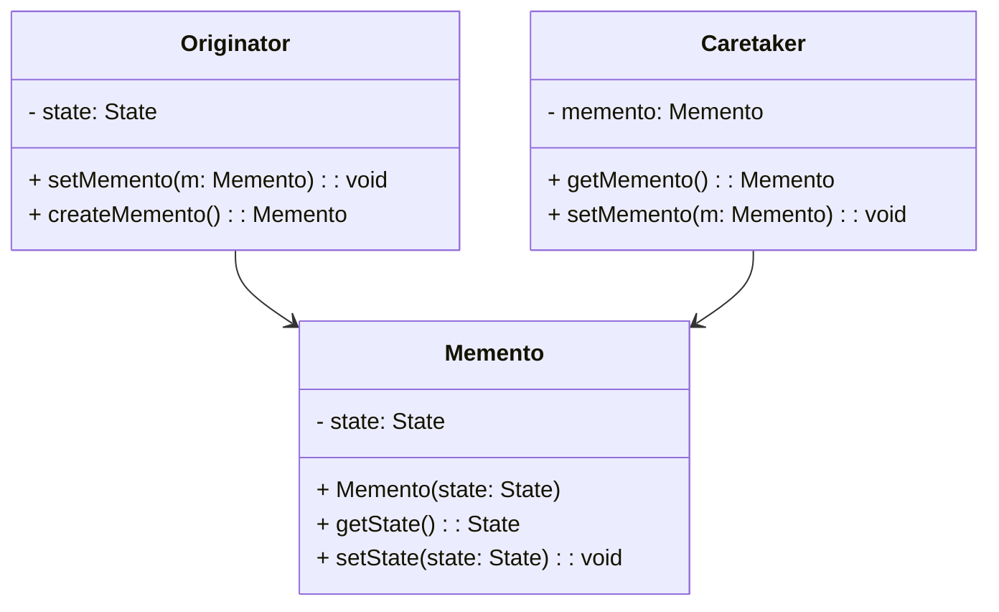

The Memento design pattern is a behavioral design pattern that allows the capture and externalization of an object's internal state so that it can be restored later without violating encapsulation. This is particularly useful in scenarios where an object's state changes but may need to be reverted to a previous state, such as in undo operations.

## Principles of the Memento Pattern

The Memento pattern consists of three primary components:

1. **Originator**: The object whose state needs to be saved and restored.
2. **Memento**: The object that stores the internal state of the Originator. It's opaque to other objects and provides a way to restore the state without revealing the details.
3. **Caretaker**: Manages the memento and ensures the Originator can revert to a previous state.

### UML Class Diagram



### Functional Programming Approach

In functional programming, Memento can be elegantly implemented using immutable data structures and pure functions. Here is an example in Haskell:

```haskell
-- Define the state type
type State = (Int, String)

-- Originator Function
setMemento :: State -> State -> State
setMemento _ newMemento = newMemento

createMemento :: State -> State
createMemento state = state

-- Caretaker Function
storeMemento :: State -> IO ()
storeMemento state = writeFile "memento.txt" (show state)

restoreMemento :: IO State
restoreMemento = do
    content <- readFile "memento.txt"
    return (read content)
```

### Implementation Insights

#### Immutability

Since functional programming stresses immutability, the saved state (Memento) is naturally compatible with the functional paradigm. The state can be passed around and transformed without altering the original data, which ensures that encapsulation and state integrity are maintained.

#### Pure Functions

Functions like `createMemento` and `setMemento` are pure functions because they respect immutability. These functions can be composed and tested independently, ensuring that the Memento pattern aligns well with functional programming principles.

## Related Design Patterns

### Command Pattern

The **Command Pattern** can be related to Memento for implementing undoable operations. Each command can store its state as a Memento, enabling rollback functionality.

### Prototype Pattern

The **Prototype Pattern** makes use of cloning and can be used in conjunction with Memento to create snapshots of the current state that can be restored later.

### Strategy Pattern

The **Strategy Pattern** and Memento can work together to manage state transitions. Each strategy might produce different states that you can store or revert to using the Memento pattern.

## Additional Resources

1. [Refactoring Guru's Memento Pattern](https://refactoring.guru/design-patterns/memento)
2. [Head First Design Patterns](https://www.oreilly.com/library/view/head-first-design/9781492077992/)
3. [Design Patterns: Elements of Reusable Object-Oriented Software](https://www.goodreads.com/book/show/85009.Design_Patterns)

## Summary

The Memento design pattern in functional programming captures an object's internal state in a way that maintains immutability, ensuring that state transitions are managed cleanly and performance costs associated with state copies are minimal. This pattern is pivotal for implementing undo functionality, state management, and ensuring the integrity of state transitions. By adhering to functional programming principles, Memento avoids common pitfalls of state management and enhances code maintainability and reliability.
