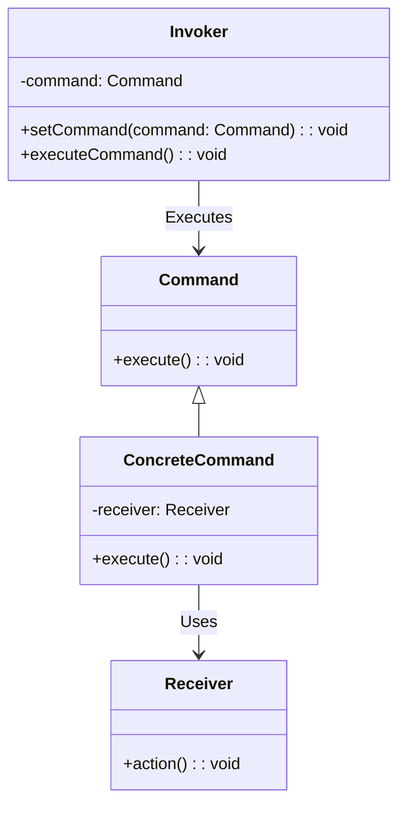

## Introduction

The **Command Pattern** is a behavioral design pattern used widely in both object-oriented and functional programming paradigms. Its primary function is to encapsulate a request or operation as an object, allowing clients to parameterize other objects with various requests, queue requests, and log them for support of undoable operations.

## Conceptual Overview

In functional programming, the emphasis is on functions as first-class citizens. The command pattern fits well into this paradigm by treating commands as high-order functions. Each command encapsulates an action and its parameters, making it modular and reusable.

### Diagrammatic Representation

Here is a high-level overview of how commands interact with an invoker and receiver to execute requests.



## Components

### Command Interface

The command interface declares the method for executing a command.

```haskell
class Command c where
    execute :: c -> IO ()
```

### Concrete Command

This class (in the object-oriented sense) or type (in the functional programming sense) implements the `Command` interface by binding together a `Receiver` object, which contains the actual method to be called.

```haskell
data ConcreteCommand = ConcreteCommand { receiver :: Receiver }

instance Command ConcreteCommand where
    execute (ConcreteCommand r) = action r
```

### Receiver

The `Receiver` class contains the actual business logic that the command will invoke.

```haskell
data Receiver = Receiver

action :: Receiver -> IO ()
action = putStrLn "Action performed by Receiver"
```

### Invoker

The `Invoker` class is responsible for initiating commands. It holds a reference to a command object and triggers the action.

```haskell
data Invoker = Invoker { command :: Command c => c }

setCommand :: Command c => Invoker -> c -> Invoker
setCommand _ cmd = Invoker cmd

executeCommand :: Invoker -> IO ()
executeCommand (Invoker cmd) = execute cmd
```

## Related Design Patterns

Several design patterns complement or are closely related to the Command Pattern:

- **Chain of Responsibility**: Links receivers to different handlers, passing requests along the chain.
- **Memento**: Captures and externalizes the internal state of an object, facilitating the undo functionality.
- **Strategy**: Encapsulates a family of algorithms, enabling interchangeability.
- **Visitor**: Allows for new operations to be added to complex object structures without modifying the structures.

### Chain of Responsibility Pattern
The Chain of Responsibility pattern works well with the command pattern to forward the command to multiple handlers, trying each until one handles the command. 

### Memento Pattern
Memento can provide undo capabilities in conjunction with the Command pattern, storing snapshots of the application state before or after commands are executed.

### Strategy Pattern
Commands encapsulate requests, the Strategy pattern can modularize and interchange the algorithms executed by these commands.

### Visitor Pattern
Use the Visitor pattern when you need to perform various operations on a collection of objects contained in a structure, whilst ensuring each command can interact appropriately.

## Summary

The **Command Pattern** offers a robust mechanism to modularize and encapsulate requests as objects in functional programming. By abstracting the invocation and execution of commands, it decouples the invoker from the receiver and paves the way for flexible command processing strategies such as queuing, logging, and undo.

### Additional Resources

- [Functional Programming in Scala](https://www.manning.com/books/functional-programming-in-scala)
- [Design Patterns: Elements of Reusable Object-Oriented Software](https://www.goodreads.com/book/show/85009.Design_Patterns)
- [Functional Programming Principles in Scala - Coursera](https://www.coursera.org/learn/scala-functional-programming)

This article should provide you with a comprehensive understanding of the Command Pattern in the context of functional programming. The associated UML diagrams and Haskell examples illustrate the encapsulation and modularity of commands, ensuring clarity in application design.
