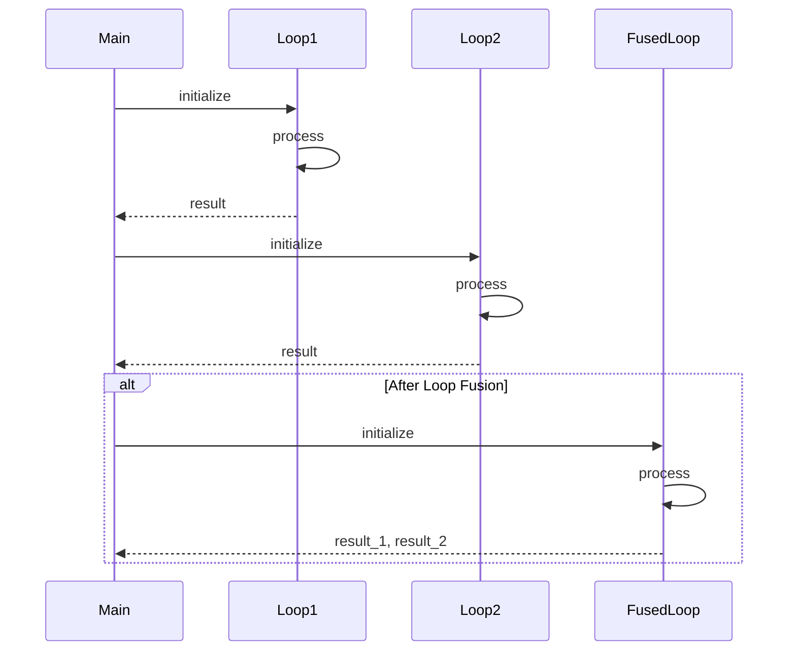

## Introduction

Loop Fusion is an optimization design pattern commonly applied in functional programming and high-performance computing. It involves combining adjacent loops that traverse the same range into a single loop, thereby reducing the overhead associated with loop iteration and improving cache performance.

## The Loop Fusion Concept

Loop fusion, also referred to as loop jamming, is a technique where multiple loops running over the same indices are merged. This consolidation of loops minimizes redundant operations and results in enhanced computational efficiency. Here is an illustrative example:

### Before Loop Fusion

```scala
val arr = Array(1, 2, 3, 4, 5)
val res1 = new Array[Int](arr.length)
val res2 = new Array[Int](arr.length)

for (i <- arr.indices) {
  res1(i) = arr(i) * 2
}

for (i <- arr.indices) {
  res2(i) = arr(i) + 3
}
```

### After Loop Fusion

```scala
val arr = Array(1, 2, 3, 4, 5)
val res1 = new Array[Int](arr.length)
val res2 = new Array[Int](arr.length)

for (i <- arr.indices) {
  val elem = arr(i) 
  res1(i) = elem * 2
  res2(i) = elem + 3
}
```

## The Benefits

1. **Reduced Overhead**: Fewer loop initialization and iteration steps.
2. **Improved Cache Performance**: Better spatial and temporal locality.
3. **Increased Readability**: Reduces code length and promotes compactness, enhancing clarity.

## Related Design Patterns

### Map-Reduce Pattern

Map-Reduce is a parallel processing design pattern that applies a function (the "map" part) to each element in a sequence and then combines (or "reduces") the results. Loop Fusion can be considered an optimization on the map phase, where multiple map operations are fused.

### Lazy Evaluation

While Loop Fusion seeks to minimize runtime overhead by combining loops, lazy evaluation delays computation until the results are needed, which can sometimes affect just-in-time loop fusion in frameworks that utilize deferred computations.

## Code Implementation

Here is a more detailed implementation in Scala, featuring Loop Fusion with added complexity:

### Initial Separate Loops

```scala
val data = Array(1, 2, 3, 4, 5)
val squared = new Array[Int](data.length)
val incremented = new Array[Int](data.length)

for (i <- data.indices) {
  squared(i) = data(i) * data(i)
}

for (i <- data.indices) {
  incremented(i) = data(i) + 1
}
```

### Fused Loop

```scala
val data = Array(1, 2, 3, 4, 5)
val squared = new Array[Int](data.length)
val incremented = new Array[Int](data.length)

for (i <- data.indices) {
  val value = data(i)
  squared(i) = value * value
  incremented(i) = value + 1
}
```

## Using KaTeX for Theoretical Explanation

Mathematically, assume two operations \\( f(x) \\) and \\( g(x) \\) applied over an index range. The naive approach would require \\( O(n + n) \\) iterations:


\sum_{i=1}^{n} f(x_i) + \sum_{i=1}^{n} g(x_i)


Using Loop Fusion, the operations are applied in a single loop of \\( O(n) \\):


\sum_{i=1}^{n} (f(x_i) + g(x_i))


## UML Sequence Diagram

Here is a sequence diagram to visualize the fusion process:



## Additional Resources

- **Books**: 
  - "Functional Programming in Scala" by Paul Chiusano and Runar Bjarnason
  - "Optimizing Compilers for Modern Architectures: A Dependence-based Approach" by Randy Allen and Ken Kennedy

- **Online Articles**:
  - [Loop Fusion in Functional Programming](https://www.functionalprogramming.com/loop-fusion)
  - [Optimizing Functional Programs](https://www.compileroptimization.com/functional-programming)

## Summary

Loop Fusion is an essential optimization pattern, streamlining computation by merging multiple adjacent loops into a single loop. This not only reduces the overhead but also significantly improves the overall performance of functional programs. By understanding and applying this pattern, functional programmers can write more efficient and readable code. Further exploration of related patterns and additional resources can deepen the comprehension and application of these concepts in real-world scenarios.
