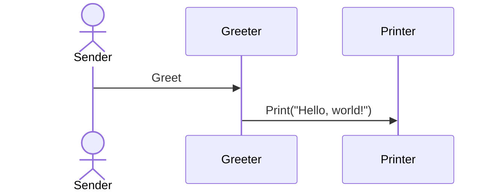

## Introduction

The Actors pattern is a design principle central to building concurrent and distributed systems. Originating from the Actor Model introduced by Carl Hewitt in the 1970s, this pattern treats "actors" as the fundamental units of computation. Each actor operates concurrently, communicates exclusively through message passing, and manages its own state independently. This approach facilitates scalable, resilient, and maintainable systems which align well with the principles of functional programming.

## Principles of the Actors Pattern

### 1. Concurrency

Actors execute concurrently without shared state. Each actor can process messages in isolation, allowing for parallel execution and eliminating the complexity of thread synchronization.

### 2. Encapsulation

Actors encapsulate state and behavior. Only the actor itself can modify its state, which is hidden from the external world, providing a robust boundary that prevents unintended interactions.

### 3. Communication via Message Passing

Actors communicate only through asynchronous message passing. This decouples the sender and the receiver, enabling flexible interactions in distributed systems.

### 4. Scalability

Actor systems can scale vertically (by increasing resources on a single machine) and horizontally (by distributing actors across multiple machines). This makes them suitable for building highly scalable applications.

### 5. Resilience

Actors can be supervised and restarted individually upon failure without affecting the rest of the system, enhancing fault tolerance.

## Implementation 

### Actor Behavior and State Management

Actors define a behavior that dictates how to handle incoming messages. Here's a simplified example in Scala using the Akka library:

```scala
import akka.actor.{Actor, ActorSystem, Props}

case object Greet

class Greeter extends Actor {
  def receive: Receive = {
    case Greet => println("Hello, world!")
  }
}

object Main extends App {
  val system = ActorSystem("MyActorSystem")
  val greeter = system.actorOf(Props[Greeter], "greeter")
  greeter ! Greet
}
```

In this example:
- The `Greeter` actor class defines a behavior (`receive` method) to handle `Greet` messages.
- The `ActorSystem` manages actors within a hierarchy.
- The `!` operator sends an asynchronous message to the actor.

### Diagram

Below is Sequence Diagram illustrating the interaction between actors:



## Benefits of the Actors Pattern

- **Modular Design:** Code is organized around actors, each responsible for specific functionality.
- **Simplified Concurrency:** Eliminates the pitfalls of shared state and locks.
- **Fault Tolerance:** Supervision strategies can automatically handle and recover from failures.
- **Flexibility:** Ideal for distributed systems, microservices, and real-time applications.

## Related Design Patterns

### 1. **Reactor Pattern**
   - Focuses on handling service requests that are delivered concurrently to a service handler by one or more dispatchers.

### 2. **Proactor Pattern**
   - An asynchronous programming pattern where processing of events occurs sequentially.

### 3. **Publisher-Subscriber Pattern**
   - Decouples the sender of messages (publisher) from the receiver (subscriber), similar to the decoupling in the Actor model.

### 4. **Command Pattern**
   - Encapsulates a request as an object, thereby parameterizing clients with queues, requests, and operations.

## Additional Resources

- **Books**
  - "Programming Scala" by Dean Wampler and Alex Payne
  - "Akka in Action" by Raymond Roestenburg, Rob Bakker, and Rob Williams
  
- **Articles and Papers**
  - "The Actor Model in 10 Minutes" by Bartosz Milewski
  - "Actors, Gates, and Locks: The Path to Parallelism?" by Joe Armstrong
  
- **Online Tutorials**
  - Akka Documentation: https://akka.io/docs

## Summary

The Actors pattern is a robust, functional programming design pattern that embraces concurrency, modularity, scalability, and resilience. By leveraging message passing and independent state management, actors can build complex, distributed systems that are easy to reason about and maintain. Understanding and implementing the actors pattern can significantly enhance the ability to develop scalable and resilient applications.

This article has discussed the foundational principles, implementation details, and related design patterns to provide a comprehensive understanding of the Actors pattern in functional programming.
