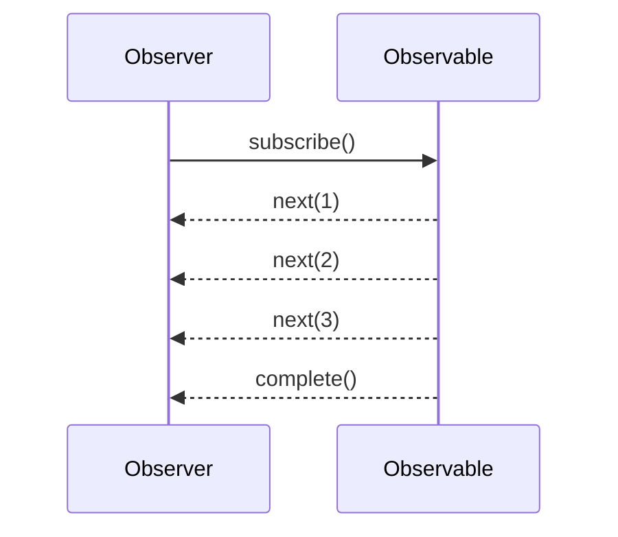

## Observable: Emitting sequences of data/events over time

### Introduction

The **Observable** pattern allows a function to asynchronously emit multiple values over time. These values can be events, a series of operations, or even changes in states. Observers (or subscribers) can subscribe to these observables to receive the emitted values as they occur.

In functional programming, the Observable pattern is often associated with the reactive programming paradigm. It supports composing async and event-based programs using sequences or streams of data.

### Basic Composition

Observers can subscribe to an observable using a callback mechanism, responding to emissions or errors produced by the observable. Observables can be finite (producing a determined number of emissions) or infinite (potentially running and emitting values endlessly).

#### Key Concepts:

- **Observable**: Represents a collection of future values or events.
- **Observer**: An entity that subscribes to the observable to receive notifications about emitted values or errors.
- **Subscription**: A channel through which the observer interacts with the observable, able to cancel the listening of future values.
- **Operators**: Functional methods available on observables (such as `map`, `filter`, `reduce`) to transform and query the stream of emitted values.

### Example in JavaScript with RxJS

```javascript
const { Observable } = require('rxjs');

// Create an observable
const observable = new Observable(subscriber => {
  subscriber.next(1);
  subscriber.next(2);
  subscriber.next(3);
  subscriber.complete();
});

// Create an observer
const observer = {
  next: (x) => console.log(`Observer received value: ${x}`),
  error: (err) => console.error(`Observer received error: ${err}`),
  complete: () => console.log('Observer received complete notification'),
};

// Subscribe the observer to the observable
observable.subscribe(observer);
```

### Functional Aspects

Unlike imperative programming, observables focus on what to emit and how to transform emissions over time, using a declarative style. Operators are typically designed to be side-effect-free and composable.

### Related Design Patterns

1. **Iterator Pattern**:
   - The Iterator allows for traversing a collection, while observables are focused on emitting and managing streams over time.
   
2. **Pub/Sub (Publish/Subscribe)**:
   - Similar in its decoupling of producers and consumers; however, observables offer additional powerful processing capabilities.
   
3. **Monads**:
   - Observables can be seen as a form of monadic structures, promoting flat-mapping and chaining behaviors, similar to collections like Lists or Futures.
   
### Practical Applications

- **User Interface Events**:
  - Handling user inputs or control movements in an event-driven manner.
- **Data Streams**:
  - Processing live data feeds like stock market prices or chat messages.
- **Async Processing**:
  - Managing asynchronous workflows or sequences of HTTP requests.

### Sequence Diagram

Here's a sequence diagram to visualize the interaction between an Observer and Observable:



### Additional Resources

1. **ReactiveX Documentation**: https://reactivex.io/documentation/observable.html
2. **"Reactive Programming with RxJS" by Sergi Mansilla**:
   - A comprehensive guide to leveraging RxJS for reactive programming in JavaScript.
3. **"Functional Reactive Programming" by Stephen Blackheath and Anthony Jones**:
   - Explores reactive programming principles in-depth using functional programming concepts.
  
### Summary

The Observable pattern is instrumental in variably timed data/emission processing in functional programming. Its ability to compose and transform sequences declaratively and efficiently fits perfectly into the reactive programming paradigm. By blending with other design patterns like Iterator and Pub/Sub, observables provide a robust solution for managing asynchronous data streams.

Understanding the nuance and applications of observables can significantly enhance your functional programming practices and approaches toward handling time-based or event-based data elegantly.
