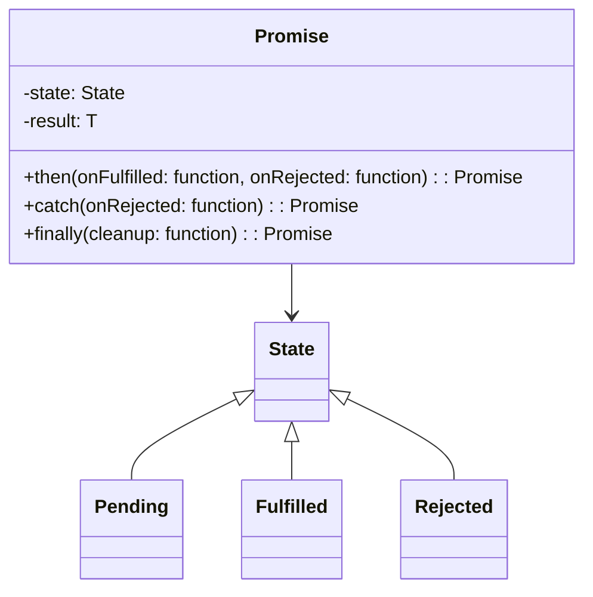
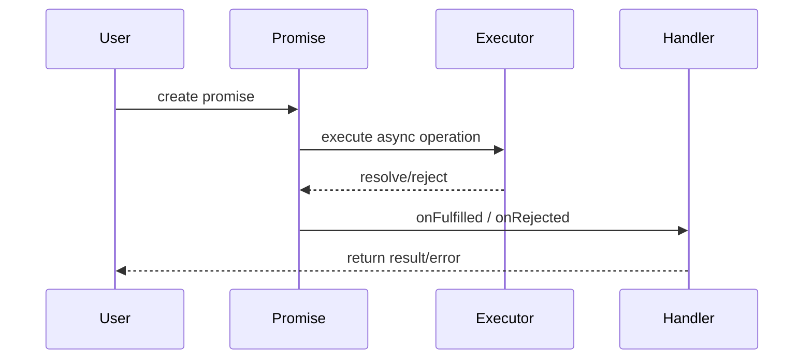

## Introduction

In functional programming, a **Promise** is a design pattern that represents a value that may be available now, or sometime in the future, or perhaps never. Promises are instrumental in managing asynchronous operations effectively, allowing developers to write code that handles future values without resorting to deeply nested callbacks—a situation often referred to as "callback hell".

## Definition

A promise is an object which can be in one of three states:

1. **Pending**: Initial state, neither fulfilled nor rejected.
2. **Fulfilled**: Meaning that the operation completed successfully.
3. **Rejected**: Meaning that the operation failed.

Here's a basic example in JavaScript:

```javascript
const promise = new Promise((resolve, reject) => {
  setTimeout(() => {
    resolve('Promise fulfilled!');
  }, 1000);
});

promise.then(result => {
  console.log(result); // Logs "Promise fulfilled!" after 1 second
}).catch(error => {
  console.error(error);
});
```

## Working with Promises

Promises provide a cleaner, more intuitive way of handling asynchronous operations compared to traditional callback methods. They support a chainable API, making the code more readable and maintainable.

### Basic Operations

- **Creating Promises**:
  ```javascript
  new Promise((resolve, reject) => {
    // Executor function where asynchronous operations take place.
  });
  ```
- **Consuming Promises**:
  ```javascript
  promise.then(successHandler).catch(failureHandler).finally(cleanupHandler);
  ```
- **Chaining Promises**:
  ```javascript
  promise
    .then(firstHandler)
    .then(secondHandler)
    .catch(errorHandler);
  ```

### Example: Asynchronous Data Fetching

Here's an example of using Promises to fetch data asynchronously using the Fetch API:

```javascript
const fetchData = url => {
  return fetch(url)
    .then(response => response.json())
    .then(data => {
      console.log('Data fetched:', data);
      return data;
    })
    .catch(error => {
      console.error('Error fetching data:', error);
    });
};

fetchData('https://api.example.com/data');
```

## Advantages of Promises

- **Avoiding Callback Hell**: Promises prevent deeply nested callbacks, which complicate code.
- **Error Handling**: All errors are handled in a single `.catch()` handler.
- **Readability**: Promises allow asynchronous code to be written in a more synchronous, linear style.

## Alternative Usage and Related Patterns

While Promises are widely used for handling asynchronous operations, there are related patterns and constructs with similar goals:

### Future

Similar to Promises but more common in other programming languages such as Scala or Dart. Futures represent values that might not yet be available, but unlike Promises, they can't be manually completed using `resolve` or `reject`.

### Async/Await

Async/Await is syntactic sugar around Promises, making asynchronous code look more like synchronous code:

```javascript
async function fetchData(url) {
  try {
    const response = await fetch(url);
    const data = await response.json();
    console.log('Data fetched:', data);
    return data;
  } catch (error) {
    console.error('Error fetching data:', error);
  }
}

fetchData('https://api.example.com/data');
```

### Reactive Extensions (RxJS)

RxJS (Reactive Extensions for JavaScript) is a library for composing asynchronous and event-based programs using observables. It provides more powerful operators for handling streams of data:

```javascript
import { from, interval } from 'rxjs';
import { map, filter } from 'rxjs/operators';

const observable = from([1, 2, 3, 4, 5]).pipe(
  filter(x => x % 2 === 0),
  map(x => x * x)
);

observable.subscribe(value => console.log(value)); // Output: 4, 16
```

## UML Diagrams

### Class Diagram



### Sequence Diagram



## Additional Resources

- [Mozilla Developer Network (MDN) Web Docs on Promises](https://developer.mozilla.org/en-US/docs/Web/JavaScript/Reference/Global_Objects/Promise)
- [JavaScript.Info: Promises](https://javascript.info/promise-basics)
- *JavaScript: The Good Parts* by Douglas Crockford
- *Eloquent JavaScript* by Marijn Haverbeke

## Conclusion

Promises revolutionize asynchronous programming in functional programming by providing a straightforward and efficient way to handle future values. They simplify error handling, improve code readability, and are the foundation for more sophisticated asynchronous manipulations. By understanding and leveraging Promises, developers can write cleaner, more maintainable code that seamlessly manages asynchronous scenarios.

---
