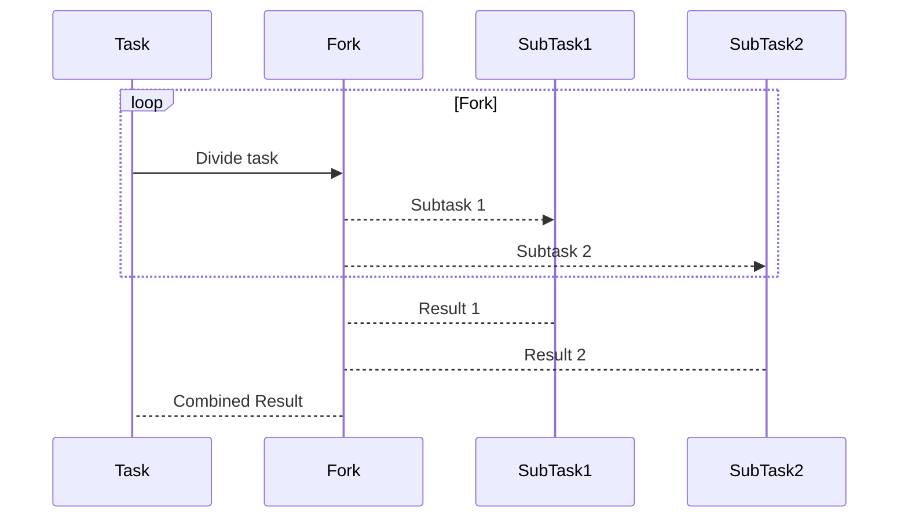

The **Fork-Join** design pattern is a prominent approach for achieving parallelism in computational tasks. This pattern involves recursively dividing a task into smaller, more manageable subtasks until they can be processed efficiently. Once these subtasks have completed their execution, their results are combined (or "joined") to produce the final output.

## Understanding Fork-Join

In Functional Programming, the Fork-Join pattern is often implemented using immutable data structures and pure functions, ensuring that side effects are minimized and enabling safe concurrent execution.

### Key Concepts

1. **Forking**: The process of dividing a task into smaller subtasks.
2. **Joining**: The process of combining the results of the subtasks to form the final output.
3. **Recursion**: Using recursive function calls to implement the Fork-Join pattern.
4. **Immutable Data Structures**: Ensuring data consistency and thread safety during parallel execution.

### Illustration

Consider the example of calculating the sum of a large array using the Fork-Join pattern:

1. **Fork**: Divide the array into two halves (subtasks).
2. **Recursive Forking**: Continue dividing until the subarrays are small enough to be easily processed.
3. **Base Case**: Sum the elements of the small subarrays when they can no longer be divided.
4. **Join**: Combine the sums of the subarrays to obtain the total sum.

### Example Implementation in Haskell

Let's implement the Fork-Join pattern in Haskell:

```haskell
import Control.Parallel.Strategies (parMap, rdeepseq)

-- Split the work into two halves
splitWork :: (Integral a) => [a] -> ([a], [a])
splitWork xs = splitAt (length xs `div` 2) xs

-- Sum function using Fork-Join
forkJoinSum :: (Num a, Integral a) => [a] -> a
forkJoinSum []  = 0
forkJoinSum [x] = x
forkJoinSum xs  = 
  let (ys, zs) = splitWork xs
  in runEval $ do
    sumLeft  <- rpar (forkJoinSum ys)
    sumRight <- rpar (forkJoinSum zs)
    rseq sumLeft
    rseq sumRight
    return (sumLeft + sumRight)
```

In this example, the `forkJoinSum` function splits the input list, recursively processes each half in parallel, and combines the results to obtain the final sum.

### Fork-Join in UML Sequence Diagram



## Related Design Patterns

1. **Map-Reduce**: Another parallel processing pattern that involves "mapping" a function over a dataset and then "reducing" the results to a single value. While it shares similarities with Fork-Join, Map-Reduce is particularly suited for processing vast amounts of data distributed across many machines.
   
   ```mermaid
   sequenceDiagram
       participant Master
       participant Map
       participant Reduce
       Master->>Map: Distribute tasks
       Map-->>Reduce: Intermediate results
       Reduce-->Master: Final Result
   ```

2. **Divide and Conquer**: A general algorithm design paradigm that solves a problem by breaking it into smaller subproblems, solving each subproblem recursively, and combining their solutions. Fork-Join can be seen as a parallelized version of this design.

3. **Actor Model**: A concurrency pattern where "actors" are computational entities that interact by sending messages to each other. While not inherently focused on task splitting and joining, the Actor Model can be employed to implement parallel processing systems, including Fork-Join.

## Additional Resources

1. *"Parallel and Concurrent Programming in Haskell"* by Simon Marlow. This book provides in-depth coverage of concurrency and parallelism in Haskell including the Fork-Join model.
2. *"Java Concurrency in Practice"* by Brian Goetz. Though Java-specific, it provides a good understanding of implementing parallelism using Java's Fork-Join framework.
3. Online courses on *Parallel Programming*:
   - [Coursera: Parallel Programming](https://www.coursera.org/specializations/parallel-programming)
   - [edX: Parallel Programming and Computing](https://www.edx.org/professional-certificate/intelx-parallel-programming)

## Summary

The Fork-Join pattern is a powerful and efficient framework for parallelizing tasks by recursively splitting them into smaller subtasks. Functional programming languages like Haskell leverage immutable data structures and pure functions to safely implement this pattern. By understanding and applying the Fork-Join pattern, you can significantly improve the performance of your parallel computations.


