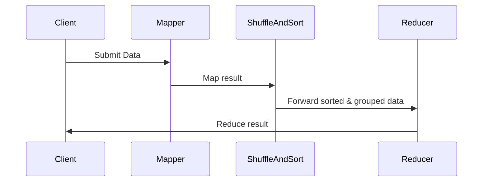

## Introduction to Map-Reduce

The **Map-Reduce** pattern is a widely adopted design pattern in both functional programming and distributed computing. It simplifies processing large data sets by dividing the job into two primary phases: **Map** and **Reduce**. The core idea behind this pattern is to handle data in parallel, providing scalable and efficient data processing.

This article will explore the Map-Reduce pattern, its implementation, advantages, and some related design patterns. We’ll also present diagrams to illustrate the concepts visually.

## The Mechanics of Map-Reduce

### Map Phase

The **Map** phase transforms data from one format to key-value pairs. Each mapper function works on a subset of the data, producing intermediate results which are later consumed by the reducer function.

### Reduce Phase

The **Reduce** phase takes the output generated by the Map phase and processes it further to create the final output. Reducer functions aggregate, summarize, or perform computations on these key-value pairs.

### Sequence of Events



## Implementing Map-Reduce

Here’s an example of a Map-Reduce implementation in a typical functional programming language like Haskell:

```haskell
-- Sample data
let data = ["apple", "banana", "apple", "apple", "banana", "orange"]

-- Map phase
let mapper (word: String) = (word, 1)
let mappedData = map mapper data

-- Shuffle and sort phase (typically done on distributed systems)
let groupedData = groupBy (\\(k1, _) (k2, _) -> k1 == k2) 
                $ sortBy (comparing fst) mappedData

-- Reduce phase
let reducer group = (fst (head group), sum $ map snd group)
let reducedData = map reducer groupedData

-- Final result
print reducedData
```

## Related Design Patterns

### 1. **Filter**

The **Filter** pattern involves processing only those elements in a list that satisfy a certain property. It's often used before applying Map-Reduce to preprocess data, removing unwanted elements early.

### 2. **Fold**

The **Fold** pattern, also known as **reduce**, combines accumulating results with a binary operation. It iterates over a collection, combining elements using a given function.

### 3. **Pipeline**

The **Pipeline** pattern breaks down complex processing into smaller, reusable steps that are composed together. It aids in structuring complex Map-Reduce operations efficiently.

### 4. **Partition**

The **Partition** pattern divides data into sub-collections which can be processed independently, much like what happens implicitly in the Map phase of Map-Reduce.

## Advantages and Disadvantages

### Advantages

- **Scalability**: Easily handles large data sets across multiple nodes.
- **Fault Tolerance**: Operations can be retried or distributed to avoid failure points.
- **Simplicity**: Clear conceptual separation of tasks.

### Disadvantages

- **Latency**: Communication overhead between map and reduce phases can introduce latency.
- **Complexity in Handling Multiple Inputs**: Handling multiple data streams requires additional effort.
- **Limited Flexibility**: Out-of-the-box implementation sometimes limits customization for specific use-cases.

## Additional Resources

- [Google's MapReduce Research Paper](https://research.google/pubs/archive/36212.pdf)
- [Apache Hadoop, a popular open-source Map-Reduce project](https://hadoop.apache.org/)
- [Haskell Data Processing with Map-Reduce](https://hackage.haskell.org/package/mrjob)
- [Distributed Systems Fundamentals](https://www.coursera.org/learn/distributed-systems)

## Summary

The Map-Reduce design pattern revolutionizes data processing by dividing tasks into mapping and reducing operations, facilitating distributed and parallel computation. Its significance is evident in large-scale systems like those managed by Google and other industry giants. Using Map-Reduce, developers achieve scalability, fault tolerance, and performance for processing big data.

By understanding and implementing the Map-Reduce pattern, functional programmers can leverage distributed computing's full potential, efficiently handling vast datasets.




