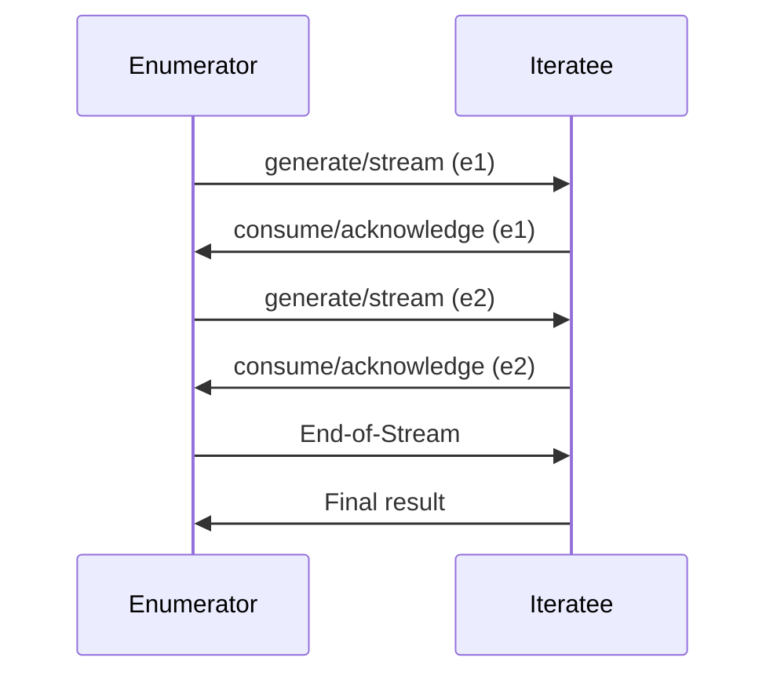

## Introduction

In functional programming, an **Iteratee** is a design pattern used for consuming streams of input data in a way that is both efficient and highly controllable. This pattern is particularly useful in managing resources such as memory and file handles during Input/Output (I/O) operations, where large data cannot be fully loaded into memory all at once. 

Iteratees facilitate incremental processing, thereby allowing a program to handle streams much like a for-loop or a while-loop would handle iterations over a finite collection in imperative programming.

## Key Concepts 

### What is an Iteratee?

An Iteratee represents a consumer of data. It is capable of consuming portions of the input incrementally, maintaining state between chunks while performing computations on the incoming stream.

### Components of an Iteratee System

There are three primary components in an iteratee-based stream processing system:

1. **Enumerator**: Produces the stream of data elements.
2. **Iteratee**: Consumes the stream element by element.
3. **Enumeratee** (optional): Transforms streams between enumerators and iteratees.

### Benefits of Using Iteratees

- **Resource Efficiency**: Stream processing in constant memory
- **Fine-grained Control**: Handling I/O operations precisely
- **Modularity**: Cleaner separation between data producers and consumers
- **Safety**: Better management of end-of-stream and error conditions

## Example Workflow

Let's walk through an example to illustrate how iteratees work:

1. **Enumerator**: This generates the data stream which could be a file, a network socket, or any other data source.
2. **Iteratee**: This processes the stream, say, by reading lines from a file, performing transformations and aggregations.
3. **Enumeratee**: This optional component acts like a filter or transformer between the enumerator and iteratee, to specify additional stream manipulations.

Consider reading a file line-by-line and summing up the lengths of all lines:

### Definitions in Pseudocode/Scala

```scala
trait Enumerator[E] {
  def run[A](iteratee: Iteratee[E, A]): Future[Iteratee[E, A]]
}

trait Iteratee[E, A] {
  def fold[B](done: (A, Input[E]) => Future[B],
              cont: (Input[E] => Iteratee[E, A]) => Future[B],
              error: (Throwable, Input[E]) => Future[B]): Future[B]
}

sealed trait Input[+E]
case object EOF extends Input[Nothing]
case class El[E](e: E) extends Input[E]
case object Empty extends Input[Nothing]
```

### Functional Workflow

1. **Creating an Enumerator**:
    ```scala
    val fileEnumerator: Enumerator[String] = ???
    ```
    This might read lines from a text file.

2. **Defining an Iteratee**:
    ```scala
    val lengthSumIteratee: Iteratee[String, Int] = ???
    ```

3. **Connecting Enumerator and Iteratee**:
    ```scala
    val totalLength: Future[Int] = 
      fileEnumerator.run(lengthSumIteratee).map(_.result)
    ```

### Sequence Diagram Example



## Related Design Patterns 

- **Lazy Evaluation**: Allows deferring computations until their results are needed. Iteratees often leverage lazy evaluation to deal with potentially infinite streams.
- **Monadic I/O**: Handling side effects declaratively using monads. Iteratees often incorporate monadic structures to maintain functional purity while dealing with I/O.
- **Pipelines**: A modular approach where data is passed through a sequence of stages.

## Additional Resources

- "Iteratee IO" by John Lato, a detailed investigation on iteratee patterns.
- Papers by Oleg Kiselyov on incremental mode of programming which often illustrate iteratees.
- Scalaz and Play Framework documentation on iterates and streams handling.

## Summary

The **Iteratee** design pattern introduces a robust mechanism for incremental stream processing in functional programming. By separating concerns between data producers and consumers, it ensures efficient resource management, precise control over operations, and modularity. Understanding iteratees can vastly improve handling I/O-bound programs where large data sizes and resource constraints pose challenges.

With related patterns like Lazy Evaluation and Monadic I/O, iteratees offer a powerful paradigm for developers seeking to write clean, efficient, and scalable functional code.


