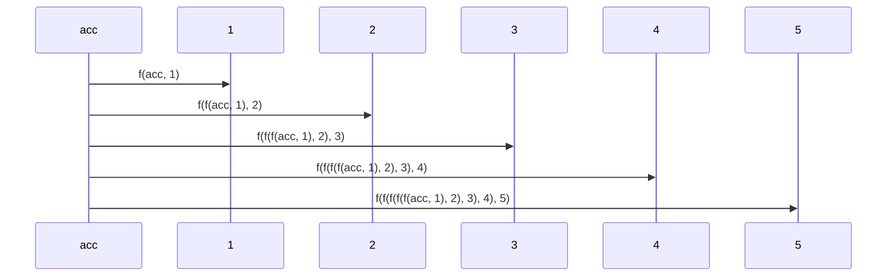
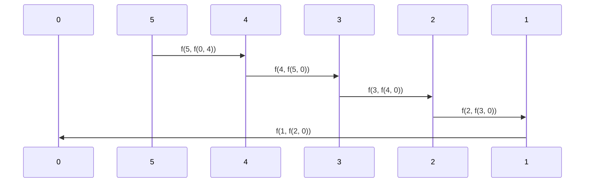

## Overview
Catamorphisms, commonly known as folds, are essential operations in functional programming used to aggregate or collapse data structures, such as lists, into a single value. These operations work by recursively applying a given function to the elements of the data structure, combining them in a way that reduces the entire structure to a simpler value. As fundamental building blocks in functional programming, understanding folds is critical to grasping how functional languages handle recursion and data transformation.

## Detailed Description

### Basics of Catamorphisms
Catamorphisms are recursive in nature and can be considered a powerful pattern for data aggregation and transformation. The term "catamorphism" comes from category theory and is part of a broader family of morphisms used for decomposing or transforming data.

There are two main types of folds:
1. **Left fold (foldl)**: Processes the list from left to right.
2. **Right fold (foldr)**: Processes the list from right to left.

### Left Fold (foldl)
A left fold iterates over the elements of a data structure from the left (beginning) to the right (end), applying a function cumulatively. The result from each iteration becomes the input for the next.

#### Definition
```haskell
foldl :: (b -> a -> b) -> b -> [a] -> b
foldl f acc []     = acc
foldl f acc (x:xs) = foldl f (f acc x) xs
```

#### Example in Haskell
```haskell
foldl (+) 0 [1, 2, 3, 4, 5]
-- This computes (((((0+1)+2)+3)+4)+5) = 15
```

### Right Fold (foldr)
A right fold operates from right to left, starting from the end of the data structure and combining elements with the provided function.

#### Definition
```haskell
foldr :: (a -> b -> b) -> b -> [a] -> b
foldr f acc []     = acc
foldr f acc (x:xs) = f x (foldr f acc xs)
```

#### Example in Haskell
```haskell
foldr (+) 0 [1, 2, 3, 4, 5]
-- This computes (1+(2+(3+(4+(5+0))))) = 15
```

### Visualization with Mermaid UML
To better understand the operations of left and right folds, we can use Mermaid UML Sequence diagrams.

#### Left Fold Visualization


#### Right Fold Visualization


## Related Design Patterns

### Anamorphisms (Unfolds)
Anamorphisms are the dual of catamorphisms. Instead of reducing a data structure, they construct or unfold a data structure from a single value or seed. Common examples include generating infinite lists or recursively creating trees.

### Hylomorphisms
A hylomorphism is a composition of a catamorphism and an anamorphism. It involves unfolding a value into a data structure with an anamorphism and then folding it back into a single value with a catamorphism.

## Additional Resources
- [Category Theory for Programmers](https://bartoszmilewski.com/2014/10/28/understanding-folds/)
- [Learn You a Haskell for Great Good!](http://learnyouahaskell.com/functors-applicative-functors-and-monoids)
- [Structure and Interpretation of Computer Programs](https://mitpress.mit.edu/sites/default/files/sicp/full-text/book/book.html)
  
## Summary
Catamorphisms (folds) are fundamental patterns in functional programming used to reduce data structures into simpler values by recursively applying a function across their elements. There are two primary types of folds: left folds (foldl) and right folds (foldr). By mastering folds, you gain the capability to traverse and aggregate data structures effectively, a skill crucial for functional programming.

Understanding related patterns like anamorphisms and hylomorphisms further deepens the comprehension of recursive data transformations and construction.

Embrace the power of folds to harness the full potential of functional programming!
