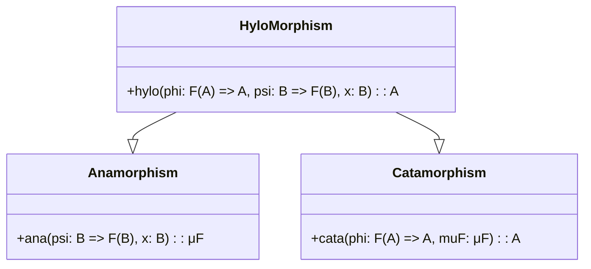

## Overview

Hylomorphism is a powerful design pattern in functional programming that combines the principles of catamorphisms (folds) and anamorphisms (unfolds). It allows for the comprehensive and efficient transformation of recursive data structures. Particularly, a hylomorphism can be understood as a composition of a process that unfolds a structure from a seed and another process that folds the structure back into a summary value.

By integrating these two operations, hylomorphisms enable developers to express complex recursive algorithms in a clear, concise, and highly modular manner.

## Components

### Anamorphism

An anamorphism (`ana`) generates a recursive data structure from a single value (seed). It can be conceptually described as an unfolding process.

For a type \\(B\\) (base type) and a recursive data structure \\(F\\), an anamorphism can be defined as:


\text{ana} :: (B \rightarrow F(B)) \rightarrow (B \rightarrow \mu F)


where \\( \mu F \\) signifies the fixed-point of the functor \\( F \\).

### Catamorphism

A catamorphism (`cata`) collapses a recursive data structure into a single value. It can be conceptualized as a folding process.

For a recursive data structure \\( F \\) and a type \\( A \\) (result type), a catamorphism can be defined as:


\text{cata} :: (F(A) \rightarrow A) \rightarrow (\mu F \rightarrow A)


### HyloMorphism

Combining an anamorphism and a catamorphism, we get a hylomorphism (`hylo`):


\text{hylo} :: (F(A) \rightarrow A) \rightarrow (B \rightarrow F(B)) \rightarrow (B \rightarrow A)


A hylomorphism unfolds a value using an anamorphism and then folds it using a catamorphism.

### Formal Representation

Consider the general form of hylomorphic recursion:


\text{hylo} \, \Phi \, \Psi \, x = \text{cata} \, \Phi \, (\text{ana} \, \Psi \, x)


where:
- \\( \Phi \\) is the folding function.
- \\( \Psi \\) is the unfolding function.
- \\( x \\) is the initial seed value.

### Example

To illustrate the concepts with an example, consider computing the factorial of a number using a hylomorphism.

#### Anamorphism for Numbers

Generates a list of numbers from \\( n \\) down to 1.

```haskell
anamorphFactorial :: Integer -> [Integer]
anamorphFactorial 0 = []
anamorphFactorial n = n : anamorphFactorial (n - 1)
```

#### Catamorphism for Product

Calculates the product of a list of numbers.

```haskell
catamorphProduct :: [Integer] -> Integer
catamorphProduct []     = 1
catamorphProduct (x:xs) = x * catamorphProduct xs
```

#### Combining using HyloMorphism

```haskell
hylomorphFactorial :: Integer -> Integer
hylomorphFactorial = catamorphProduct . anamorphFactorial
```

## Related Design Patterns

### Paramorphism

Paramorphism is an extension of catamorphisms that permits access to both the result of the recursive step and the data itself.

### Apomorphism

Apomorphism is the dual of paramorphism that extends anamorphisms, allowing for the early termination of the unfolding process.

### F-Algebra and F-Coalgebra

These are abstract mathematical structures that underlie the principles of catamorphisms and anamorphisms, respectively. Understanding F-Algebra and F-Coalgebra helps in formalizing hylomorphisms.

## UML Class Diagram

To visualize the relationship between anamorphism, catamorphism, and hylomorphism, refer to the following UML Class diagram:



## Sequence Diagram

To further illustrate the function composition in hylomorphism, refer to the following Mermaid UML Sequence diagram:

```mermaid
sequenceDiagram
    participant Start
    participant Ana
    participant Cata
    participant End

    Start->>Ana: seed value
    Ana->>Cata: unfolded structure
    Cata->>End: collapsed result
```

## Additional Resources

1. **Books**
   - *"Algorithms: A Functional Programming Approach"* by Fethi Rabhi and Guy Lapalme.
   - *"Category Theory for Programmers"* by Bartosz Milewski.
   
2. **Papers**
   - *"Functional Programming with Bananas, Lenses, Envelopes and Barbed Wire"* by Erik Meijer, Maarten Fokkinga, and Ross Paterson.
   
3. **Online Tutorials**
   - *"Recursive Data Types & Recursion Schemes"* by Gabriel Gonzalez.

## Summary

Hylomorphism leverages the power of both catamorphisms and anamorphisms, offering a succinct method to process recursive data structures comprehensively. By understanding and utilizing hylomorphisms, developers can create more modular, maintainable, and expressive functional programs. They provide a robust framework for defining complex data transformations and recursive operations, making them invaluable in functional programming design.


