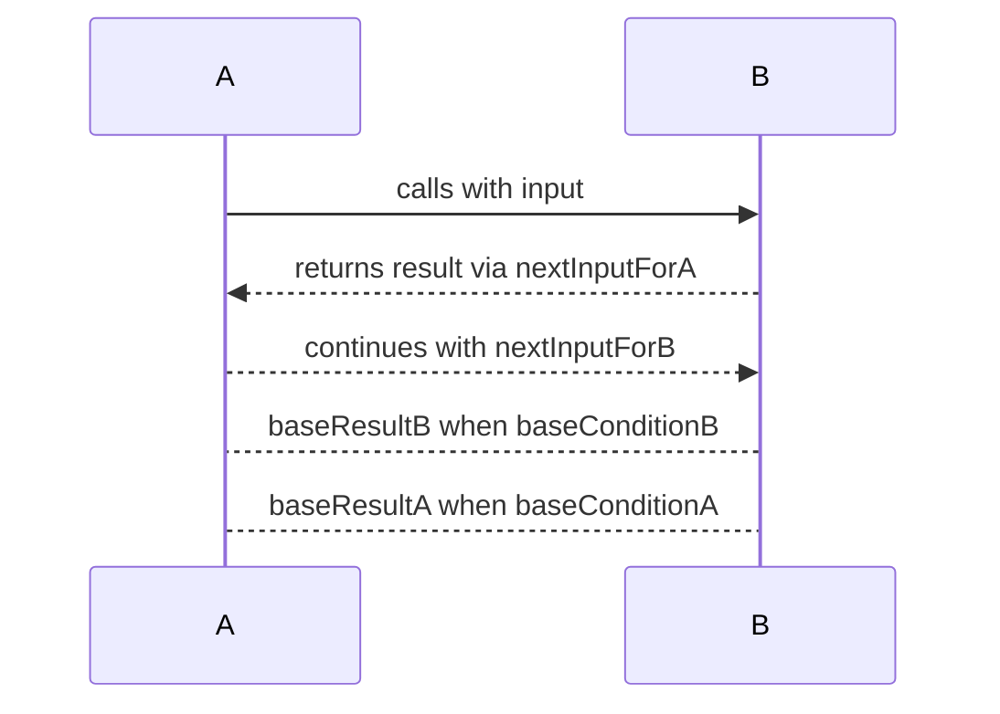

## Introduction to Mutual Recursion

Mutual Recursion is a design pattern where two or more functions are defined in terms of each other. This kind of recursive behavior is often utilized to break down complex problems into simpler sub-problems that are solved by different functions in a coordinated manner.

In the context of functional programming, mutual recursion is particularly useful for maintaining function purity and leveraging higher-order functions to manage state and control flow without side effects.

## Principles of Mutual Recursion

The essence of mutual recursion lies in the interdependent relationship between functions. To set the stage, consider two functions `A` and `B` that call each other in their definitions:

```haskell
function A(input) {
    if (baseConditionA(input)) {
        return baseResultA;
    } else {
        return B(nextInputForB(input));
    }
}

function B(input) {
    if (baseConditionB(input)) {
        return baseResultB;
    } else {
        return A(nextInputForA(input));
    }
}
```

In this hypothetical example:

- **Function A** invokes **Function B** with modified parameters.
- **Function B** in turn invokes **Function A**.

This pattern creates a loop of function calls that eventually must terminate when base conditions are met.

### Example in Haskell

Let's look at an example in Haskell to understand mutual recursion using even and odd number determination:

```haskell
isEven :: Int -> Bool
isEven 0 = True
isEven n = isOdd (n - 1)

isOdd :: Int -> Bool
isOdd 0 = False
isOdd n = isEven (n - 1)
```

In this example:
- `isEven` checks if a number `n` is even by indirectly delegating the computation to `isOdd`.
- `isOdd` checks if a number `n` is odd by delegating the computation back to `isEven`.

This mutual dependency forms the basis of mutual recursion.

## Implementing Mutual Recursion in Different Languages

### JavaScript Example

```javascript
function isEven(n) {
    if (n === 0) {
        return true;
    } else {
        return isOdd(n - 1);
    }
}

function isOdd(n) {
    if (n === 0) {
        return false;
    } else {
        return isEven(n - 1);
    }
}

console.log(isEven(10)); // true
console.log(isOdd(10));  // false
```

### Python Example

```python
def is_even(n):
    if n == 0:
        return True
    else:
        return is_odd(n - 1)

def is_odd(n):
    if n == 0:
        return False
    else:
        return is_even(n - 1)

print(is_even(10))  # True
print(is_odd(10))   # False
```

## Related Design Patterns

- **Direct Recursion**: A simpler recursive pattern where a function calls itself.
- **Tail Recursion**: A form of recursion where the recursive call is the last operation in the function, enabling optimization.
- **Higher-Order Functions**: Functions that take other functions as arguments or return them as results, essential for functional patterns like mutual recursion.
- **Continuation-Passing Style (CPS)**: A style of coding that makes control flow explicit and can be used to address problems encountered with mutual recursion, such as avoiding deep recursion depth.

## Diagrams and Models

Here's UML sequence diagram illustrating mutual recursion:



## Further Readings and Resources

1. [Structure and Interpretation of Computer Programs by Harold Abelson and Gerald Jay Sussman](https://mitpress.mit.edu/sites/default/files/sicp/index.html)
2. [Real World Haskell by Bryan O'Sullivan, Don Stewart, and John Goerzen](http://book.realworldhaskell.org/)
3. [Learn You a Haskell for Great Good! by Miran Lipovača](http://learnyouahaskell.com/)
4. [Eloquent JavaScript by Marijn Haverbeke](https://eloquentjavascript.net/)

## Summary

Mutual Recursion is a robust design pattern in functional programming utilized to manage complex recursive relationships between functions. By understanding mutual recursion, developers can handle interdependent function scenarios more effectively. This design pattern not only enhances problem decomposition but also aligns with core functional programming principles like immutability and pure functions.

Leveraging tools and patterns like higher-order functions, Continuation-Passing Style (CPS), and understanding the optimization techniques for recursion set the stage for writing efficient, understandable, and maintainable functional code.
