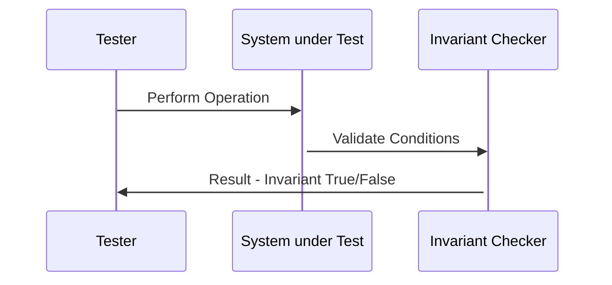

## Introduction

Invariant Testing is a crucial concept in functional programming aimed at ensuring that specific properties or conditions remain true across different test cases. This method of testing is fundamental in maintaining system consistency and reliability. Unlike traditional testing that often focuses on individual cases, invariant testing looks at broader conditions or "invariants" that should hold true universally, providing a robust safety net against bugs and unexpected behaviors.

## Principles of Invariant Testing

Invariant testing revolves around the idea that some conditions should remain unchanged regardless of input or state. These invariants act as guardrails, ensuring that the system behaves as expected.

### Key Principles

1. **Immutability**: Objects should remain immutable, or at least predictable, throughout their lifecycle.
2. **Referential Transparency**: Expressions should always yield the same result given the same inputs.
3. **Idempotence**: Operations should have consistent outcomes irrespective of repetition.

## Detailed Example

Consider a simple banking system where an account can be credited or debited. The balance of the customer's account should always be non-negative.

```haskell
-- Haskell Example of Invariant Testing

type Balance = Int

credit :: Balance -> Int -> Balance
credit balance amount = balance + amount

debit :: Balance -> Int -> Balance
debit balance amount = balance - amount

-- Invariant: balance must always be non-negative
balanceInvariant :: Balance -> Bool
balanceInvariant balance = balance >= 0

-- Test case example
testCreditDebitInvariant :: Bool
testCreditDebitInvariant =
    let initialBalance = 100
        newBalance = (credit initialBalance 50) `debit` 30
    in balanceInvariant newBalance
```

## Workflow of Invariant Testing

1. **Define Invariants**: Clearly state the properties you expect to hold true.
2. **Write Tests**: Implement test cases that simulate various operations and scenarios.
3. **Validate Invariants**: Ensure that the invariants hold true after each operation.

### UML Sequence Diagram



## Comparison with Related Design Patterns

### Property-Based Testing
Property-Based Testing is closely related to invariant testing but focuses on generating a wide range of inputs to ensure that the properties hold. Invariant testing checks specific conditions, whereas property-based testing broadly analyzes behaviors across numerous inputs.

### Contract Programming
Contract Programming (Design by Contract) involves defining preconditions, postconditions, and invariants formally as part of the function or method contracts. This is a more formalized and comprehensive approach compared to invariant testing, which is generally simpler and more focused.

## Additional Resources

1. [Haskell Programming from First Principles](http://haskellbook.com/)
2. [Functional Programming in Scala](https://www.manning.com/books/functional-programming-in-scala)
3. [QuickCheck: A Lightweight Tool for Random Testing of Haskell Programs](https://hackage.haskell.org/package/QuickCheck)

## Summary

Invariant Testing in functional programming is an effective method to ensure system reliability and consistency by validating that specific properties or conditions hold true across various test scenarios. Adhering to principles like immutability, referential transparency, and idempotence, this testing technique helps in identifying and preventing bugs early in the software development lifecycle. By comparing it with related patterns such as Property-Based Testing and Contract Programming, we can appreciate its unique advantages and applications.
