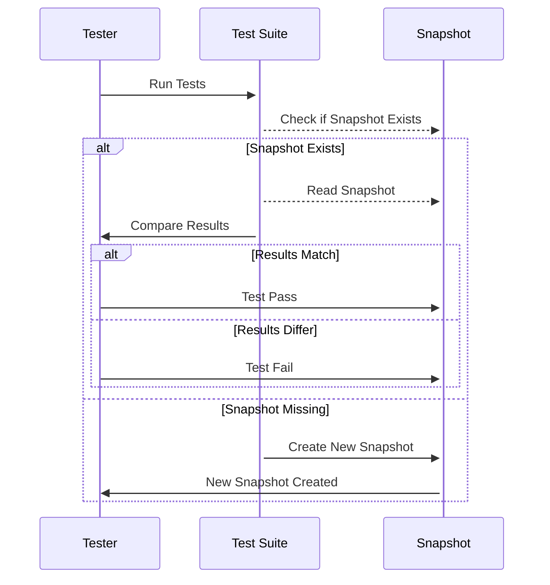

Snapshot testing is a powerful testing technique widely used in functional programming to capture the output of a program or a function at a specific point in time and then compare this captured state against future runs. This process ensures consistency and helps in detecting unintended changes in the program's behavior.

## Introduction to Snapshot Testing

Snapshot testing is used primarily to ensure that the expected output of a program or component remains unchanged. This is particularly useful in UI testing, where the output may include rendered components or visual states. In functional programming, snapshot testing captures the immutable output of pure functions, ensuring that any changes are intentional rather than accidental.

## How Snapshot Testing Works

Snapshot Testing typically involves the following steps:

1. **Initial Run and Snapshot Creation**: When the test runs for the first time, it records the output of the component or function and creates a snapshot file that represents this output.

2. **Comparison on Subsequent Runs**: On subsequent test runs, the current output is compared against the saved snapshot. If there is any discrepancy, the test fails, indicating that the output has changed.

3. **Review and Update**: When legitimate changes occur, you may need to update the snapshot to reflect the new expected output.

### Snapshot Testing Sequence Diagram

The following Mermaid sequence diagram illustrates the process of snapshot testing:



## Advantages of Snapshot Testing

Snapshot testing brings several advantages to the development process:

- **Efficiency**: Eliminates the need for writing complex assertions by capturing whole outputs.
- **Reusability**: Once written, snapshot tests can be reused and maintained easily.
- **Debugging**: Simplifies the detection of unexpected changes by providing a clear, historical record of the output.

## Implementing Snapshot Testing

Here's a basic example using a functional programming language like JavaScript with Jest, a popular testing framework.

```javascript
const func = (input) => {
  return `Hello, ${input}!`;
};

test('func generates the correct greeting message', () => {
  const input = 'World';
  const output = func(input);
  expect(output).toMatchSnapshot();
});
```

In this example, the snapshot will capture the output `Hello, World!` on the first run. On subsequent runs, any changes to the output will fail the test unless the snapshot is updated with the new expected output.

### KaTeX Rendering Example

Consider a functional program that generates mathematical formulas using KaTeX. A snapshot might capture the rendered LaTeX output:

```javascript
const renderMath = (formula) => {
  return katex.renderToString(formula);
};

test('renderMath renders the correct LaTeX', () => {
  const formula = "\\frac{a}{b}";
  const output = renderMath(formula);
  expect(output).toMatchSnapshot();
});
```

## Related Design Patterns

- **Functional Core, Imperative Shell**: Encapsulates pure functions and immutable data structures within a functional core while maintaining stateful interactions in an imperative shell.
- **Regression Testing**: Although not a formal design pattern, snapshot testing is a crucial subset of regression testing, aimed at catching regressions by comparing new behavior against previously captured states.
- **Immutable Data Structures**: Facilitates reliable snapshot testing since it guarantees the unchanged nature of data over time.

## Additional Resources

1. [Jest Documentation on Snapshot Testing](https://jestjs.io/docs/snapshot-testing)
2. [Functional Programming Principles in Scala by Martin Odersky](https://www.coursera.org/learn/scala-functional-programming)

## Summary

Snapshot testing in functional programming is a robust method for ensuring that the output of programs or components remains consistent over time. By capturing outputs at specific points in time and comparing them to future runs, developers can quickly identify unintended changes. The simplicity and effectiveness of snapshot testing make it an essential tool in the functional programmer's toolkit.

Snapshot testing supports the principles of immutability and pure functions, reinforcing the reliability of the software through every iteration. Whether you are developing mathematical rendering functions or complex user interfaces, snapshot testing is an invaluable strategy for maintaining high-quality, bug-free code.
