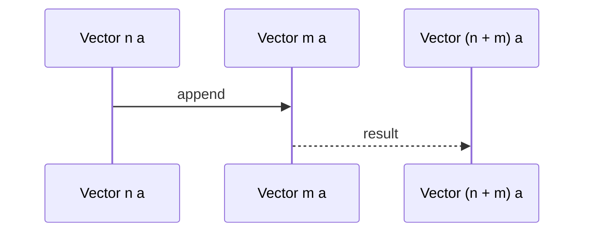

## Introduction to Dependent Types

Dependent types are types that depend on values. This powerful concept allows for more precise type checking at compile-time, enabling the encoding of richer constraints and invariants directly into the type system. This elevates type systems from simply being mechanisms for detecting simple category errors to powerful tools for expressing and verifying program properties.

## Basic Concepts

### Value-Dependent Types

In traditional programming languages, types are abstracted away from the values they represent. However, in languages supporting dependent types, types can be parameterized by values. This capability allows for the definition of more specific types that reflect detailed properties and constraints of the data.

For example, consider a type for vectors of a fixed length:

```haskell
data Vector (n : Nat) a where
  Nil  : Vector 0 a
  Cons : a -> Vector n a -> Vector (n + 1) a
```

In this definition, `Vector n a` is a type that depends on the natural number `n` representing the length of the vector. `Nil` is a vector of length 0, and `Cons` constructs a vector of length `n + 1`.

### Type-Level Natural Numbers

A common use case involves using types to represent natural numbers and imposing constraints based on these numbers. This combines algebra with types to capture properties around sizes, dimensions, or any other numeric property.

### Proofs as Types

In dependently-typed languages, proofs of properties about programs can be expressed as types. Validating that a property holds corresponds to writing a term (proof) that inhabits the type (proposition).

For example, consider proving that the concatenation of two vectors gives a vector whose length is the sum of the two original lengths:

```haskell
append : Vector n a -> Vector m a -> Vector (n + m) a
append Nil ys = ys
append (Cons x xs) ys = Cons x (append xs ys)
```

In this code snippet, the type of `append` captures a property of the function: appending a vector of length `n` with a vector of length `m` results in a vector of length `n + m`.

## Advantages of Dependent Types

- **Stronger Guarantees**: Dependent types allow encoding invariants directly into types, offering stronger compile-time guarantees about program correctness.
- **Expressiveness**: They provide a richer language to express complex properties and constraints, that are otherwise difficult to enforce.
- **Consistency**: Programs have fewer runtime errors as many correctness concerns are handled at the compile-time level.

## Languages Supporting Dependent Types

Several functional programming languages support dependent types, including:

- **Idris**: A language deeply integrated with dependent types, allowing elaborate proofs and type-driven development.
- **Agda**: A dependently typed language and proof assistant, primarily used for formal verification.
- **Coq**: Primarily a proof assistant, Coq's specification language is based on the calculus of inductive constructions, which also supports dependent types.
- **Haskell**: Through extensions such as GADTs (Generalized Algebraic Data Types) and type families, Haskell provides some level of dependent type functionality.

## Related Design Patterns

### Phantom Types

Phantom types use type parameters that do not correspond to actual data fields. They enable the embedding of additional type information, which can be crucial for ensuring correctness in more abstract ways, similar to dependent types but without the full spectrum of dependently-typed features.

### Algebraic Data Types (ADTs)

ADTs are a foundational concept and closely related to dependent types. By combining ADTs with dependent types, one can define more precise and expressive data structures.

### GADTs

Generalized Algebraic Data Types extend ADTs with more expressive types that can be parameterized in a value-dependent manner.

## Sequence Diagram of Vector Append

Here's a visual representation using UML sequence diagram:



## Additional Resources

- [Idris Tutorial](https://www.idris-lang.org/documentation/tutorial/)
- [Agda Documentation](https://agda.readthedocs.io/en/v2.6.1.3/)
- [Coq Manual](https://coq.inria.fr/distrib/current/refman/)
- [Haskell GADTs](https://wiki.haskell.org/GADT)
- [Proofs and Types](https://www.cs.cmu.edu/~rwh/courses/types/)

## Summary

Dependent types provide a powerful tool to improve type precision and ensure program correctness at compile-time in functional programming. By incorporating values into types, dependent types allow for expressing intricate constraints and properties, leading to safer and more robust software. While not all programming languages support dependent types natively, those that do, such as Idris, Agda, and Coq, offer significant advantages when correct program behavior is essential.
