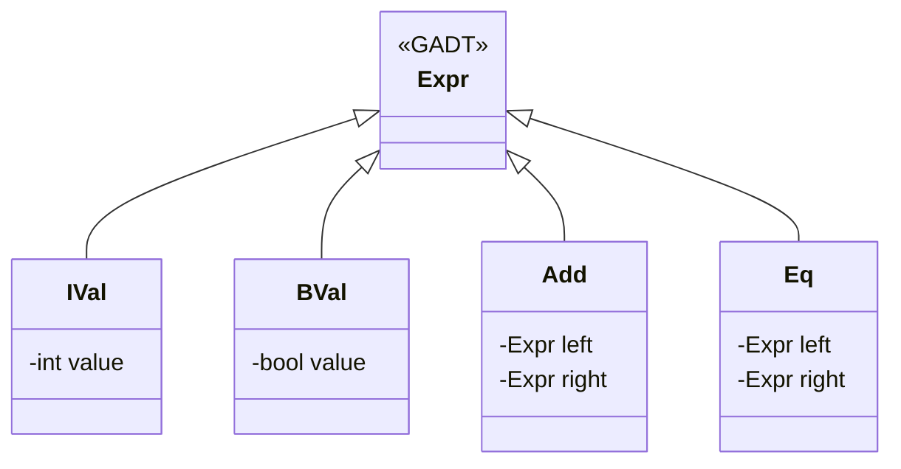

Generalized Algebraic Data Types (GADTs) extend the capabilities of regular algebraic data types (ADTs) by allowing more precise type annotations for each constructor in a data type. This allows us to encode more information in the type system, improving type safety and expressiveness. 

## What is a GADT?

GADTs augment the expressiveness of normal ADTs by allowing different constructors of a data type to yield differently typed results. This can be useful in various scenarios like ensuring valid operations on types or implementing embedded domain-specific languages (DSLs).

### Syntax and Example

Here’s a basic example from Haskell to illustrate GADTs:

```haskell
{-# LANGUAGE GADTs #-}

data Expr a where
  IVal :: Int -> Expr Int
  BVal :: Bool -> Expr Bool
  Add  :: Expr Int -> Expr Int -> Expr Int
  Eq   :: Expr Int -> Expr Int -> Expr Bool
```

In this `Expr` data type, each constructor specifies the result type `a`. 

- `IVal` constructs an `Expr Int` from an `Int`.
- `BVal` constructs an `Expr Bool` from a `Bool`.
- `Add` takes two `Expr Int`s and produces an `Expr Int`.
- `Eq` takes two `Expr Int`s and produces an `Expr Bool`.

### Using GADTs

The utility of GADTs becomes evident when evaluating expressions. Consider the evaluation function:

```haskell
eval :: Expr a -> a
eval (IVal n)     = n
eval (BVal b)     = b
eval (Add e1 e2)  = eval e1 + eval e2
eval (Eq e1 e2)   = eval e1 == eval e2
```

This `eval` function pattern matches on the type-safe constructors, allowing it to yield properly typed results without additional runtime type checks.

## Benefits of GADTs

1. **Type Safety**: GADTs allow the compiler to ensure at compile-time that certain invariants hold, preventing many classes of bugs.

2. **Expressiveness**: By enabling encoding more precise types, GADTs can represent more complex logic directly in the type system, facilitating clear and maintainable code.

3. **DSL Implementation**: GADTs are particularly powerful for implementing domain-specific languages, where domain rules can be enforced directly in the type system.

## Related Design Patterns

### Phantom Types

Phantom types use type parameters that do not correspond to actual data within a type but serve to carry type information that can provide additional type safety. While similar in extending type information, phantom types are generally less flexible compared to GADTs.

### Type Classes

Type classes provide polymorphic functions without resorting to subtyping, but combined with GADTs, they can offer more powerful ways to encode complex behaviors and enforce type constraints:

```haskell
class Eval e where
  eval :: e -> e

instance Eval (Expr Int) where
  eval (IVal n)    = n
  eval (Add e1 e2) = eval e1 + eval e2

instance Eval (Expr Bool) where
  eval (BVal b)    = b
  eval (Eq e1 e2)  = eval e1 == eval e2
```

## UML Example

Below is diagram that visualizes the relationship within the `Expr` type in a UML-like structure.



## Additional Resources

- [Haskell: GADTs](https://wiki.haskell.org/GADT)
- [Functional Programming in Scala](https://www.manning.com/books/functional-programming-in-scala) - While Scala doesn't natively support the same style of GADTs as Haskell, it covers similar topics around type systems.
- [Why Types Matter](http://www.math.chalmers.se/~rjmh/Papers/whyfp.pdf) by John Hughes

## Summary

GADTs offer a robust way to extend traditional algebraic data types with more expressive and precise type annotations. Leveraging GADTs allows for safer and more readable code by embedding more type information directly into the expressions and rules of a program. This makes GADTs invaluable in ensuring type correctness and enhancing the capabilities of functional programming, particularly in complex scenarios where traditional ADTs fall short. Through examples and diagrams, we’ve demonstrated how GADTs can be effectively utilized and how they relate to other functional programming patterns.
