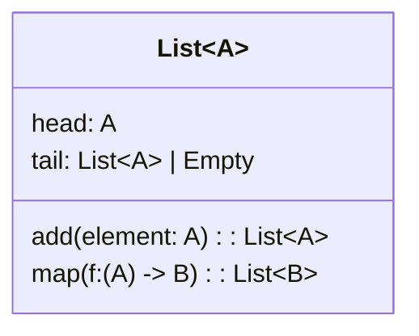

## Introduction

Generic Programming, also known as parameterized programming, is a paradigm where algorithms are written in a way that they operate on any data type. This approach is highly favored in functional programming due to its support for type abstraction, higher-order abstractions, and code reuse. The key to Generic Programming is the use of type parameters, which allows developers to define algorithms and data structures that are independent of type specifics.

## Core Principles

### Type Abstraction
Type Abstraction is the process of defining operations without specifying the type of data they operate on. This is achieved using type parameters, making the code flexible and reusable.

```haskell
-- A simple example in Haskell
-- A function that returns the first element of a list
firstElement :: [a] -> a
firstElement (x:_) = x
```

In the example above, `[a]` denotes a list of elements of any type `a`, illustrating type abstraction.

### Higher-Order Functions
Higher-Order Functions are functions that can take other functions as arguments or return them as results. They are often used in conjunction with type abstraction to create more generalized algorithms.

```haskell
-- A higher-order function that applies a function to each element of a list
map :: (a -> b) -> [a] -> [b]
map _ [] = []
map f (x:xs) = f x : map f xs
```

### Parametric Polymorphism
Parametric Polymorphism allows functions and data types to be written generically, so they can handle values identically without depending on their type. This is a cornerstone of Generic Programming in functional languages.

```scala
// A generic class in Scala
class Box[A](value: A) {
  def getValue: A = value
}
```

## Applications in Functional Programming

### Functional Data Structures
Generic Programming is extensively used in the design of functional data structures, such as lists, trees, and graphs. These structures can be implemented once and used with any type.

```haskell
-- A binary tree data structure in Haskell
data Tree a = Empty | Node a (Tree a) (Tree a)
```

### Libraries and Frameworks
Many functional programming libraries, such as the Haskell Standard Library and Scala’s collections framework, make extensive use of Generic Programming to provide versatile and reusable components.

### Algorithms
Algorithms like sorting, searching, and transformation can be written in a generic manner to work with any data type.

```haskell
-- QuickSort algorithm in Haskell
quickSort :: (Ord a) => [a] -> [a]
quickSort [] = []
quickSort (x:xs) = quickSort [a | a <- xs, a <= x]
                 ++ [x] ++
                 quickSort [a | a <- xs, a > x]
```

## Related Design Patterns

### Monads
Monads provide a design pattern that embodies computation defined as generic types and sequence computations. They are powerful tools for building complex functional structures.

```haskell
-- Example of Maybe Monad in Haskell
data Maybe a = Nothing | Just a

instance Monad Maybe where
  return = Just
  Nothing >>= _ = Nothing
  (Just x) >>= f = f x
```

### Functors
Functors are a type of design pattern that can be mapped over. They provide a context in which functions can be applied, facilitating generic data manipulation.

```haskell
-- Functor example in Haskell
instance Functor [] where
  fmap = map
```

### Type Classes
Type Classes in languages like Haskell act as a mechanism to define generic interfaces that can be implemented by different data types.

```haskell
-- Definition of EQ type class
class Eq a where
  (==) :: a -> a -> Bool
  (/=) :: a -> a -> Bool
```

## Diagrammatic Representation

### Class Diagram
Here is a class diagram to illustrate the concept of a generic list in Haskell:



### Sequence Diagram
A sequence diagram illustrating the interaction between a generic collection and a higher-order function:

```mermaid
sequenceDiagram
    participant Client
    participant List
    participant Function

    Client ->>+ List: create
    list = new List<int>()
    Client ->>+ List: map(func)
    activate Function
    List ->> Function: apply
    Function ->> List: result
    deactivate Function
    List ->> Client: new List with result
```

## Additional Resources

1. [Learn You a Haskell for Great Good!](http://learnyouahaskell.com/) - Comprehensive guide to Haskell programming
2. [Scala Documentation](https://docs.scala-lang.org/) - Official Scala documentation with emphasis on generic programming and collections
3. [Functional Programming Patterns in Scala and Clojure](https://www.amazon.com/Functional-Programming-Patterns-Scala-Clojure/dp/1601986985) - A book providing insights on functional design patterns

## Summary

Generic Programming in functional programming emphasizes writing flexible, reusable code that can operate across various types. By employing type abstraction, higher-order functions, and parametric polymorphism, developers can create elegant and efficient solutions. It integrates well with functional paradigms like Monads and Functors and is crucial in crafting versatile libraries and frameworks.

Understanding and applying Generic Programming principles can greatly enhance code maintainability and scalability, making it an indispensable skill in the functional programming toolkit.
