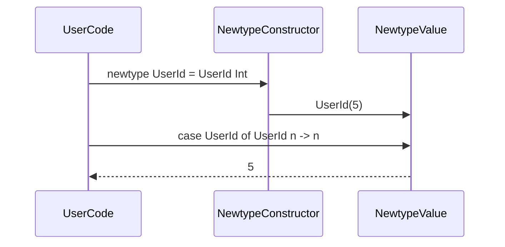

## Introduction to Newtype

In functional programming, type safety is paramount. One powerful pattern to leverage type safety is the **Newtype** design pattern. This pattern involves the creation of a new, distinct type from an existing type, enabling the programmer to add type-specific constraints and behaviors while maintaining type safety and clarity. 

## Purpose and Motivation

The primary purpose of the Newtype pattern is to define new types to create better type distinctions. By using Newtype, you can:
- **Enhance Code Readability:** The type itself becomes a clearer representation of the data it is intended to encapsulate.
- **Ensure Type Safety:** Different types cannot be used interchangeably, reducing the risks of errors.
- **Flexible Abstraction:** Add constraints or behaviors specific to the new type without modifying the underlying implementation.

## Basic Example

Consider an example in Haskell. Suppose we have two different types, `UserId` and `ProductId`, both represented by integers:

```haskell
newtype UserId = UserId Int
newtype ProductId = ProductId Int
```

In this example, though both `UserId` and `ProductId` are imbued with integers, they are distinct types. This distinction prevents accidental usage of a `UserId` where a `ProductId` is expected, and vice versa.

## Detailed Explanation

### Definition and Implementation

The Newtype keyword is a way in Haskell to introduce a new type that is distinct from its underlying type but has the same runtime representation:

```haskell
newtype Example = Example Int
```

**Key Points:**
- **Runtime Efficiency:** Newtypes are as efficient as the types they wrap around since they incur no runtime overhead.
- **Type Safety:** Enhances type safety by distinguishing role-specific meanings at compile-time.

### Unwrapping and Wrapping

Creating and retrieving the value inside a newtype is straightforward:

```haskell
-- Wrapping value
let userId = UserId 5  -- Given UserId 5 

-- Unwrapping value
case userId of
  UserId n -> n  -- Extracts the actual integer value `5`
```

### Deriving Typeclasses

Often, you'll need instances of common typeclasses for your new Newtypes. In Haskell, this can be achieved easily with deriving:

```haskell
newtype UserId = UserId Int deriving (Eq, Show, Ord, Read)
```

## Related Design Patterns

### Value Objects

In Domain-Driven Design (DDD), Value Objects are conceptually similar to Newtypes. They encapsulate data and behavior distinctively, ensuring type safety and representational clarity in a business context.

### Wrapper Types

While Newtype focuses on creating distinct types at the type level, Wrapper Types can add additional behavior or constraints by wrapping an existing type.

## Additional Resources

1. **Book:** "Haskell Programming from First Principles" - A comprehensive guide to Haskell and its type system.
2. **Article:** [The Power of Newtype](https://www.haskellforall.com/2020/08/the-power-of-newtype.html) - An article discussing various advantages of the Newtype design pattern.
3. **Library:** The `newtype` package on Hackage - Practical utilities for working with Newtypes in Haskell. 

## Diagrammatic Representation

Here is class diagram to illustrate the concept of Newtype:

```mermaid
classDiagram
    class Int {
    }

    class UserId {
    }

    class Newtype ~n
    UserId --> Int

    Int : base type
    UserId : new type
```

And a sequence diagram depicting the use and unwrapping of Newtype:



## Summary

The Newtype pattern is a highly effective tool in the arsenal of functional programmers. It enhances type safety, improves readability, and enables flexible abstractions without performance overhead. By understanding and applying Newtype, developers can write more robust and maintainable code.

By making subtle but meaningful distinctions in your type system, you not only prevent a range of potential bugs but also make your codebase more intuitive and expressive. Invest the time to systematically use Newtype where applicable, and you will find that your functional programs become both safer and easier to understand.
