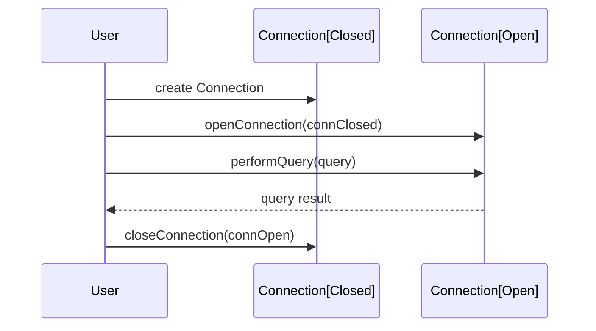

## Introduction

Phantom types are a kind of type system feature in functional programming where type parameters don't have corresponding runtime values but are used to enforce compile-time constraints. They are powerful for maintaining invariants and enhancing type safety in a program. This article delves deep into the concept and utility of phantom types, illustrating through various examples and associated design patterns.

## Understanding Phantom Types

In typical type systems, type parameters correspond to the actual data types used within the data structure. In phantom types, however, some type parameters are "phantoms"; they are used solely in the type domain, not in the runtime representation of the data.

A phantom type's primary goal is to leverage the type system to enforce more strict guarantees at compile-time. This ensures that certain kinds of errors are caught as early as possible, typically by restricting functions to operate on data of specific, constrained types.

### Example: Encoding State in Phantom Types

Consider a scenario where we need to enforce the state of a resource (e.g., a database connection) at compile-time. Phantom types can help encode this state information.

In Haskell, it might look like this:

```haskell
{-# LANGUAGE GADTs, DataKinds, KindSignatures #-}

data Status = Open | Closed

data Connection (s :: Status) where
    MkConnection :: Connection Closed

openConnection :: Connection Closed -> Connection Open
openConnection MkConnection = MkConnection -- Imagine real opening logic here

closeConnection :: Connection Open -> Connection Closed
closeConnection MkConnection = MkConnection -- Imagine real closing logic here

performQuery :: Connection Open -> String -> IO ()
performQuery _ query = putStrLn $ "Executing query: " ++ query

-- Usage:
-- let conn = openConnection MkConnection
-- performQuery conn "SELECT * FROM users"
-- let closedConn = closeConnection conn
```

Here, the `Connection` type has a phantom type parameter `s` that signifies whether it's open or closed. This enforcement prevents, for example, running a query on a closed connection.

### Key Characteristics

- **Type-level Assurance:** Phantom types provide type-level information that the compiler can enforce, ensuring certain operations are only invoked in valid contexts.
- **Zero Runtime Overhead:** Since they only exist at the type level, there is no runtime penalty for using phantom types.
- **Expressiveness:** They allow encoding rich domain-specific constraints directly into a type system.

## Related Design Patterns

### The `State` Monad

The `State` Monad is a well-known functional programming pattern for handling stateful computations. Like phantom types, the `State` monad can enforce structured state transitions in a type-safe manner.

### Tagged Types

Tagged types (or newtypes) in Haskell and other FP languages are a way to create distinct types even if they share similar structures. They help in avoiding type errors by creating strong type distinctions.

### Type-Level Programming

Type-level programming encompasses all practices of performing computations at the type level, enhancing code safety and expressiveness. Phantom types are a subset of this broader paradigm.

## Example in Scala

Scala also supports phantom types via type parameterization and traits or classes to encode extra constraints:

```scala
sealed trait State
sealed trait Open extends State
sealed trait Closed extends State

case class Connection[S <: State]()

def openConnection(c: Connection[Closed]): Connection[Open] = Connection[Open]()
def closeConnection(c: Connection[Open]): Connection[Closed] = Connection[Closed]()

def performQuery(c: Connection[Open], query: String): Unit = {
  println(s"Executing query: $query")
}

// Usage:
// val connClosed = Connection[Closed]()
// val connOpen = openConnection(connClosed)
// performQuery(connOpen, "SELECT * FROM users")
// val connClosedAgain = closeConnection(connOpen)
```

Here, the `Connection` type is parameterized on a phantom type parameter `S` which models the state. Operations ensure that methods like `performQuery` will only accept a `Connection` in the `Open` state.

## UML Sequence Diagram

Below is a UML sequence diagram illustrating the flow of using a connection with phantom types:



This diagram indicates the sequence of operations making use of phantom types to prevent invalid state transitions.

## Additional Resources

1. [GADT Documentation in Haskell](https://wiki.haskell.org/GADT)
2. [Type Parameters and Variance in Scala](https://docs.scala-lang.org/tour/variances.html)
3. `Real World Haskell` - For comprehensive Haskell use cases.
4. `Scala with Cats` - A deep dive into advanced type use in Scala.

## Summary

Phantom types are a compelling pattern in functional programming for enhancing type safety without incurring runtime overhead. By encoding constraints directly into the type system, phantom types ensure more rigorous correctness guarantees and more expressive APIs. As we have explored through both Haskell and Scala examples, phantom types can play a crucial role in state management and other domains requiring strict compile-time invariants.

They form an integral part of the broader concepts in type-level programming and tie into other FP paradigms like the `State` Monad and Tagged Types, all contributing to writing robust, error-resistant code.
