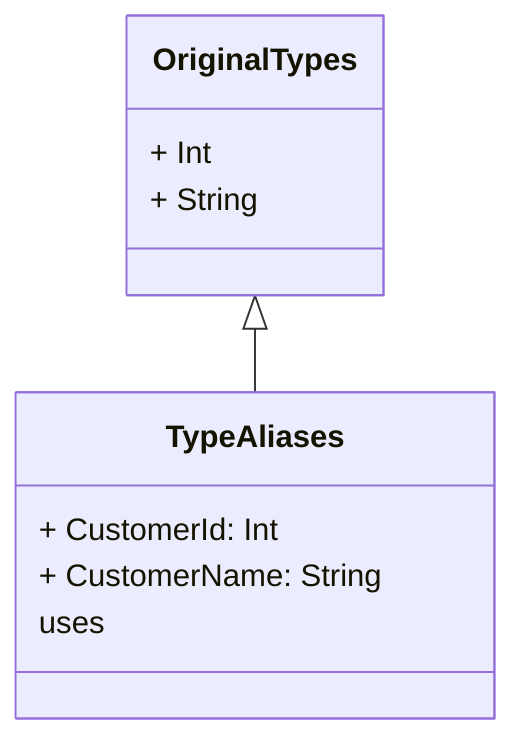

## Introduction to Type Aliases

Type aliases in functional programming play a crucial role in creating more readable and maintainable code. By providing semantic aliases for existing types, developers can convey the intent behind the use of these types more clearly. This practice enhances the understandability of the codebase and reduces errors caused by mistyped or misused types.

In languages like Haskell, Scala, TypeScript, and others, type aliases are a common tool used to create meaningful and expressive type definitions without introducing new types.

## Defining Type Aliases

Type aliases allow you to give a new name to an existing type. This new name can then be used interchangeably with the original type, improving readability and making the code self-documenting.

### Example in Haskell

```haskell
type CustomerId = Int
type CustomerName = String

getCustomerName :: CustomerId -> CustomerName
getCustomerName customerId = ...
```

In this example, `CustomerId` is an alias for `Int`, and `CustomerName` is an alias for `String`. These aliases make the function type signature more informative and clearer.

### Example in TypeScript

```typescript
type UserId = number;
type UserName = string;

function getUserName(userId: UserId): UserName {
  // implementation
}
```

Similarly, in TypeScript, `UserId` and `UserName` provide semantic meaning to the types `number` and `string`, respectively.

## Advantages of Using Type Aliases

1. **Improved Readability**: Type aliases help clarify the meaning and purpose of various types used in your code.
2. **Ease of Refactoring**: Changes to the underlying type require fewer code changes, as you only need to update the alias definition.
3. **Self-Documentation**: Code becomes more self-explanatory, reducing the need for additional comments or documentation.
4. **Consistency**: Ensures that types representing the same concept are used consistently throughout the codebase.

## Related Design Patterns

1. **Wrapper Types**: Wrapper or Newtype patterns go beyond type aliases by creating entirely new types. While type aliases are purely syntactic, wrapper types provide stronger type guarantees.
2. **Abstract Data Types (ADTs)**: ADTs hide implementation details and expose only the necessary operations, promoting abstraction and encapsulation. Type aliases can be used within ADTs to improve clarity.
3. **Phantom Types**: Phantom types use type parameters that aren't used at runtime but provide compile-time type checking, improving the reliability of your code. They often work in tandem with type aliases.

## UML Class Diagram

Here is an example Mermaid UML Diagram illustrating the relationship between aliases and their underlying types.



## Further Reading

- [Haskell Type Aliases Documentation](https://www.haskell.org/onlinereport/haskell2010/haskellch2.html#x7-170002.4)
- [TypeScript Handbook on Type Aliases](https://www.typescriptlang.org/docs/handbook/advanced-types.html#type-aliases)
- [Scala Type Aliases](https://docs.scala-lang.org/tour/type-aliases.html)

## Summary

Type aliases in functional programming are a powerful tool for enhancing code readability and maintainability. By allowing developers to create semantic aliases for existing types, type aliases make code more expressive and easier to understand. When combined with other design patterns such as wrapper types and abstract data types, they contribute to a robust and readable codebase. 

Understanding and utilizing type aliases effectively can significantly improve your development practices and code quality.


