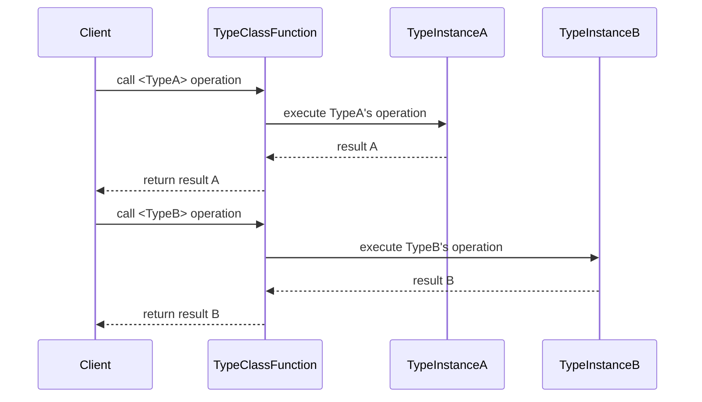

## Introduction to Type Classes

Type classes are a powerful concept in functional programming that allow for ad-hoc polymorphism or overloading based on the type of arguments. They are a way to define generic functions that can operate on a variety of data types while maintaining type safety. As a design pattern, type classes enable developers to write more generic and reusable code.

### Origins and Key Concepts

Type classes were first introduced in the Haskell programming language and have influenced other programming languages, such as Scala and Rust.

- **Ad-hoc Polymorphism**: This allows functions to operate on arguments of different types, with the operations tailored according to the argument's type.
- **Type Safety**: Compiler ensures that functions are applied to appropriate types, preventing a broad category of runtime errors.
- **Modularity**: Code remains decoupled and more modular since behavior can be defined in terms of type classes even for types that are defined elsewhere.

### Core Components

#### Declaration

A type class is essentially a collection of types that share a set of operations. Here's an example type class declaration in Haskell:

```haskell
class Eq a where
  (==) :: a -> a -> Bool
  (/=) :: a -> a -> Bool
```

This declares a type class `Eq` for types that support equality testing. The types that can be instances of this class need to implement the methods `(==)` and `(/=)`.

#### Instance

To make a specific type an instance of a type class, you provide implementations for the required methods. For instance:

```haskell
instance Eq Int where
  (==) x y = x `intEq` y
  (/=) x y = not (x == y)

intEq :: Int -> Int -> Bool
intEq x y = ... -- implementation
```

In this case, `Int` is made an instance of the `Eq` type class.

### Example: Functor Type Class

The `Functor` type class is another widely discussed example, as it abstracts over computation contexts.

```haskell
class Functor f where
  fmap :: (a -> b) -> f a -> f b
```

An example instance for lists:

```haskell
instance Functor [] where
  fmap = map
```

This demonstrates that lists can be mapped over using the `fmap` function, providing a general structure for applying a function to each element in a higher-level data structure.

## Related Design Patterns

### Type-Level Programming

Type classes can be combined with other design patterns like type-level programming to achieve more declarative and expressive code. 

### Dependency Injection

In some contexts, type classes serve a similar role to dependency injection in object-oriented programming, allowing the behavior of a piece of code to depend on what types and instances are in scope.

### Ad-Hoc Polymorphism in Other Languages

- **Scala**: Uses implicits and traits to achieve similar functionality.
- **Rust**: Implements type classes via traits.
- **F#**: Has type extension methods, which are conceptually similar to type classes.

## UML Sequence Diagram: Type Class Usage Example

Here is UML Sequence Diagram showing the interaction of a type class-based function with multiple instances.



## Additional Resources

- **_Learn You a Haskell for Great Good!_** by Miran Lipovača: A beginner-friendly introduction to Haskell and type classes.
- **Haskell Programming from First Principles** by Christopher Allen and Julie Moronuki: An in-depth guide to Haskell, with extensive coverage of type classes.
- **Functional Programming in Scala** by Paul Chiusano and Runar Bjarnason: Provides insights into type classes in the Scala programming language.

## Summary

Type classes are quintessential in functional programming for achieving polymorphism in a type-safe manner. By allowing functions to operate on different data types while maintaining type safety, type classes contribute to writing more flexible, reusable, and modular code. The pattern originated in Haskell and has since seen adoption in several other functional programming languages, reflecting its broad utility and effectiveness. Understanding type classes opens up numerous possibilities for crafting elegant and expressive code in a functional paradigm.

For anyone diving into functional programming, grasping the concepts and applications of type classes is a foundational step towards mastering the idioms and best practices that make this paradigm powerful.

---
