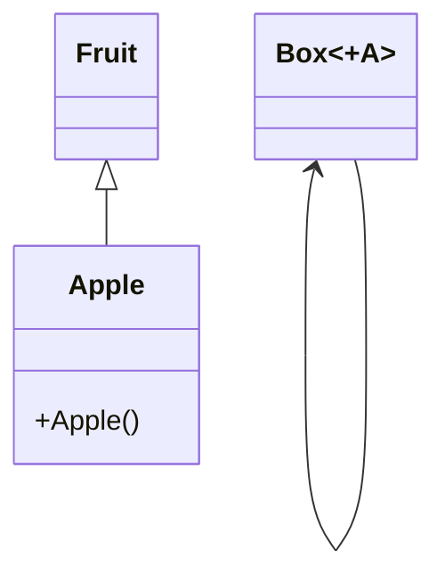
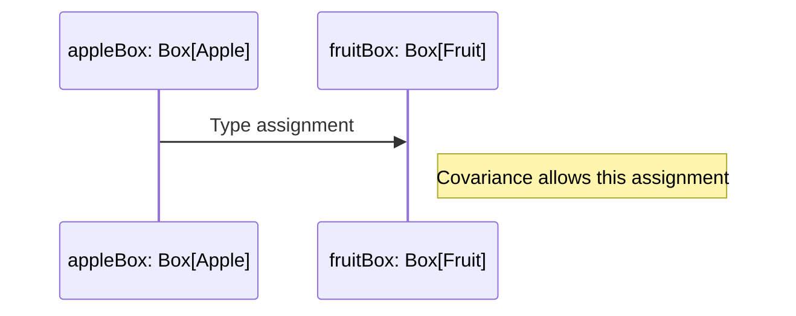

## Introduction

In functional programming and type theory, variance annotations are an essential design pattern used to control and understand the subtype relationships between parameterized types. These annotations provide a way to specify how subtyping between more complex types (like generic classes or traits) relates to the subtypes of their component types.

*Covariance*, *contravariance*, and *invariance* are the three primary types of variance annotations:

- **Covariant ( +T )**: Specifies that a type is compatible with its subtypes—useful in scenarios where a type is expected to be read-only.
- **Contravariant ( -T )**: Specifies that a type is compatible with its supertypes—valuable where an instance of a type acts on objects of that type.
- **Invariant ( T )**: Specifies no subtyping relationship constraints; neither covariant nor contravariant.

## Detailed Explanation

### Covariance

Covariance allows a type parameter to be substituted with its subtype. Syntax in Scala:

```scala
trait Box[+A]
```

In this case, if we have:

```scala
class Fruit
class Apple extends Fruit
```

`Box[Apple]` can be considered a subtype of `Box[Fruit]`, allowing us to write:

```scala
val appleBox: Box[Apple] = new Box[Apple]
val fruitBox: Box[Fruit] = appleBox
```

### Contravariance

Contravariance allows a type parameter to be substituted with its supertype. Syntax in Scala:

```scala
trait Box[-A]
```

With the classes:

```scala
class Fruit
class Apple extends Fruit
```

`Box[Fruit]` can be considered a subtype of `Box[Apple]`, and it's permissible to write:

```scala
val fruitBox: Box[Fruit] = new Box[Fruit]
val appleBox: Box[Apple] = fruitBox
```

### Invariance

Invariant types do not accept subtypes or supertypes without casting. Here, variance annotations are omitted.

```scala
trait Box[A]
```

Given the classes:

```scala
class Fruit
class Apple extends Fruit
```

Neither `Box[Apple]` nor `Box[Fruit]` are subtypes of one another, maintaining strict type relationships.

## Visual Representation

Using Mermaid UML, we can visualize the concepts clearly:



### Sequence Diagram Example

To demonstrate the flow of type assignment, we can use a sequence diagram:



## Related Design Patterns

### Functor, Applicative, and Monad

- **Functor**: A context that can be mapped over, highly relevant with covariance.
- **Applicative**: Extends Functor allowing for function application within a context.
- **Monad**: Further extends Applicative with the ability to chain operations.

### Type Classes

- **Type Classes**: Utilized in Haskell, Scala, and other languages to define behavior parametrized by types which tie closely with variance annotations for ensuring type safety.

### Generics and Polymorphism

- **Generics**: Variance annotations are integral to the generic type system, allowing polymorphic functions to operate safely on different types.

## Additional Resources

- **Books**:
  - "Functional Programming in Scala" by Paul Chiusano and Runar Bjarnason
  - "Scala with Cats" by Noel Welsh, Dave Gurnell

- **Online Articles**:
  - [Variance in Scala](https://docs.scala-lang.org/tour/variances.html)
  - [Covariance and Contravariance in C#](https://docs.microsoft.com/en-us/dotnet/csharp/programming-guide/concepts/covariance-contravariance/)

## Conclusion

Variance annotations are powerful tools for managing subtype relationships in parameterized types, enhancing type safety and flexibility in functional programming. Understanding covariance, contravariance, and invariance helps developers create more robust and reusable code, ensuring functions and data types can interact safely across different abstractions. Exploring related patterns like Functors, Applicatives, and Monads offers deeper insights into the application and integration of variance in functional programming paradigms.
