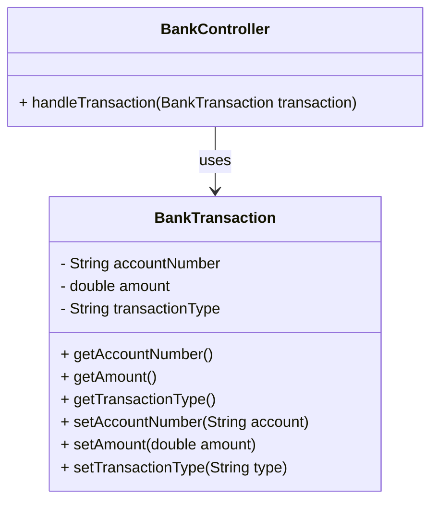
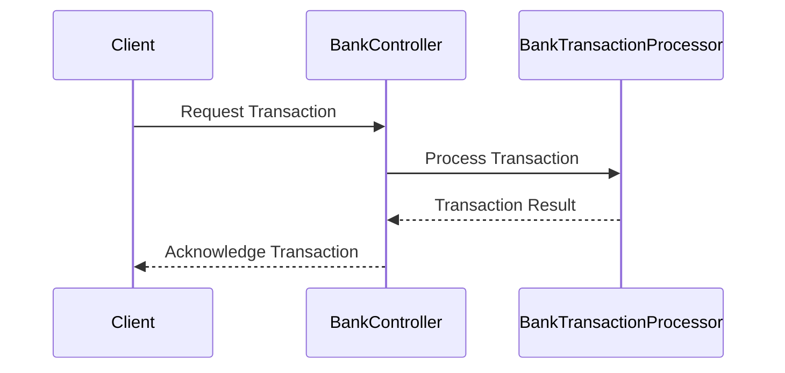
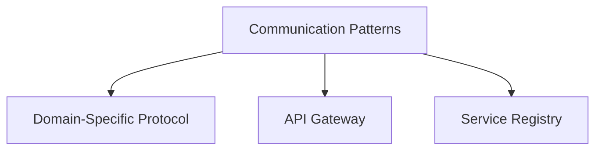

---

title: Domain-Specific Protocol
linkTitle: Domain-Specific Protocol
description: "Exploring the Domain-Specific Protocol pattern in microservices: Definition, intent, benefits, trade-offs, examples in Java, Spring Boot, and Spring Cloud."
type: docs
date: 2024-08-17
draft: false
meta: 
  date: false
  reading_time: false
authors:
  - fuadefendi
series:
  - Microservices
categories:
  - Communication
tags:
  - Domain-Specific Protocol
  - Microservices
  - System Architecture
  - Communication Mechanisms
  - API Design
  - Network Protocols
  - Data Exchange
  - Inter-Service Communication
canonical: "https://softwarepatternslexicon.com/java-microservices/communication-protocols/domain-specific-protocol"
license: "© 2024 Tokenizer Inc. CC BY-NC-SA 4.0"
---

## Definition

The Domain-Specific Protocol pattern involves designing and using a specialized protocol tailored to the needs of a particular domain. Instead of relying solely on generic communication mechanisms (like HTTP/REST, gRPC), services use a protocol specifically crafted to manage domain-specific data and operations efficiently.

## Intent

The primary goal of this pattern is to optimize communication between microservices by using protocols designed to understand and support the peculiar characteristics and requirements of a specific domain.

## Also Known As

- Custom Protocol
- Specialized Protocol

## Detailed Definitions and Explanations

### Key Features

1. **Efficient Data Exchange:** A domain-specific protocol is optimized for the domain’s data structures and operations, leading to more efficient data exchange.
2. **Improved Performance:** Since it is tailored for a specific purpose, it can reduce overhead and improve performance.
3. **Enhanced Security:** The ability to include domain-specific security features.
4. **Consistency and Reliability:** Ensures better consistency and reliability in data exchange by adhering to domain rules.

### Code Examples

**Example of a Custom Protocol in Java using Spring Boot:**

```java
// Custom Protocol for Bank Transaction Communication

@RestController
@RequestMapping("/bank")
public class BankController {

    @PostMapping("/transaction")
    public ResponseEntity<String> handleTransaction(@RequestBody BankTransaction transaction) {
        // Process transaction
        return ResponseEntity.ok("Transaction processed");
    }
}

class BankTransaction {
    private String accountNumber;
    private double amount;
    private String transactionType;

    // Getters and Setters
}
```

### Example Class Diagrams



### Example Sequence Diagrams



### Benefits

- **Efficiency:** Highly optimized for the specific domain, leading to better performance.
- **Clarity:** Clear specifications ensure there's no ambiguity in communication.
- **Security:** Custom protocols can offer enhanced security features pertinent to the domain.
- **Interoperability:** Reduced complexity in interactions between services understanding the same protocol.

### Trade-offs

- **Complexity:** Implementation may be complex and time-consuming.
- **Learning Curve:** Require domain-specific knowledge.
- **Maintenance:** Continuous updates needed to adapt to domain changes.

### When to Use

- When operations and data exchange cannot be adequately supported by generic protocols.
- When performance is a critical criterion, and domain-specific optimization is required.
- When enhanced security tailored to specific operations is necessary.

### Example Use Cases

- Financial transactions in banking applications.
- Real-time communication in IoT systems.
- Custom messaging protocols in high-frequency trading systems.

### When Not to Use

- When the generic protocols suffice and additional complexity is unwarranted.
- When development resources are limited, making maintenance difficult.
- When the domain does not have high-specificity requirements or strong performance demands.

### Related Design Patterns

#### API Gateway
- Allows unified access to microservices via a single endpoint, which can leverage domain-specific protocols.

#### Service Registry
- Can store and manage multiple services that use different domain-specific protocols for easier discovery and access.

## References

- [Spring Boot](https://spring.io/projects/spring-boot)
- [Spring Cloud](https://spring.io/projects/spring-cloud)
- [Microservices Patterns](https://microservices.io/patterns/index.html)
- [Domain-Driven Design (DDD)](https://dddcommunity.org)


## Open Source Frameworks and Tools

- **Spring Cloud:** Provides tools for developers to quickly build some of the common patterns in distributed systems.
- **Apache Thrift:** Framework for scalable cross-language services development.

## Cloud Computing, SAAS, PAAS

Exploring deployment of domain-specific protocols across different cloud computing models:

### SaaS (Software as a Service)
A domain-specific application provided as a service, optimized for particular business processes.

### PaaS (Platform as a Service)
Use PaaS offerings to build and deploy domain-specific protocols without managing underlying infrastructure.

### IaaS (Infrastructure as a Service)
Leverage IaaS to customize virtual machines for running services with domain-specific protocols.

## Suggested Books

- *Building Microservices* by Sam Newman
- [Patterns of Enterprise Application Architecture](https://amzn.to/4cGutvM) by Martin Fowler
- [Domain-Driven Design: Tackling Complexity in the Heart of Software](https://amzn.to/3zyYxeB) by Eric Evans

## Grouping Related Patterns

### Communication Patterns in Microservices



### Description of Related Patterns

**API Gateway:** Acts as a single entry point into the system, providing a way to route requests to the appropriate microservice.

**Service Registry:** Maintains a list of service instances’ locations and shares this information to adapt to changes in the system; essential for service discovery.

## Guidance on Problem-Solving

To leverage a Domain-Specific Protocol effectively:
1. **Identify Domain Requirements:** Understand the specific needs and constraints within the domain.
2. **Design Custom Protocol:** Tailor the protocol to address identified requirements.
3. **Implement and Optimize:** Develop the microservices around this protocol, ensuring optimizations for performance and security.
4. **Maintain and Evolve:** Continuously iterate on the protocol and implementation to adapt to changing domain needs.

By following a structured approach, you ensure efficient communication that aligns closely with your domain objectives.

---

This article provides a comprehensive guide to understanding and implementing the Domain-Specific Protocol pattern in microservices architecture.
