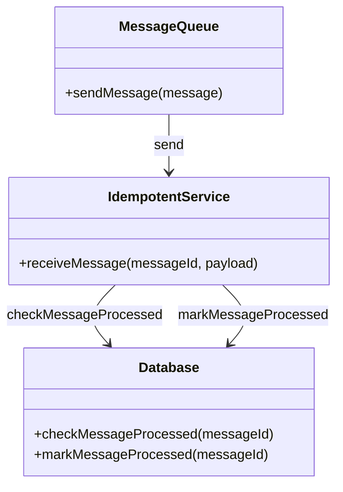
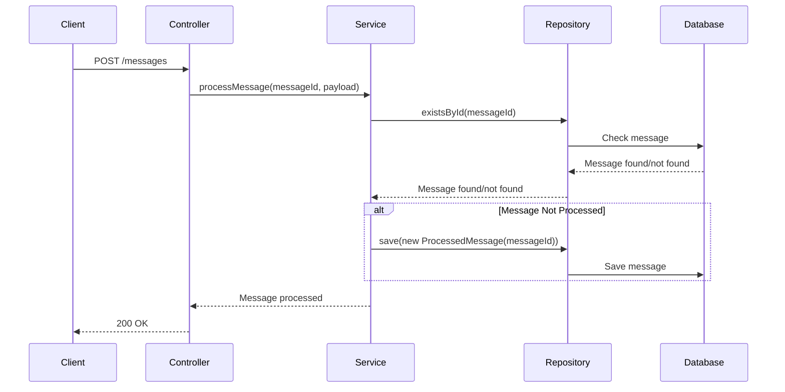
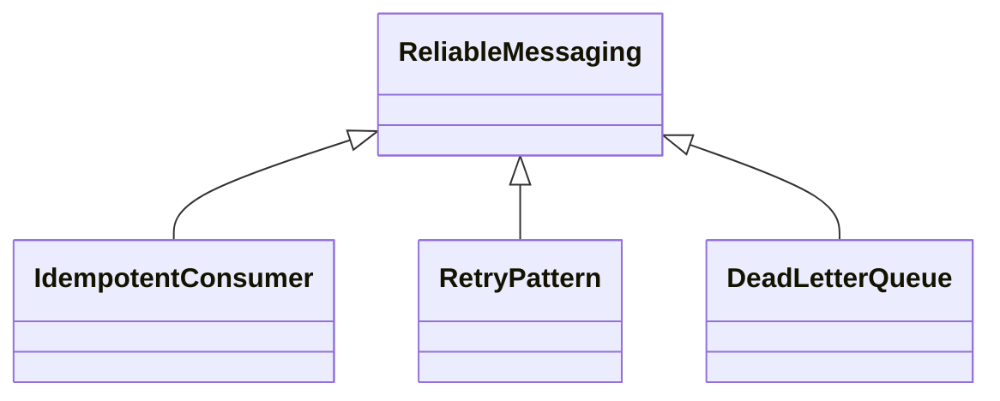

## Definition

The **Idempotent Consumer** pattern ensures that message consumers in a microservices architecture can handle being invoked multiple times with the same message without producing unintended side effects or inconsistent results.

## Intent

The intent of the Idempotent Consumer pattern is to allow a service to repeatedly process the same message and achieve the same result, thereby making operations idempotent.

## Also Known As

- Idempotent Receiver

## Detailed Definition and Explanation

Idempotency is crucial in ensuring fault tolerance and consistency in message-driven systems. In distributed systems, messages might be delivered multiple times due to retries, network issues, or other failures. The Idempotent Consumer pattern ensures that these re-delivered messages do not cause the application to enter an invalid state or perform duplicate work.

Here is a visual representation with a **Diagram**:



## Key Features

1. **Message Identifier:** Each message must have a unique identifier.
2. **Idempotency Check:** Check if the message has been processed before.
3. **Idempotent Operations:** Ensure the logic is idempotent.

## Example Code

Here is an example of implementing an Idempotent Consumer in Java using Spring Boot and Spring Cloud:

### Entity Class

```java
@Entity
public class ProcessedMessage {

    @Id
    private String messageId;

    // constructor, getters, setters, equals, and hashCode
}
```

### Repository Interface

```java
public interface ProcessedMessageRepository extends JpaRepository<ProcessedMessage, String> {}
```

### Service Class

```java
@Service
public class MessageProcessingService {

    @Autowired
    private ProcessedMessageRepository repository;

    @Transactional
    public void processMessage(String messageId, String payload) {
        if (!repository.existsById(messageId)) {
            // Process the message
            //...

            // Mark the message as processed
            repository.save(new ProcessedMessage(messageId));
        }
    }
}
```

### Controller Class

```java
@RestController
@RequestMapping("/messages")
public class MessageController {

    @Autowired
    private MessageProcessingService processingService;

    @PostMapping
    public ResponseEntity<String> receiveMessage(@RequestBody MessageDTO message) {
        processingService.processMessage(message.getId(), message.getPayload());
        return ResponseEntity.ok("Message processed");
    }
}

class MessageDTO {
    private String id;
    private String payload;

    // getters and setters
}
```

### Sequence Diagram



## Benefits

- **Reliability:** Enhances the reliability of the system in the face of network failures and retries.
- **Consistency:** Maintains data consistency by ensuring operations are performed once.
- **Fault Tolerance:** Gracefully handles repeat message deliveries.

## Trade-offs

- **Complexity:** Adds complexity to the system in terms of managing processed messages.
- **Performance:** May introduce a slight performance overhead due to the need for checks and storing processed message IDs.

## When to Use

- When the system involves asynchronous communication and message delivery guarantees are not stringent.
- When there is a possibility of duplicate message delivery due to retries or network issues.

## Example Use Cases

- Payment Processing: Ensuring that payment is processed only once.
- Inventory Management: Preventing inventory updates from being applied multiple times.

## When Not to Use

- When messages are strictly guaranteed to be delivered only once.
- When the overhead of deduplication checks outweighs the benefit in a high-performance system.

## Anti-patterns

- **Idempotent Ignorance:** Ignoring the necessity of idempotency and risking inconsistent states.
- **Improper ID Management:** Not handling the uniqueness and persistence of message IDs properly.

## Related Design Patterns

- **Retry Pattern:** Identifies retries in case of transient failures.
- **Compensating Transaction:** Provides a way to undo operations in case of failures.

## References, Credits, Open Source Frameworks, and Tools

- **Spring Boot & Spring Cloud Docs:** ([Spring Boot](https://spring.io/projects/spring-boot)) ([Spring Cloud](https://spring.io/projects/spring-cloud))
- **Apache Kafka:** A distributed streaming platform that supports exactly-once processing semantics.
- **Redis:** Can be used to store processed message IDs efficiently.

## Cloud Computing Context

In the context of Cloud Computing, PaaS and SaaS, this pattern is particularly relevant for services using message queues like AWS SQS, Google Cloud Pub/Sub, or Azure Service Bus.

## Suggested Books for Further Studies

- [Designing Data-Intensive Applications](https://amzn.to/4cuX2Na) by Martin Kleppmann
- "Microservices Patterns" by Chris Richardson

## Related Patterns Group: Messaging Reliability 

We can group the Idempotent Consumer with other messaging reliability patterns:



### Detailed Descriptions

1. **Retry Pattern:** Handles the retry logic of failed operations.
2. **Dead Letter Queue:** Manages messages that cannot be processed successfully after specified retries.

### How to Solve Messaging Reliability

- Implementing checks and ensuring idempotent operations.
- Incorporate retries with exponential backoff.
- Utilize Dead Letter Queues to handle messages that could not be processed.

By combining these patterns, you can build robust and reliable message-driven microservices.


