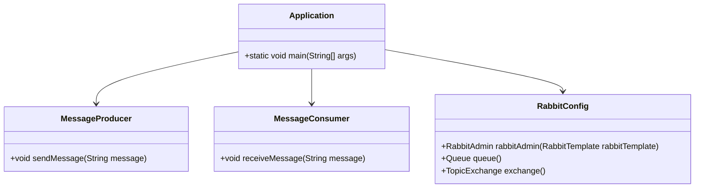
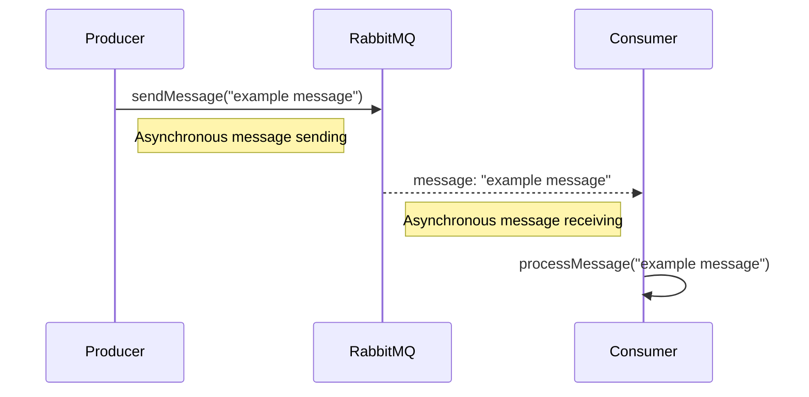

## Definition
The Messaging Pattern enables communication between services in a microservices architecture using asynchronous messaging. This pattern promotes loose coupling, scalability, and fault tolerance by allowing services to interact without requiring real-time synchronous connections.

## Intent
Provide a mechanism for services to communicate asynchronously, facilitating interactions that are resilient, scalable, and decoupled from the timing of the sender and receiver.

## Also Known As
- Event-Driven Architecture
- Message-Driven Communication

## Detailed Definition and Explanations

### Overview
In a microservices architecture, services often need to communicate with each other to fulfill business functionalities. The Messaging Pattern uses asynchronous messaging systems—such as message queues or event streams—to allow services to communicate without needing direct RESTful or RPC-style calls.

This pattern ensures that senders can post messages to a messaging channel, and the receivers can read and process messages at their own pace, promoting smoother and more resilient interactions.

### Key Features
- **Asynchronous Communication**: Services communicate without waiting for each other, leading to non-blocking operations.
- **Loose Coupling**: Services are decoupled from one another, making the system more modular and easier to maintain.
- **Resilience**: The system is resilient against failures; if one service fails, it doesn't necessarily affect others immediately.
- **Scalability**: Messaging systems can be scaled independently to handle varying loads.

### Code Example
Below is an example of implementing the Messaging Pattern using Java, Spring Boot, and Spring Cloud with RabbitMQ.

#### Spring Boot Application for Producer and Consumer

##### Maven Dependencies
Add relevant dependencies to your `pom.xml`.

```xml
<dependency>
    <groupId>org.springframework.boot</groupId>
    <artifactId>spring-boot-starter-amqp</artifactId>
</dependency>
```

##### Producer
Publish messages to the RabbitMQ.

```java
import org.springframework.amqp.rabbit.core.RabbitTemplate;
import org.springframework.beans.factory.annotation.Autowired;
import org.springframework.stereotype.Component;

@Component
public class MessageProducer {
    
    @Autowired
    private RabbitTemplate rabbitTemplate;

    private static final String EXCHANGE_NAME = "example.exchange";

    public void sendMessage(String message) {
        rabbitTemplate.convertAndSend(EXCHANGE_NAME, "example.routingkey", message);
    }
}
```

##### Consumer
Consume messages from the RabbitMQ.

```java
import org.springframework.amqp.rabbit.annotation.RabbitListener;
import org.springframework.stereotype.Component;

@Component
public class MessageConsumer {

    @RabbitListener(queues = "example.queue")
    public void receiveMessage(String message) {
        System.out.println("Received message: " + message);
    }
}
```

##### Configuration
Configure the RabbitMQ properties.

```java
import org.springframework.amqp.core.Queue;
import org.springframework.amqp.core.TopicExchange;
import org.springframework.amqp.rabbit.annotation.EnableRabbit;
import org.springframework.amqp.rabbit.core.RabbitAdmin;
import org.springframework.context.annotation.Bean;
import org.springframework.context.annotation.Configuration;

@Configuration
@EnableRabbit
public class RabbitConfig {

    @Bean
    public RabbitAdmin rabbitAdmin(RabbitTemplate rabbitTemplate) {
        return new RabbitAdmin(rabbitTemplate);
    }

    @Bean
    public Queue queue() {
        return new Queue("example.queue", false);
    }

    @Bean
    public TopicExchange exchange() {
        return new TopicExchange("example.exchange");
    }
}
```

### Example Class Diagram



### Example Sequence Diagram


    
## Benefits
- **Decoupling**: Services are loosely coupled, reducing dependencies and points of failure.
- **Scalability**: Independent scalability of messaging components.
- **Resilience**: Fault isolation capability, enhancing system robustness.
- **Increased Availability**: Enables retries and processing in case of temporary service unavailability.

## Trade-offs
- **Complexity**: Increased complexity in tracking and managing messages.
- **Latency**: Potential delays in message delivery and processing.
- **Testing and Debugging**: More challenging than synchronous communication due to asynchrony.

## When to Use
- When services need to communicate but do not require immediate responses.
- When designing systems that need to be resilient to individual service failures.
- For event-driven systems where events trigger actions across multiple services.

## Example Use Cases
- **Order Processing Systems**: Processing orders where multiple services handle inventory check, payment, and shipment.
- **Notification Systems**: Sending notifications such as emails or messages based on user actions.

## When Not to Use
- When real-time responses are required.
- For simple service-to-service communication where synchronous, direct calls suffice.

## Anti-patterns
- Overusing messaging for simple tasks, leading to unnecessary complexity.
- Not having proper message retry policies, leading to message loss.

## Related Design Patterns
- **Event-Driven Architecture**: Leverages events to trigger and communicate across services.
- **Service Invocation Patterns (Sync & Async)**: Patterns governing service-to-service communication styles.
- **CQRS (Command Query Responsibility Segregation)**: Segregates read and write operations in the system, often leveraging messaging for event handling.

## Open Source Frameworks and Tools
- **RabbitMQ**: Popular open-source message broker.
- **Apache Kafka**: Distributed streaming platform widely used for building real-time data pipelines and streaming applications.

## Cloud Computing
- **AWS SQS**: Managed message queues service by Amazon Web Services.
- **Google Pub/Sub**: Cloud messaging service for building event-driven systems.

## Suggested Books for Further Reading
- *[Designing Data-Intensive Applications](https://amzn.to/4cuX2Na)* by Martin Kleppmann
- *"Microservices Patterns"* by Chris Richardson
- *"Building Microservices"* by Sam Newman

## References and Credits
- [Spring Cloud Stream](https://spring.io/projects/spring-cloud-stream)
- [RabbitMQ Documentation](https://www.rabbitmq.com/documentation.html)

Use this Messaging Pattern to design systems that are more resilient, scalable, and maintainable by leveraging asynchronous communication between services.
